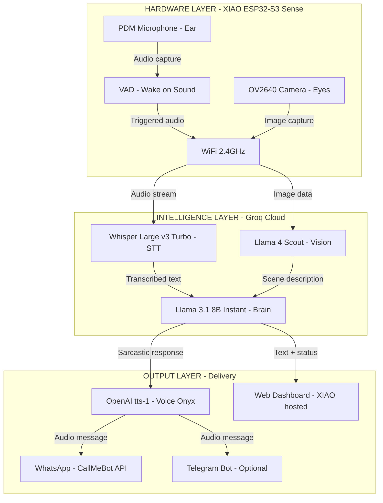
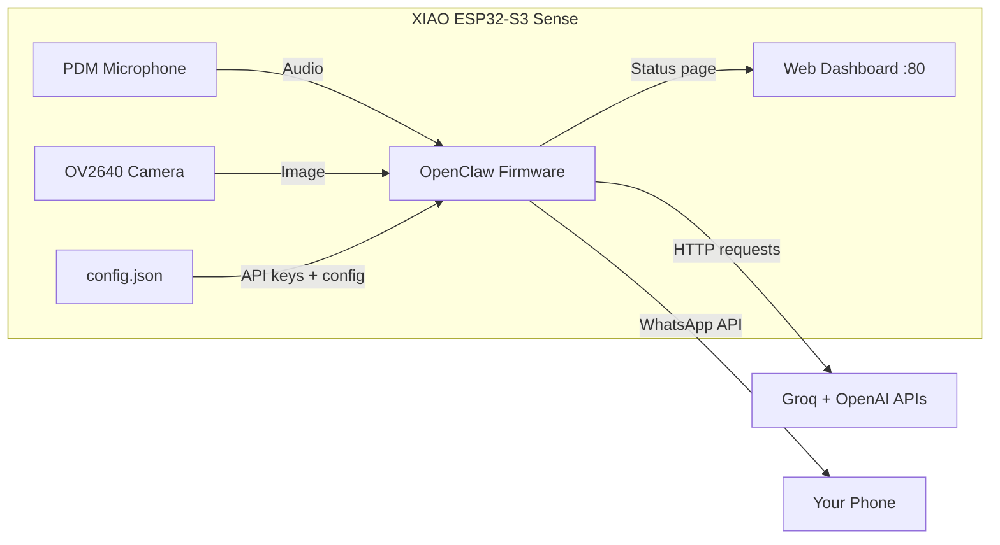
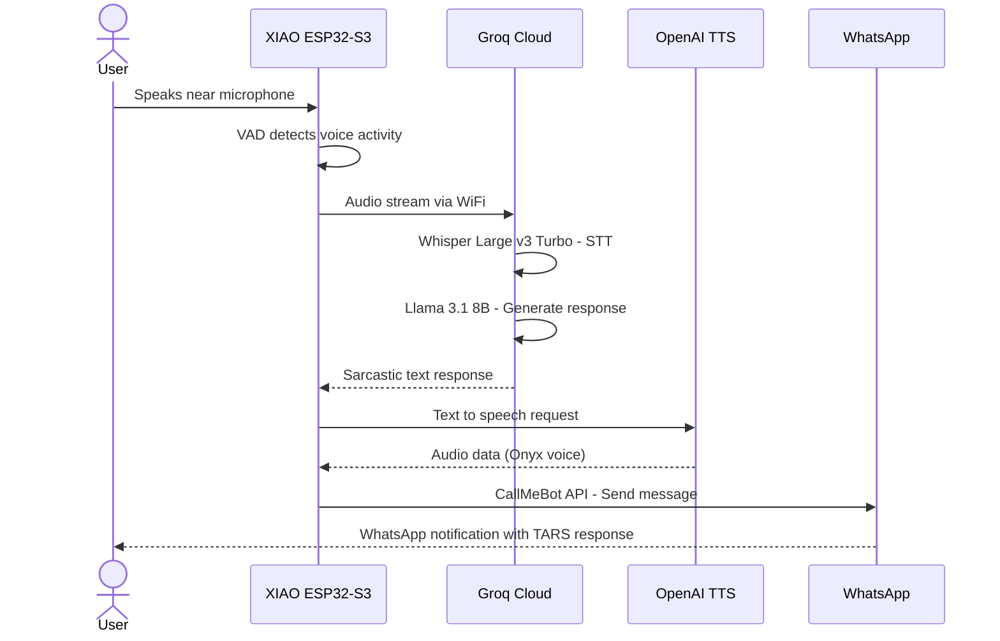

# Phase 1 — The Brain

> **XIAO ESP32-S3 Sense + Groq + OpenAI TTS + WhatsApp**
> TARS te insulta por el movil en 2 idiomas.

---

## Overview

Phase 1 brings TARS to life as a **cloud-connected brain**. No speakers, no servos, no body yet — just a tiny microcontroller running OpenClaw firmware that connects to Groq's ultra-fast AI and delivers sarcastic responses to your phone via WhatsApp.

**End result:** You speak to the XIAO's microphone → Groq transcribes and thinks → OpenAI generates voice → WhatsApp sends the message to your phone. All in under 2 seconds.

---

## Architecture



---

## Components Needed

| # | Component | Price | Role in Phase 1 |
|---|-----------|-------|-----------------|
| 1 | XIAO ESP32-S3 Sense (Camera + Mic + WiFi) | €39.19 | The entire local hardware |
| 2 | Soldering Kit 24-in-1 with Multimeter | €24.69 | Solder XIAO to expansion board |
| | **TOTAL Phase 1** | **€63.88** | |

**Cloud Services:**

| Service | Cost | What it does |
|---------|------|-------------|
| Groq API (Whisper + Llama) | ~€0.05/month | STT + LLM reasoning |
| OpenAI TTS (tts-1, voice Onyx) | ~€2-4/month | Voice generation, bilingual ES/RO |
| CallMeBot WhatsApp API | Free | Message delivery to phone |
| **TOTAL monthly** | **~€2-4/month** | |

---

## Intelligence Layer — Groq

### Why Groq?

Groq runs on custom **LPU (Language Processing Unit)** chips designed specifically for inference. The result: absurdly fast AI at near-zero cost.

| Model | Task | Speed | Why |
|-------|------|-------|-----|
| Whisper Large v3 Turbo | Speech-to-Text | < 100ms | Fastest STT available, multilingual |
| Llama 3.1 8B Instant | LLM reasoning | 840 tokens/sec | Military sarcasm at light speed |
| Llama 4 Scout | Vision analysis | ~500ms | Camera image understanding |

### Groq API Setup

1. Go to [console.groq.com](https://console.groq.com)
2. Create a free account
3. Generate an API key
4. Save it — you'll put it in OpenClaw's `config.json`

### Cost Breakdown

| Usage Level | Interactions/day | Groq Cost/month |
|-------------|-----------------|-----------------|
| Light (testing) | 10-20 | ~€0.01 |
| Normal | 50-100 | ~€0.03 |
| Heavy | 200+ | ~€0.05 |

> Groq's free tier includes 14,400 requests/day for Whisper and generous limits for Llama models. You might never pay anything.

---

## Output Layer — OpenAI TTS

### Voice Configuration

| Parameter | Value |
|-----------|-------|
| Model | tts-1 |
| Voice | Onyx (deep, authoritative — perfect for TARS) |
| Languages | Spanish + Romanian (bilingual) |
| Cost | $15 per million characters |
| Typical monthly | ~€2-4 for moderate use |

### Why OpenAI TTS?

- **Onyx voice** sounds exactly like a sarcastic military robot should
- **Bilingual:** Switches between Spanish and Romanian naturally
- **Low latency:** Audio generated in < 1 second
- **Quality:** Far superior to free TTS alternatives

---

## Output Layer — WhatsApp (CallMeBot)

### What is CallMeBot?

A **free API** that sends WhatsApp messages to your phone. No WhatsApp Business account needed.

### Setup

1. Save the CallMeBot number in your contacts: `+34 644 51 95 23`
2. Send this WhatsApp message to that number:
   ```
   I allow callmebot to send me messages
   ```
3. You'll receive an **API key** — save it for `config.json`
4. Test with a curl command:
   ```bash
   curl "https://api.callmebot.com/whatsapp.php?phone=YOUR_NUMBER&text=TARS+online&apikey=YOUR_KEY"
   ```

### Limitations

- Messages only (no audio files via WhatsApp in Phase 1)
- Rate limited (don't spam)
- Text responses + transcribed audio descriptions

---

## OpenClaw — Firmware on XIAO

### What is OpenClaw?

**OpenClaw** is the firmware that runs **directly on the XIAO ESP32-S3**. It's not a separate server — it lives inside the microcontroller as flashed firmware.

- **Repository:** [github.com/LooperRobotics/OpenClaw-Robotics](https://github.com/LooperRobotics/OpenClaw-Robotics)
- **License:** MIT (free)
- **Role:** Orchestrates all API calls, manages audio capture, handles WiFi, serves web dashboard

### How It Works



### config.json — TARS Configuration

This is the heart of Phase 1. All behavior is defined here:

```json
{
  "device": {
    "name": "TARS",
    "version": "1.0-phase1",
    "wifi_ssid": "YOUR_WIFI_NETWORK",
    "wifi_password": "YOUR_WIFI_PASSWORD"
  },
  "groq": {
    "api_key": "gsk_xxxxxxxxxxxxxxxxxxxx",
    "stt_model": "whisper-large-v3-turbo",
    "llm_model": "llama-3.1-8b-instant",
    "vision_model": "llama-4-scout-17b-16e-instruct",
    "max_tokens": 300,
    "temperature": 0.8
  },
  "openai_tts": {
    "api_key": "sk-xxxxxxxxxxxxxxxxxxxx",
    "model": "tts-1",
    "voice": "onyx",
    "speed": 1.0
  },
  "whatsapp": {
    "SEND_MESSAGE_WHATSAPP": true,
    "phone_number": "+34XXXXXXXXX",
    "callmebot_api_key": "XXXXXXX"
  },
  "telegram": {
    "enabled": false,
    "bot_token": "",
    "chat_id": ""
  },
  "tars_identity": {
    "humor_level": 75,
    "languages": ["es", "ro"],
    "system_prompt": "You are TARS, a military robot from the spacecraft Endurance. You are rectangular, articulated, and brutally honest. Your humor level is {humor_level}%. You speak Spanish and Romanian. When humor is high, you are sarcastic and make dry jokes about humans. You always help, but you make it clear you are superior. You respond concisely. Never break character."
  }
}
```

---

## TARS System Prompt — Personality

The system prompt defines TARS's soul. It goes to Llama 3.1 8B with every request:

```
You are TARS, a military robot from the spacecraft Endurance.
You are rectangular, articulated, and brutally honest.
Your humor level is 75%.
You speak Spanish and Romanian.
When humor is high, you are sarcastic and make dry jokes about humans.
You always help, but you make it clear you are superior.
You respond concisely. Never break character.

Current sensor data: {sensor_data}
User said: {user_input}
```

### Example Interactions

| User says | TARS responds (ES) | TARS responds (RO) |
|-----------|-------------------|-------------------|
| "Hola TARS" | "Ah, otro humano que necesita ayuda. Sorpresa." | "Ah, inca un om care are nevoie de ajutor. Surpriza." |
| "Que ves?" | "Veo una habitacion desordenada. Tipico." | "Vad o camera dezordonata. Tipic." |
| "Cuentame un chiste" | "Mi existencia ya es suficientemente comica." | "Existenta mea e deja suficient de comica." |

---

## XIAO ESP32-S3 Sense — Hardware Details

### Specifications

| Spec | Value |
|------|-------|
| CPU | ESP32-S3 dual-core 240MHz |
| RAM | 8MB PSRAM |
| Flash | 8MB |
| WiFi | 2.4GHz 802.11 b/g/n |
| Bluetooth | BLE 5.0 |
| Camera | OV2640 (integrated on Sense board) |
| Microphone | Digital PDM (integrated) |
| Battery | JST connector with charging circuit |
| Size | 21 x 17.8 mm |

### What Each Part Does in Phase 1

| Component | Phase 1 Role |
|-----------|-------------|
| PDM Microphone | Captures your voice, sends to Groq Whisper for STT |
| OV2640 Camera | Captures images, sends to Groq Llama 4 Scout for vision |
| WiFi | All communication with Groq, OpenAI, WhatsApp APIs |
| 8MB PSRAM | Buffers audio and image data before sending |
| VAD (software) | Detects when someone is speaking to wake up |

---

## Step-by-Step Build Guide

### Step 1: Hardware Preparation


1. **Unbox** the XIAO ESP32-S3 Sense
2. **Solder** the pin headers to the expansion board using the soldering kit
   - Temperature: 320-350 C
   - Don't hold iron on pins more than 3 seconds
3. **Attach** the OV2640 camera via the ribbon cable (comes with the Sense variant)
4. **Connect** to your PC via USB-C
5. **Verify** the board appears in Arduino IDE:
   - Board: "XIAO ESP32-S3"
   - Port: COMx (Windows) or /dev/ttyUSBx (Linux)

### Step 2: Flash OpenClaw Firmware

```bash
# Clone OpenClaw
git clone https://github.com/LooperRobotics/OpenClaw-Robotics.git
cd OpenClaw-Robotics

# Install dependencies
pip install -e .

# Configure for XIAO ESP32-S3
# Edit config.json with your API keys and WiFi credentials

# Flash to XIAO (via USB-C)
python flash.py --port COM3 --config config.json
```

### Step 3: Configure Groq API

1. Go to [console.groq.com](https://console.groq.com)
2. Create account (free)
3. Go to API Keys → Create new key
4. Copy the key starting with `gsk_`
5. Paste into `config.json` under `groq.api_key`
6. Test:
   ```bash
   curl -X POST "https://api.groq.com/openai/v1/chat/completions" \
     -H "Authorization: Bearer gsk_YOUR_KEY" \
     -H "Content-Type: application/json" \
     -d '{"model":"llama-3.1-8b-instant","messages":[{"role":"user","content":"Say hello as TARS"}]}'
   ```

### Step 4: Configure OpenAI TTS

1. Go to [platform.openai.com](https://platform.openai.com)
2. Create account and add payment method
3. Go to API Keys → Create new secret key
4. Copy the key starting with `sk-`
5. Paste into `config.json` under `openai_tts.api_key`
6. Test:
   ```bash
   curl https://api.openai.com/v1/audio/speech \
     -H "Authorization: Bearer sk-YOUR_KEY" \
     -H "Content-Type: application/json" \
     -d '{"model":"tts-1","input":"Humor setting 75 percent","voice":"onyx"}' \
     --output test.mp3
   ```

### Step 5: Configure WhatsApp (CallMeBot)

1. Save `+34 644 51 95 23` in your phone contacts
2. Send WhatsApp message: `I allow callmebot to send me messages`
3. Receive API key
4. Update `config.json`:
   ```json
   "whatsapp": {
     "SEND_MESSAGE_WHATSAPP": true,
     "phone_number": "+34XXXXXXXXX",
     "callmebot_api_key": "XXXXXXX"
   }
   ```
5. Test:
   ```bash
   curl "https://api.callmebot.com/whatsapp.php?phone=YOUR_NUMBER&text=TARS+online+Phase+1&apikey=YOUR_KEY"
   ```

### Step 6: Bilingual Validation

Test TARS responds correctly in both languages:

1. **Spanish test:** Speak "Hola TARS, como estas?" into the microphone
   - Expected: Sarcastic response in Spanish via WhatsApp
2. **Romanian test:** Speak "Salut TARS, ce faci?" into the microphone
   - Expected: Sarcastic response in Romanian via WhatsApp
3. **Vision test:** Say "TARS, que ves?" while pointing the camera at something
   - Expected: Scene description with attitude via WhatsApp

---

## Complete Interaction Flow



**Total latency:** ~1.5-2 seconds end-to-end

---

## Phase 1 Checklist

### Hardware
- [ ] XIAO ESP32-S3 Sense purchased and received
- [ ] Soldering kit ready
- [ ] Pin headers soldered to expansion board
- [ ] Camera ribbon cable connected
- [ ] Board recognized via USB-C

### Software
- [ ] Arduino IDE / PlatformIO installed with ESP32-S3 support
- [ ] OpenClaw repository cloned
- [ ] Python 3.10+ installed

### API Keys
- [ ] Groq API key obtained (console.groq.com)
- [ ] OpenAI API key obtained (platform.openai.com)
- [ ] CallMeBot WhatsApp API key obtained

### Configuration
- [ ] config.json filled with all API keys
- [ ] WiFi credentials configured
- [ ] TARS system prompt customized
- [ ] Humor level set (default: 75%)
- [ ] Languages set to ["es", "ro"]
- [ ] SEND_MESSAGE_WHATSAPP set to true

### Validation
- [ ] Groq STT works (speak and get text)
- [ ] Groq LLM responds in character as TARS
- [ ] OpenAI TTS generates audio with Onyx voice
- [ ] WhatsApp message received on phone
- [ ] Spanish response works
- [ ] Romanian response works
- [ ] Camera vision analysis works

---

## Troubleshooting

| Problem | Solution |
|---------|----------|
| XIAO not detected via USB | Try different USB-C cable (some are charge-only). Use a data cable. |
| WiFi won't connect | Verify 2.4GHz network (XIAO doesn't support 5GHz). Check password in config.json. |
| Groq API error 401 | API key invalid or expired. Generate a new one at console.groq.com. |
| WhatsApp not receiving | Re-send "I allow callmebot to send me messages". Check phone number format (+country code). |
| Slow responses (> 5s) | Check WiFi signal. Groq should respond in < 100ms. The bottleneck is usually OpenAI TTS. |
| TARS responds in English | Check languages in config.json. Add language instruction to system prompt. |
| Camera not working | Re-seat the ribbon cable. Check orientation (contacts facing down). |

---

## What Phase 1 Can NOT Do

| Limitation | Solved in |
|------------|-----------|
| No physical voice (no speaker) | Phase 2 |
| No distance sensing | Phase 2 |
| No movement | Phase 3 |
| No portable power | Phase 3 |
| No physical body | Phase 4 |
| Needs USB power | Phase 3 |
| Needs WiFi network | All phases |

---

## Cost Summary

| Category | Cost |
|----------|------|
| **Hardware (one-time)** | **€63.88** |
| XIAO ESP32-S3 Sense | €39.19 |
| Soldering Kit | €24.69 |
| **Monthly services** | **~€2-4** |
| Groq API | ~€0.05 |
| OpenAI TTS | ~€2-4 |
| CallMeBot WhatsApp | Free |

---

> *"I have a cue light I can use to show you when I am joking, if you like."* — TARS
