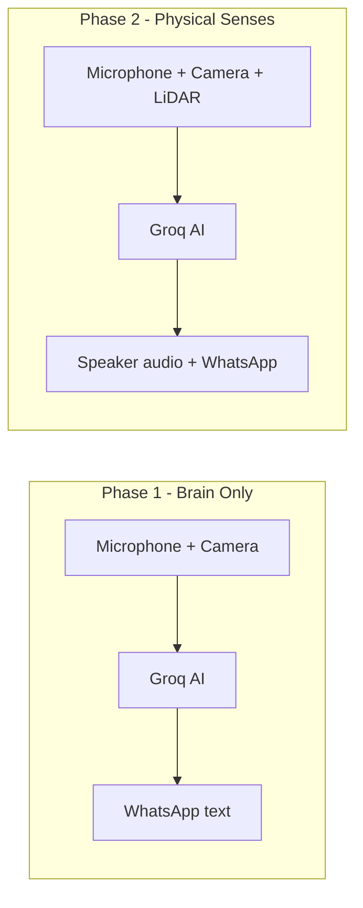
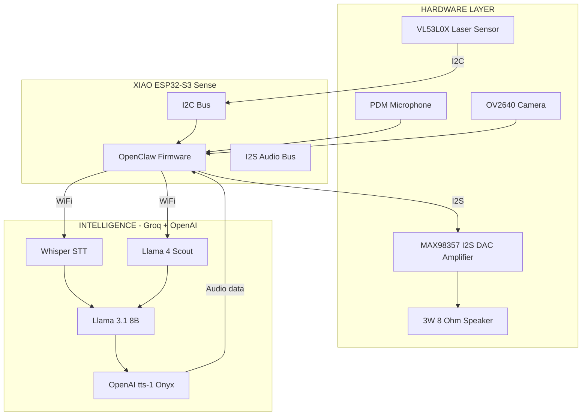
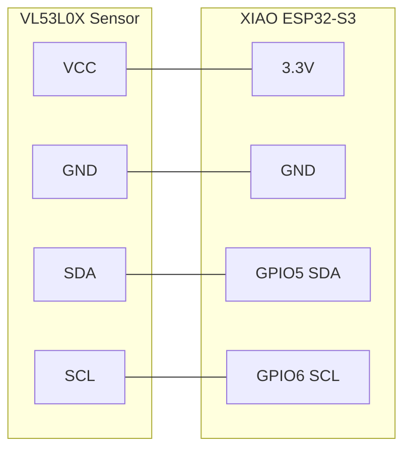
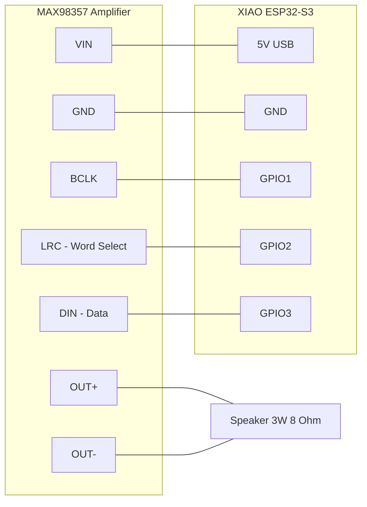
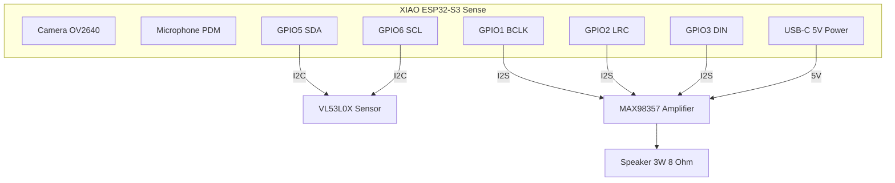

# Phase 2 — The Senses

> **LiDAR + Speaker + DAC**
> El robot te "oye" y "habla" fisicamente.

---

## Overview

Phase 2 gives TARS **physical senses**. After Phase 1, TARS could think and respond via WhatsApp — now it gains a **real voice** through speakers and **spatial awareness** through the VL53L0X laser sensor. TARS stops being a silent brain and becomes a robot that talks out loud and perceives the world around it.

**End result:** You speak → TARS listens through the microphone → thinks via Groq → responds OUT LOUD through the speaker + sends distance/proximity alerts.

---

## What Changes from Phase 1



| Capability | Phase 1 | Phase 2 |
|------------|---------|---------|
| Hears you | Via PDM microphone | Same microphone |
| Thinks | Groq Llama 3.1 | Same Groq |
| Responds | WhatsApp text only | **Physical speaker + WhatsApp** |
| Sees | Camera to Groq Vision | Same camera |
| Senses distance | No | **VL53L0X laser (0-4m)** |
| Detects approach | No | **Triggers greeting when someone nears** |

---

## Architecture



---

## New Components (Phase 2)

| # | Component | Price | Function |
|---|-----------|-------|----------|
| 1 | VL53L0X / VL53L1X Laser Range Sensor | €11.99 | Distance and obstacle detection |
| 2 | MAX98357 I2S DAC Amplifier 3W | €9.99 | Digital audio to amplified speaker signal |
| 3 | Mini Speakers 3W 8 Ohm x4 (JST-PH2.0) | €8.99 | TARS physical voice output |
| | **Phase 2 additions** | **€30.97** | |
| | **Cumulative total (Phase 1 + 2)** | **€94.85** | |

> **Note:** Phase 2 still uses USB power from Phase 1. Battery comes in Phase 3.

---

## VL53L0X / VL53L1X — Distance Sensor (LiDAR)

### What Is It?

A **Time of Flight (ToF)** laser sensor that measures distance with millimetric precision by timing how long a laser pulse takes to bounce back.

### Specifications

| Spec | VL53L0X | VL53L1X |
|------|---------|---------|
| Range | Up to ~2 meters | Up to ~4 meters |
| Interface | I2C | I2C |
| Accuracy | +/- 3% | +/- 3% |
| Speed | Up to 50Hz | Up to 50Hz |
| I2C Address | 0x29 | 0x29 |
| Voltage | 2.6V - 5.5V | 2.6V - 5.5V |

### What Does It Do in TARS?

- **Obstacle detection:** TARS knows if something is in front of it
- **Proximity greeting:** Detects when someone approaches and triggers a sarcastic greeting
- **Environment awareness:** Sends distance data to Groq for contextual responses
- **Safety:** Prevents TARS from walking into walls (Phase 3+)

### Wiring to ESP32-S3



| VL53L0X Pin | ESP32-S3 Pin | Wire Color (suggested) |
|-------------|-------------|----------------------|
| VCC | 3.3V | Red |
| GND | GND | Black |
| SDA | GPIO5 | Blue |
| SCL | GPIO6 | Yellow |

### Arduino Code — Distance Reading

```cpp
#include <Wire.h>
#include <VL53L0X.h>

VL53L0X sensor;

void setup() {
    Serial.begin(115200);
    Wire.begin(5, 6);  // SDA=GPIO5, SCL=GPIO6
    
    sensor.init();
    sensor.setTimeout(500);
    sensor.startContinuous();
}

void loop() {
    int distance_mm = sensor.readRangeContinuousMillimeters();
    
    if (distance_mm < 500) {
        // Someone is close! Trigger TARS greeting
        triggerGreeting(distance_mm);
    }
    
    Serial.print("Distance: ");
    Serial.print(distance_mm);
    Serial.println(" mm");
    
    delay(100);
}

void triggerGreeting(int distance) {
    // Send to OpenClaw -> Groq -> "A human at 30cm. Fascinating."
    String payload = "{\"event\":\"proximity\",\"distance_mm\":" + String(distance) + "}";
    sendToOpenClaw(payload);
}
```

---

## MAX98357 — I2S DAC Amplifier

### What Is It?

A **Class D digital audio amplifier** that takes I2S digital audio directly from the ESP32 and outputs amplified analog signal to a speaker. No separate DAC needed — it's all in one chip.

### Specifications

| Spec | Value |
|------|-------|
| Output Power | 3.2W at 4 Ohm, 1.8W at 8 Ohm |
| Input | I2S digital audio |
| Voltage | 2.5V - 5.5V |
| THD+N | 0.015% at 1kHz |
| Sample Rate | Up to 96kHz |
| No external components needed | Built-in clock recovery |

### Wiring to ESP32-S3



| MAX98357 Pin | ESP32-S3 Pin | Function |
|-------------|-------------|----------|
| VIN | 5V (USB) | Power (5V from USB in Phase 2) |
| GND | GND | Ground |
| BCLK | GPIO1 | I2S Bit Clock |
| LRC | GPIO2 | I2S Word Select (Left/Right Clock) |
| DIN | GPIO3 | I2S Data Input |
| OUT+ | Speaker + | Amplified audio positive |
| OUT- | Speaker - | Amplified audio negative |

> **Phase 2 Note:** Power comes from USB 5V. In Phase 3, the DC-DC Step-Up will provide 5V from battery.

### Arduino Code — Play Audio

```cpp
#include <driver/i2s.h>

#define I2S_BCLK  1
#define I2S_LRC   2
#define I2S_DOUT  3

void setupI2S() {
    i2s_config_t config = {
        .mode = (i2s_mode_t)(I2S_MODE_MASTER | I2S_MODE_TX),
        .sample_rate = 16000,
        .bits_per_sample = I2S_BITS_PER_SAMPLE_16BIT,
        .channel_format = I2S_CHANNEL_FMT_ONLY_LEFT,
        .communication_format = I2S_COMM_FORMAT_STAND_I2S,
        .intr_alloc_flags = ESP_INTR_FLAG_LEVEL1,
        .dma_buf_count = 8,
        .dma_buf_len = 1024,
        .use_apll = false
    };

    i2s_pin_config_t pins = {
        .bck_io_num = I2S_BCLK,
        .ws_io_num = I2S_LRC,
        .data_out_num = I2S_DOUT,
        .data_in_num = I2S_PIN_NO_CHANGE
    };

    i2s_driver_install(I2S_NUM_0, &config, 0, NULL);
    i2s_set_pin(I2S_NUM_0, &pins);
}

void playAudioBuffer(uint8_t* buffer, size_t length) {
    size_t bytes_written;
    i2s_write(I2S_NUM_0, buffer, length, &bytes_written, portMAX_DELAY);
}
```

---

## Speakers — 3W 8 Ohm

### Placement in TARS

TARS is a rectangular monolith. The speakers mount **inside the body panels** (Phase 4), but in Phase 2 they sit exposed on the breadboard.

| Spec | Value |
|------|-------|
| Power | 3W |
| Impedance | 8 Ohm |
| Connector | JST-PH2.0 |
| Quantity | 4 included (use 1-2 in Phase 2) |

> **Phase 2:** Use 1 speaker connected to the MAX98357. The other 3 are spares for Phase 4's multi-speaker setup.

---

## Complete Phase 2 Wiring



---

## Updated Interaction Flow (Phase 2)


---

## Step-by-Step Build Guide

### Step 1: Test VL53L0X Independently

1. Wire VL53L0X to XIAO (I2C: SDA=GPIO5, SCL=GPIO6)
2. Upload the distance reading sketch
3. Open Serial Monitor at 115200 baud
4. Move your hand in front of the sensor
5. Verify readings: 0-2000mm for VL53L0X, 0-4000mm for VL53L1X

### Step 2: Test MAX98357 + Speaker Independently

1. Wire MAX98357 to XIAO (I2S: BCLK=GPIO1, LRC=GPIO2, DIN=GPIO3)
2. Power MAX98357 from USB 5V
3. Solder speaker wires to MAX98357 OUT+/OUT-
4. Upload a tone generation sketch
5. Verify you hear a test tone from the speaker

### Step 3: Test Audio Playback from OpenAI TTS

1. Generate a test audio file via OpenAI TTS API:
   ```bash
   curl https://api.openai.com/v1/audio/speech \
     -H "Authorization: Bearer sk-YOUR_KEY" \
     -H "Content-Type: application/json" \
     -d '{"model":"tts-1","input":"I am TARS. Humor setting 75 percent.","voice":"onyx"}' \
     --output tars_test.mp3
   ```
2. Convert to WAV format compatible with ESP32:
   ```bash
   ffmpeg -i tars_test.mp3 -ar 16000 -ac 1 -f wav tars_test.wav
   ```
3. Stream audio data through I2S to speaker
4. Verify TARS's voice comes through clearly

### Step 4: Integrate Everything

1. Connect VL53L0X AND MAX98357+Speaker simultaneously
2. Verify I2C (sensor) and I2S (audio) don't conflict
3. Test: approach sensor → triggers Groq → response plays on speaker
4. Flash updated OpenClaw firmware with audio output enabled

### Step 5: Update config.json

Add audio output configuration:

```json
{
  "audio_output": {
    "enabled": true,
    "i2s_bclk": 1,
    "i2s_lrc": 2,
    "i2s_dout": 3,
    "sample_rate": 16000,
    "volume": 80
  },
  "lidar": {
    "enabled": true,
    "i2c_sda": 5,
    "i2c_scl": 6,
    "proximity_threshold_mm": 500,
    "trigger_greeting": true
  }
}
```

---

## Phase 2 Checklist

### Hardware
- [ ] VL53L0X sensor purchased and received
- [ ] MAX98357 amplifier purchased and received
- [ ] Speakers (3W 8 Ohm) purchased and received
- [ ] VL53L0X wired to I2C (GPIO5 SDA, GPIO6 SCL)
- [ ] MAX98357 wired to I2S (GPIO1, GPIO2, GPIO3)
- [ ] Speaker soldered to MAX98357 output
- [ ] All components on breadboard

### Software
- [ ] VL53L0X library installed (Pololu VL53L0X)
- [ ] I2S audio driver configured
- [ ] Distance readings verified in Serial Monitor
- [ ] Test tone plays through speaker
- [ ] OpenAI TTS audio plays through speaker

### Integration
- [ ] Proximity detection triggers Groq response
- [ ] Groq response plays as audio through speaker
- [ ] WhatsApp still works alongside speaker
- [ ] Camera vision still functional
- [ ] No I2C/I2S bus conflicts

---

## Troubleshooting

| Problem | Solution |
|---------|----------|
| VL53L0X reads 65535 | Sensor not detected. Check I2C wiring. Run I2C scanner sketch. |
| No sound from speaker | Check MAX98357 VIN is 5V. Verify I2S pin assignments. Check speaker polarity. |
| Crackling audio | Add 100uF capacitor across MAX98357 VIN and GND. Check solder joints. |
| I2C bus hangs | Add 4.7K pull-up resistors on SDA and SCL lines. |
| Sensor + audio conflict | They use different buses (I2C vs I2S). Check for shared GPIO pin conflicts. |
| Audio too quiet | Increase volume in config.json. Use 4 Ohm speaker for more power (3.2W vs 1.8W). |

---

## I2C Address Map

| Device | I2C Address | Bus |
|--------|-------------|-----|
| VL53L0X | 0x29 | I2C (GPIO5/GPIO6) |
| OLED Display (Phase 4) | 0x3C | I2C (same bus, no conflict) |

> Both devices can share the same I2C bus without issues.

---

## What Phase 2 Adds vs Phase 1

| New Capability | Description |
|---------------|-------------|
| Physical voice | TARS speaks through a real speaker |
| Distance sensing | Laser measurement 0-4 meters |
| Proximity detection | Automatic greeting when approached |
| Richer sensor data | Distance data sent to Groq for context |
| Audio + text output | Speaker AND WhatsApp simultaneously |

---

## What Phase 2 Still Cannot Do

| Limitation | Solved in |
|------------|-----------|
| No movement | Phase 3 |
| No portable power (USB only) | Phase 3 |
| No physical body | Phase 4 |
| No OLED display | Phase 4 |
| Wires exposed on breadboard | Phase 4 |

---

## Cost Summary

| Category | Cost |
|----------|------|
| **Phase 2 hardware** | **€30.97** |
| VL53L0X Sensor | €11.99 |
| MAX98357 Amplifier | €9.99 |
| Speakers 3W 8 Ohm x4 | €8.99 |
| **Cumulative hardware (P1+P2)** | **€94.85** |
| **Monthly services (unchanged)** | **~€2-4** |

---

> *"Everybody good? Plenty of slaves for my robot colony?"* — TARS
