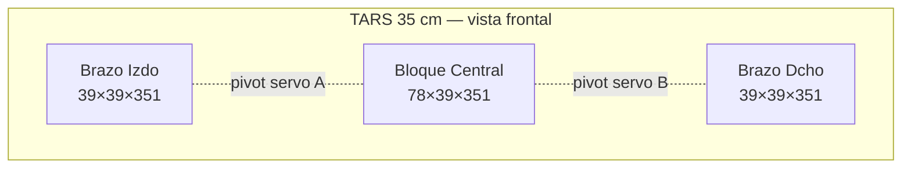
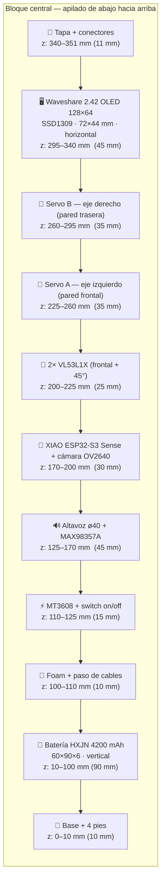
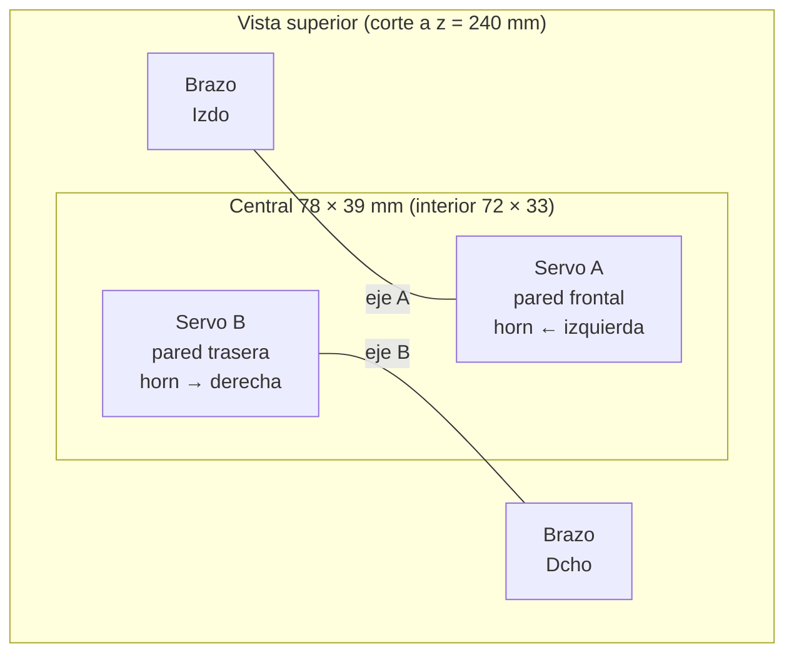
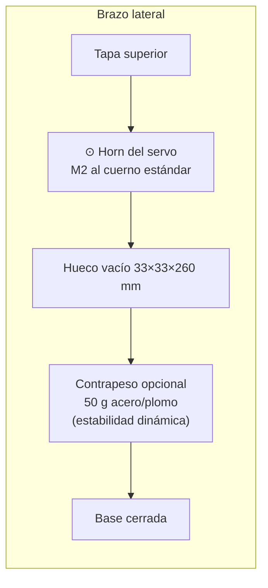
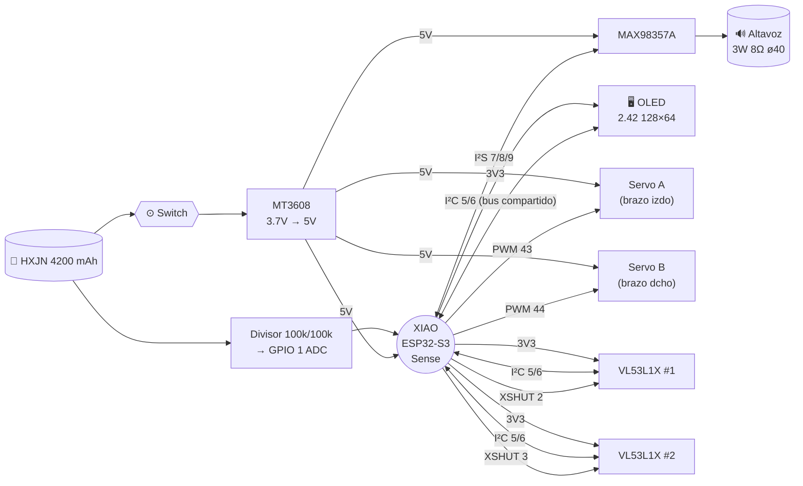

# TARS — Mecánica Fase 3

> Diseño mecánico del chasis impreso para **Bambu Lab X1 / P1S** en PETG.  
> Proporciones canónicas TARS (9 u alto · 4 u ancho · 1 u fondo) respetando todos los componentes reales adquiridos.

---

## 🧱 Componentes y dimensiones reales

| Componente                      | Dimensiones (mm)        | Nota                              |
| ------------------------------- | ----------------------- | --------------------------------- |
| XIAO ESP32-S3 Sense             | 21 × 17,5 × 5 + ø8 lente| mic PDM + cámara OV2640 on-board  |
| Batería HXJN 4200 mAh 606090    | 60 × 90 × 6             | 3,7 V · BMS · 4 A pico            |
| MT3608 step-up                  | 36 × 17 × 9             | 3,7 → 5 V · η ≈ 90 %              |
| MAX98357A (amp I²S)             | 21 × 17 × 3             |                                   |
| Altavoz 3 W 8 Ω ø40 mm          | ø40 × 5                 | caja acústica integrada           |
| 2× VL53L1X (ToF)                | 13 × 18 × 3 c/u         | I²C + XSHUT independiente         |
| 2× EMAX ES08MD (servo)          | 32 × 12 × 29 c/u        | incluye flanges y corona          |
| **Waveshare 2.42" OLED 128×64** | **72 × 44 × 10**        | SSD1309 · I²C (0x3C) o SPI        |

La pieza que manda el **ancho interior** del central es la **OLED 2.42"** (72 mm). La pieza que manda el **fondo** es el **altavoz ø40**.

---

## 📐 Dimensiones finales (driver: OLED 2.42")

| Magnitud          | Valor        |
| ----------------- | ------------ |
| **Altura total**  | **351 mm**   |
| **Ancho total**   | **156 mm**   |
| **Fondo**         | **39 mm**    |
| Unidad modular    | 39 mm        |
| Ancho central     | 78 mm (2 u)  |
| Ancho brazo       | 39 mm (1 u)  |
| Peso estimado     | ~535 g       |

> Una OLED horizontal de 72 mm no entra en un central de 68 mm. Ensanchando la unidad a **39 mm** (68 → 78 mm central) encaja con 3 mm de pared y 3 mm de holgura. Altura sube de 306 → 351 mm (canónico 9 u mantenido).

---

## 🧩 Arquitectura modular (4 piezas impresas)



---

## 🔩 Vista frontal — apilamiento vertical del central

Interior útil del central: **72 × 33 × 333 mm**.



> La OLED queda en la parte superior del central, igual que las "pantallas" canónicas de TARS en la película.

---

## 📊 Tabla detallada — alojamiento vertical (z, mm)

| z inicio | z fin | Alto | Componente                      | Dimensiones       | Fijación                    |
| -------: | ----: | ---: | ------------------------------- | ----------------- | --------------------------- |
|        0 |    10 |   10 | Base + 4 pies                   | pared 3 mm        | integrada                   |
|       10 |   100 |   90 | **Batería HXJN**                | 60 × 90 × 6       | foam 1,5 mm + velcro dorso  |
|      100 |   110 |   10 | Foam + paso cables              | —                 | —                           |
|      110 |   125 |   15 | **MT3608** step-up + switch     | 36 × 17 × 9       | tornillos M2                |
|      125 |   170 |   45 | **Altavoz ø40** + MAX98357A     | ø40 × 5 + 21×17×3 | caja acústica interna       |
|      170 |   200 |   30 | **XIAO ESP32-S3 Sense**         | 21 × 17,5 × 5 + ø8| tornillos M1.6              |
|      200 |   225 |   25 | 2× **VL53L1X** ToF              | 13 × 18 × 3 c/u   | tornillos M2                |
|      225 |   260 |   35 | **Servo A** (eje izdo — frontal)| 32 × 12 × 29      | tornillos M2 chasis         |
|      260 |   295 |   35 | **Servo B** (eje dcho — trasero)| 32 × 12 × 29      | tornillos M2 chasis         |
|      295 |   340 |   45 | **OLED Waveshare 2.42" 128×64** | 72 × 44 × 10      | tornillos M2 + ventana PMMA |
|      340 |   351 |   11 | Tapa + conectores USB-C externo | —                 | encaje por presión + imanes |

---

## 🔭 Vista superior — escalonado de servos

Los servos se alternan en fondo (uno pegado a la pared frontal, otro a la trasera) para evitar colisión en el eje horizontal.



---

## 🦴 Brazos laterales (39 × 39 × 351 mm · interior 33 × 33 × 341 mm)



**Recorrido angular:** ES08MD físico 180°, limitado por software a **0°–120°** → oscilación ±60°.  
**Gap pivot brazo↔central:** 2 mm.

---

## 🖥️ OLED Waveshare 2.42" — integración

### Especificaciones

| Parámetro        | Valor               |
| ---------------- | ------------------- |
| Controlador      | **SSD1309**         |
| Resolución       | 128 × 64            |
| Área activa      | 55,01 × 27,49 mm    |
| Interfaz         | I²C (0x3C) / SPI    |
| Alimentación     | 3,3 V (tolera 5 V)  |
| Consumo típico   | ~20 mA              |
| Color            | amarillo monocromo  |

### Conexión — modo I²C (recomendado, compartido con ToF)

| Pin OLED | GPIO XIAO | Notas                       |
| -------- | --------- | --------------------------- |
| VCC      | 3V3       | 3,3 V                       |
| GND      | GND       |                             |
| SCL      | GPIO 6    | **compartido con VL53L1X**  |
| SDA      | GPIO 5    | **compartido con VL53L1X**  |

**Sin conflicto de direcciones**: OLED 0x3C · ToF #1 0x30 · ToF #2 0x31 (reasignados desde 0x29 en boot via XSHUT).

### Rol visual

| Línea | Contenido                                     |
| ----- | --------------------------------------------- |
| 1     | Modo (LISTEN · THINK · SPEAK · LOOK · SLEEP)  |
| 2     | Mood actual (snarky, curious, tired, ...)     |
| 3–5   | Última frase reconocida / transcribiendo      |
| 6     | Batería %  +  temperatura chip                |
| 7     | Estado WiFi + latencia Groq (ms)              |
| 8     | Animación ASCII "pensando" / barras VU mic    |

### Librería Arduino

`U8g2` — modo `U8G2_SSD1309_128X64_NONAME0_F_HW_I2C`. Soporta fuentes, animaciones y doble buffer.

---

## 🔊 Altavoz ø40 — caja acústica integrada

La mitad frontal del central imprime una **caja sellada de ~25 cm³** detrás del altavoz:

- Ventana frontal: rejilla hexagonal 35 × 35 mm (parametrizada en el STL)
- Sellado: junta de foam 1 mm alrededor del altavoz
- Volumen interno ≥ 25 cm³ (necesario para no saturar agudos en 3 W 8 Ω)
- Paredes: 3 perímetros + 40 % infill giroide → rigidez acústica

Respuesta utilizable ~250 Hz – 15 kHz → voz TTS clara sin distorsión perceptible.

---

## 🧵 Diagrama de cableado completo



---

## ⚙️ Pinout XIAO ESP32-S3 Sense

| GPIO        | Función                        | Componente              |
| ----------- | ------------------------------ | ----------------------- |
| 1 (A0)      | ADC battery monitor            | Divisor resistivo       |
| 2           | XSHUT                          | VL53L1X #1              |
| 3           | XSHUT                          | VL53L1X #2              |
| 5           | **I²C SDA (bus compartido)**   | OLED + 2× ToF           |
| 6           | **I²C SCL (bus compartido)**   | OLED + 2× ToF           |
| 7           | I²S BCLK                       | MAX98357A               |
| 8           | I²S LRC / WS                   | MAX98357A               |
| 9           | I²S DIN                        | MAX98357A               |
| 41          | PDM CLK (interno)              | Mic on-board            |
| 42          | PDM DATA (interno)             | Mic on-board            |
| 43          | PWM servo                      | Servo A (brazo izdo)    |
| 44          | PWM servo                      | Servo B (brazo dcho)    |

**Direcciones I²C:**

| Componente  | Dirección | Asignación                              |
| ----------- | --------: | --------------------------------------- |
| OLED 2.42"  |    `0x3C` | fija (SSD1309 default)                  |
| VL53L1X #1  |    `0x30` | reasignada en boot (XSHUT #2 en LOW)    |
| VL53L1X #2  |    `0x31` | reasignada en boot (XSHUT #1 en LOW)    |

---

## ⚖️ Peso y balance

| Componente                           | Peso (g) |
| ------------------------------------ | -------: |
| Carcasa PETG (4 piezas, 40 % infill) |      220 |
| Batería HXJN 4200 mAh                |       84 |
| 2× servos EMAX ES08MD                |       32 |
| Altavoz ø40 + MAX98357               |       28 |
| OLED Waveshare 2.42"                 |       30 |
| XIAO + 2× VL53L1X + MT3608           |       15 |
| Tornillería + cables + foam          |       25 |
| Contrapesos brazos (2× 50 g opcion.) |      100 |
| **Total**                            |  **534** |

Centro de masas ~100 mm del suelo (batería abajo) → estable pese a la altura.

---

## 🔋 Autonomía recalculada (con OLED)

OLED añade ~20 mA. Sobre 3360 mAh útiles (DoD 80 %):

| Escenario                | Consumo @3.7V | Autonomía   |
| ------------------------ | ------------: | ----------- |
| Idle sin pantalla        |       ~80 mA  | ~42 h       |
| Idle con OLED            |      ~100 mA  | ~33 h       |
| Conversación + OLED      |      ~200 mA  | ~17 h       |
| Activo (servos + visión) |      ~320 mA  | ~10 h       |
| Intensivo                |      ~570 mA  | ~6 h        |
| Pico 2 servos + TTS      |      ~1,2 A   | transitorio |

**Uso realista asistente casero: 8–10 h**.

---

## 🖨️ Plan de impresión Bambu X1 / P1S

| Pieza                   | Dimensión (mm)  | Tiempo aprox. | Filamento |
| ----------------------- | --------------- | ------------: | --------: |
| Brazo izquierdo         | 39 × 39 × 351   |       ~5 h    |     55 g  |
| Brazo derecho           | 39 × 39 × 351   |       ~5 h    |     55 g  |
| Central — mitad frontal | 78 × 20 × 351   |       ~7 h    |     65 g  |
| Central — mitad trasera | 78 × 19 × 351   |       ~7 h    |     65 g  |
| Tapa superior           | 78 × 39 × 11    |       ~45 min |     12 g  |
| Base inferior           | 78 × 39 × 10    |       ~45 min |     12 g  |
| **TOTAL**               |                 | **~25 h**     | **264 g** |

> **Material:** PETG (térmicamente estable cerca del MT3608).  
> **Orientación:** vertical eje Z; el central va partido longitudinalmente en 2 mitades para instalar la electrónica antes de cerrar.  
> **Perímetros:** 3 · **Infill:** 35–40 % giroide · **Layer:** 0,2 mm · **Soportes:** solo en ventanas frontales.  
> **Color sugerido:** gris metálico + detalles naranja (TARS canónico).

---

## 🔩 Lista de tornillería

| Cantidad | Tornillo                | Uso                                        |
| -------: | ----------------------- | ------------------------------------------ |
|        8 | M2 × 8 mm               | Servos al chasis                           |
|        4 | M2 × 10 mm              | VL53L1X + MT3608                           |
|        4 | M2 × 8 mm               | OLED al marco frontal                      |
|        4 | M1.6 × 6 mm             | XIAO                                       |
|        2 | M2 × 12 mm              | Horn servo ↔ brazo lateral                 |
|        8 | M3 × 16 mm              | Unión mitades central + tapa + base        |
|        4 | Tuerca M3 empotrada     | Ensamblaje modular                         |
|        4 | Imán neodimio 5 × 2 mm  | Tapa superior desmontable (acceso USB-C)   |

---

## 🪟 Ventanas / aberturas frontales (cara delantera central)

| Altura z (mm) | Abertura            | Dimensiones     | Acabado                    |
| ------------- | ------------------- | --------------- | -------------------------- |
| 125–170       | Rejilla altavoz     | 35 × 35 mm      | patrón hexagonal 3 mm      |
| 170–195       | Ventana cámara      | ø10 mm          | PMMA 1 mm transparente     |
| 200–215       | Ventanas ToF (×2)   | 6 × 10 mm c/u   | PMMA 1 mm transparente     |
| 295–340       | Ventana OLED        | 56 × 28 mm      | PMMA 1 mm tintado ámbar    |

---

## ✅ Checklist final de encaje

- [x] Batería 60 × 90 × 6 → hueco 63 × 95 × 15 (foam 1,5 mm cada lado) ✓
- [x] MT3608 36 × 17 × 9 → hueco 70 × 20 × 15 con espacio para switch ✓
- [x] Altavoz ø40 + caja acústica 25 cm³ → 45 mm altura ✓
- [x] XIAO + lente cámara ø8 → 30 mm altura · 17 mm fondo (33 disp.) ✓
- [x] 2× VL53L1X con XSHUT → ventanas independientes frontal/45° ✓
- [x] 2× servos ES08MD escalonados frontal/trasero (no colisión Z) ✓
- [x] OLED 2.42" 72 × 44 mm → hueco 72 × 44 + 3 mm marco ✓
- [x] Bus I²C compartido sin colisión: OLED 0x3C · ToF 0x30/0x31 ✓
- [x] Cableado enrutable por canal trasero 5 × 340 mm ✓
- [x] Brazos con hueco 33 × 33 × 341 mm + contrapeso opcional ✓
- [x] Recorrido angular ±60° libre de colisión ✓
- [x] Centro de masas bajo → no se vuelca ✓
- [x] Tapa superior con imanes → acceso USB-C para flashear ✓

---

## 📦 Resumen final

```
╔════════════════════════════════════════════════╗
║  TARS real — 35,1 cm alto                      ║
║  15,6 cm ancho · 3,9 cm fondo                  ║
║                                                ║
║  ✓ Batería 4200 mAh — autonomía 8–10 h         ║
║  ✓ Altavoz ø40 + amp I²S + caja acústica       ║
║  ✓ OLED 2.42" 128×64 — pantalla canónica       ║
║  ✓ 2× ToF VL53L1X — visión espacial            ║
║  ✓ 2× servos ES08MD — brazos oscilantes        ║
║  ✓ XIAO ESP32-S3 Sense — cerebro + cam + mic   ║
║                                                ║
║  Peso total ~534 g                             ║
║  Impresión Bambu ~25 h · 264 g PETG            ║
╚════════════════════════════════════════════════╝
```
