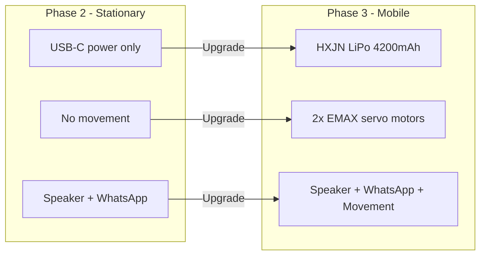
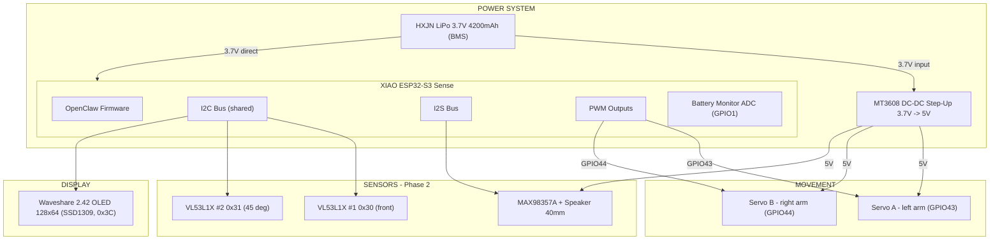
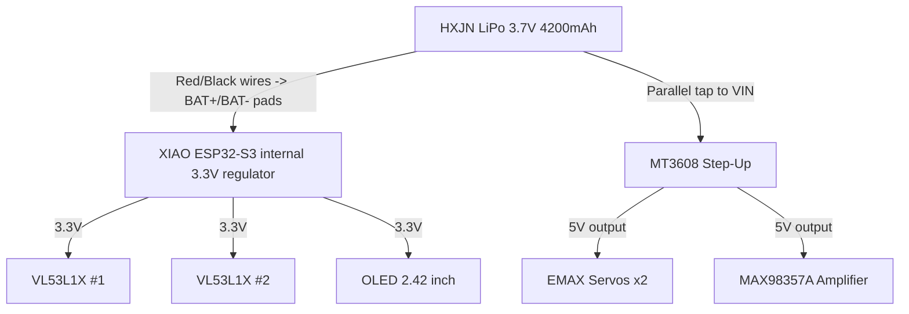
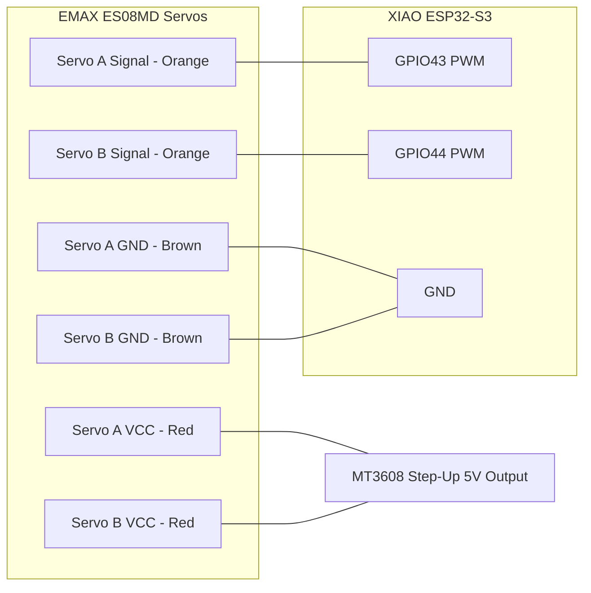
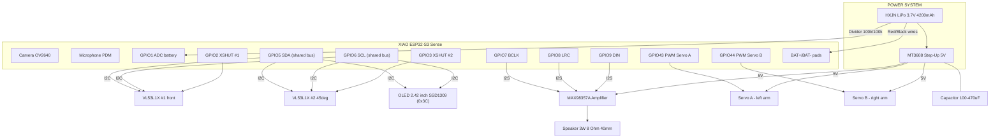
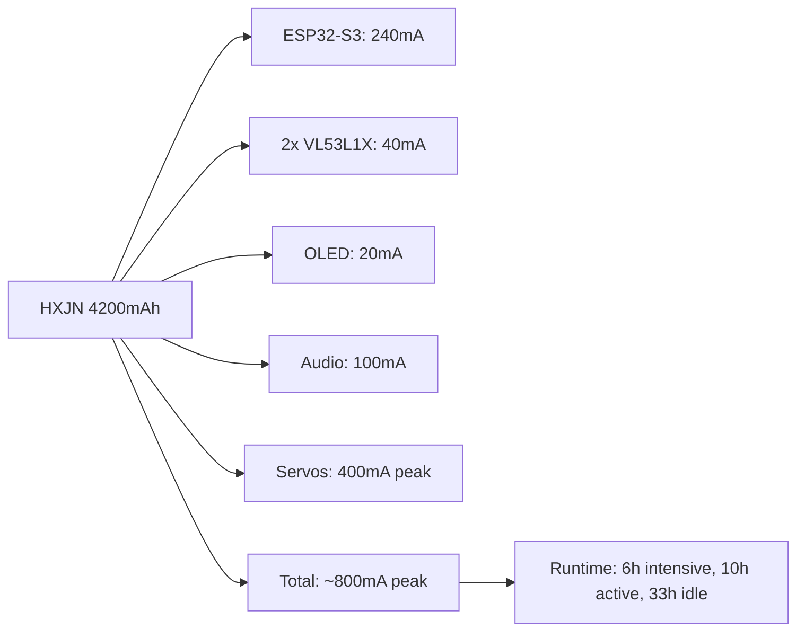

# Phase 3 — The Muscles

> **Battery + MT3608 Step-Up + Servos + OLED + Chassis PETG**
> Movimiento independiente, pantalla y carcasa final.

> 📐 **Mecanica detallada:** toda la geometría del chasis (351 mm x 156 mm x 39 mm, apilamiento vertical, ventanas, plan de impresión) esta en [PHASE3_MECHANICS.md](PHASE3_MECHANICS.md). Este documento cubre la parte electronica y de firmware.

---

## Overview

Phase 3 cuts the cord. TARS gains **independent power** via an HXJN LiPo 4200 mAh battery, **voltage regulation** through the MT3608 DC-DC Step-Up converter, **physical movement** with two EMAX ES08MD digital servos, a **2.42" OLED face** and its final **PETG chassis**. After this phase, TARS can move, gesture, display status, and run without being plugged into a computer.

**End result:** A robot that hears, thinks, speaks, senses distance, moves its panels, and runs on battery — all wirelessly.

---

## What Changes from Phase 2



| Capability | Phase 2 | Phase 3 |
|------------|---------|---------|
| Power source | USB-C cable | **HXJN LiPo 3.7V 4200mAh with BMS** |
| Voltage regulation | None needed | **MT3608 DC-DC Step-Up 3.7V -> 5V** |
| Movement | None | **2x EMAX ES08MD servos (PWM on GPIO 43/44)** |
| Display | None | **Waveshare 2.42" OLED 128x64 (I2C, same bus as ToF)** |
| Portable | No | **Yes, fully wireless** |
| Runtime | Unlimited (USB) | **~6h intensive, ~10h active, ~33h idle** |
| Gestures | None | **Arm oscillation +/-60 deg, scripted gesture library** |
| Enclosure | Breadboard | **PETG chassis 351x156x39 mm (see PHASE3_MECHANICS.md)** |

---

## Architecture



---

## New Components (Phase 3)

| # | Component | Price | Function |
|---|-----------|-------|----------|
| 1 | EMAX ES08MD Digital Servo x2 | €25.49 | Arm oscillation, gestures |
| 2 | MT3608 DC-DC Boost Step-Up (3.7V to 5V) | €7.99 | Voltage conversion for 5V devices |
| 3 | HXJN LiPo 3.7V 4200mAh 606090 (bare wires, BMS) | €22.99 | Portable power source |
| 4 | Waveshare 2.42" OLED 128x64 SSD1309 (I2C/SPI) | €21.99 | Canonical TARS face display |
| 5 | PETG filament (~264 g for full chassis) | €~6.00 | 3D-printed body |
| | **Phase 3 additions** | **~€84.46** | |
| | **Cumulative total (P1+P2+P3)** | **~€191.30** | |

---

## LiPo Battery — HXJN 3.7V 4200mAh 606090

### Specifications

| Spec | Value |
|------|-------|
| Voltage | 3.7V nominal (4.2V full, 3.0V cutoff) |
| Capacity | 4200 mAh |
| Dimensions | 60 x 90 x 6 mm |
| Weight | ~84 g |
| Wires | Bare cables (red + / black -), strip and tin |
| Protection | Integrated BMS (Seiko IC, 4A peak) |
| Chemistry | Lithium Polymer |
| Charging | Via external TP4056-style charger OR XIAO BAT+/BAT- pads with USB-C |

### How It Powers TARS



### Battery Life Estimation

| Component | Typical Current Draw |
|-----------|---------------------|
| ESP32-S3 (WiFi active) | ~240mA |
| 2x VL53L1X sensors | ~40mA (20mA each) |
| OLED 2.42" (active) | ~20mA |
| MAX98357A + speaker (playing) | ~100mA |
| Servos (moving) | ~200mA each |
| Servos (idle/holding) | ~10mA each |
| **Total (everything active)** | **~810mA** |
| **Total (idle, listening, no servos)** | **~100mA** |

| Mode | Estimated Runtime (4200 mAh, 80% DoD = 3360 mAh useful) |
|------|--------------------------------------------------------|
| Full intensive (all moving + speaking) | ~6 hours |
| Active (conversation + servos occasional) | ~10 hours |
| Idle (listening + OLED + WiFi, no servos) | ~33 hours |
| Deep sleep | ~days |

### Safety Rules

1. **NEVER** discharge below 3.0V — damages the battery permanently
2. **NEVER** short-circuit the battery — risk of fire
3. **NEVER** puncture, bend, or heat the battery
4. **ALWAYS** charge via the XIAO's USB-C port (built-in charge controller)
5. **Monitor** battery voltage via ADC pin on XIAO
6. **Store** at ~3.8V (50% charge) if not using for weeks

### Battery Monitoring Code

```cpp
#define BATTERY_PIN A0  // ADC pin connected to battery

float readBatteryVoltage() {
    int raw = analogRead(BATTERY_PIN);
    // XIAO ESP32-S3: 12-bit ADC, voltage divider factor
    float voltage = (raw / 4095.0) * 3.3 * 2.0;  // x2 for voltage divider
    return voltage;
}

int batteryPercentage(float voltage) {
    if (voltage >= 4.2) return 100;
    if (voltage <= 3.0) return 0;
    return (int)((voltage - 3.0) / 1.2 * 100);
}

void checkBattery() {
    float v = readBatteryVoltage();
    int pct = batteryPercentage(v);
    
    if (pct < 10) {
        // Critical! Warn user and reduce power
        sendWhatsApp("TARS battery critical: " + String(pct) + "%");
        disableServos();
    }
}
```

---

## MT3608 DC-DC Step-Up Converter

### Why Do We Need It?

The LiPo battery outputs **3.7V**, but the servos and the MAX98357A amplifier need **5V**. The MT3608 boosts the voltage.

### Specifications

| Spec | Value |
|------|-------|
| Model | MT3608 |
| Input Voltage | 2V - 24V |
| Output Voltage | 5V (adjustable via on-board potentiometer) |
| Max Current | ~2A continuous |
| Efficiency | ~90% |
| Dimensions | 36 x 17 x 9 mm |

### Wiring


| MT3608 Pin | Connection |
|------------|------------|
| VIN+ | Battery positive (3.7V, red wire) |
| VIN- / GND | Battery negative (black wire) |
| VOUT+ | 5V output to servos and amplifier |
| VOUT- / GND | Common ground with ESP32 |

> **CRITICAL:** Before connecting anything, use the multimeter to verify the output is exactly 5V. Adjust the potentiometer on the MT3608 until output reads **5.0V**.

### Setup Procedure

1. Connect battery red/black wires to MT3608 VIN+/VIN-
2. **Do NOT connect any load yet**
3. Use multimeter to measure VOUT
4. Adjust the tiny potentiometer until output reads **5.0V** (+/- 0.1V)
5. Mark the MT3608 module so you don't accidentally adjust it later
6. Connect servos and MAX98357A to VOUT
7. Verify voltage stays stable under load (connect one servo, measure again)

---

## EMAX ES08MD Servos

### Specifications

| Spec | Value |
|------|-------|
| Weight | 12g each |
| Torque | 2.4 kg/cm (at 6V) |
| Speed | 0.08s / 60 degrees |
| Voltage | 4.8V - 6.0V |
| Type | Digital, metal gears |
| Signal | PWM (standard servo protocol) |
| Rotation | 0 - 180 degrees |

### What Do They Move in TARS?

TARS from Interstellar is a rectangular monolith with **articulated arms** on either side that oscillate. Each servo drives one lateral arm, pivoting at the top of the central block.

| Servo | Function | Movement | PWM pin |
|-------|----------|----------|---------|
| Servo A | Left arm rotation | +/-60 deg oscillation | GPIO 43 |
| Servo B | Right arm rotation | +/-60 deg oscillation | GPIO 44 |

> Physical range of ES08MD is 0-180 deg; software-limited to **30-150 deg** so arms swing +/-60 deg around the 90 deg neutral.

**Gesture examples:**

| Gesture | Servo 1 | Servo 2 | When |
|---------|---------|---------|------|
| Neutral | 90 deg | 90 deg | Default standing position |
| Greeting | 45 deg | 135 deg | Panels open when someone approaches |
| Thinking | 80 deg | 100 deg | Small movement while processing |
| Shrug | 60 deg then 90 deg | 120 deg then 90 deg | Quick open-close when sarcastic |
| Alert | 0 deg | 180 deg | Panels fully open for emphasis |
| Sleep | 90 deg | 90 deg | Panels closed, low power |

### Wiring



| Servo Wire | Connection |
|-----------|------------|
| Orange (Signal) Servo A | GPIO43 on ESP32 |
| Orange (Signal) Servo B | GPIO44 on ESP32 |
| Red (VCC) both | 5V from MT3608 |
| Brown (GND) both | Common GND with ESP32 |

### Power Warning

> **IMPORTANT:** Servos draw up to **400mA each** during rapid movement (current spikes up to 1A). NEVER power servos directly from the ESP32's 3.3V or 5V pin — it will cause resets or damage. Always use the Step-Up module.

> **Recommended:** Add a **100uF - 470uF electrolytic capacitor** across the 5V servo power line to absorb current spikes.

### Arduino Code — Servo Control

```cpp
#include <ESP32Servo.h>

Servo servo1;
Servo servo2;

#define SERVO1_PIN 43
#define SERVO2_PIN 44

void setup() {
    servo1.attach(SERVO1_PIN);
    servo2.attach(SERVO2_PIN);
    
    // Start at neutral position
    servo1.write(90);
    servo2.write(90);
}

// TARS gesture functions
void gesture_neutral() {
    servo1.write(90);
    servo2.write(90);
}

void gesture_greeting() {
    servo1.write(45);
    servo2.write(135);
    delay(1000);
    gesture_neutral();
}

void gesture_shrug() {
    servo1.write(60);
    servo2.write(120);
    delay(300);
    gesture_neutral();
}

void gesture_thinking() {
    for (int i = 85; i <= 95; i++) {
        servo1.write(i);
        servo2.write(180 - i);
        delay(50);
    }
    gesture_neutral();
}

void gesture_alert() {
    servo1.write(0);
    servo2.write(180);
    delay(2000);
    gesture_neutral();
}

// OpenClaw calls this with the gesture name from Groq
void executeGesture(String gesture) {
    if (gesture == "greeting") gesture_greeting();
    else if (gesture == "shrug") gesture_shrug();
    else if (gesture == "thinking") gesture_thinking();
    else if (gesture == "alert") gesture_alert();
    else gesture_neutral();
}
```

### Gesture Integration with Groq

Groq's Llama 3.1 response now includes a gesture tag:

```json
{
  "response": "Another human seeking wisdom from a rectangle. Fascinating.",
  "gesture": "shrug",
  "emotion": "amused_sarcasm"
}
```

Updated system prompt addition:
```
When responding, also choose a gesture from: neutral, greeting, shrug, thinking, alert.
Return your response as JSON with keys: response, gesture, emotion.
```

---

## Complete Phase 3 Wiring



### GPIO Pin Assignment (All Phases)

| GPIO | Function | Phase | Device |
|------|----------|-------|--------|
| GPIO1 (A0) | ADC Battery monitor | Phase 3 | Voltage divider 100k/100k |
| GPIO2 | XSHUT sensor #1 | Phase 2 | VL53L1X #1 |
| GPIO3 | XSHUT sensor #2 | Phase 2 | VL53L1X #2 |
| GPIO5 | I2C SDA (shared) | Phase 2/3 | VL53L1X x2 + OLED |
| GPIO6 | I2C SCL (shared) | Phase 2/3 | VL53L1X x2 + OLED |
| GPIO7 | I2S BCLK | Phase 2 | MAX98357A |
| GPIO8 | I2S LRC | Phase 2 | MAX98357A |
| GPIO9 | I2S DIN | Phase 2 | MAX98357A |
| GPIO41 | PDM Mic CLK | Phase 1 | PDM Mic (on-board) |
| GPIO42 | PDM Mic DATA | Phase 1 | PDM Mic (on-board) |
| GPIO43 | PWM Servo A | Phase 3 | EMAX ES08MD left arm |
| GPIO44 | PWM Servo B | Phase 3 | EMAX ES08MD right arm |
| Built-in | Camera | Phase 1 | OV2640 |

---

## Updated config.json for Phase 3

```json
{
  "servos": {
    "enabled": true,
    "servo_a_pin": 43,
    "servo_b_pin": 44,
    "neutral_angle": 90,
    "range_deg": 60,
    "gestures_enabled": true
  },
  "battery": {
    "monitor_enabled": true,
    "adc_pin": 1,
    "divider_ratio": 2.0,
    "low_threshold_percent": 15,
    "critical_threshold_percent": 5,
    "warn_via_whatsapp": true
  },
  "power": {
    "step_up_model": "MT3608",
    "step_up_voltage": 5.0,
    "servo_power_save": true,
    "auto_sleep_minutes": 30
  },
  "display": {
    "driver": "SSD1309",
    "i2c_address": "0x3C",
    "resolution": "128x64",
    "library": "U8G2_SSD1309_128X64_NONAME0_F_HW_I2C"
  }
}
```

---

## Step-by-Step Build Guide

### Step 1: Set Up the MT3608 Step-Up Converter

1. Connect LiPo battery red/black wires to MT3608 VIN+/VIN-
2. **Do NOT connect any load yet**
3. Use multimeter to measure VOUT
4. Adjust potentiometer until output reads **5.0V** (+/- 0.1V)
5. Mark the MT3608 module so you don't accidentally adjust it later

### Step 2: Test Servos Independently

1. Connect ONE servo to MT3608 5V output
2. Connect servo signal wire to GPIO43
3. Upload servo test sketch (sweep 30-150 deg)
4. Verify smooth movement without ESP32 resets
5. Repeat with second servo on GPIO44
6. Test both servos simultaneously

### Step 3: Add Capacitor

1. Solder a **100uF-470uF electrolytic capacitor** across the 5V line
   - **Positive (longer leg)** to 5V
   - **Negative (marked stripe)** to GND
2. This absorbs servo current spikes and prevents brownouts
3. Verify voltage stability: move both servos rapidly while monitoring with multimeter

### Step 4: Battery Power Test

1. Disconnect USB-C
2. Connect HXJN LiPo red/black wires to XIAO BAT+/BAT- pads (check polarity!)
3. Verify XIAO boots and connects to WiFi
4. Verify both VL53L1X sensors read distances
5. Verify OLED shows status screen
6. Verify speaker plays audio
7. Verify servos move
8. Check battery voltage via ADC — should read ~3.7-4.2V

### Step 5: Integrated Test

1. All components on battery power (no USB)
2. Approach TARS → VL53L1X detects → Groq responds → speaker plays → servos gesture → OLED updates
3. Monitor battery voltage over time
4. Test WhatsApp messages still work
5. Test bilingual responses with gestures

### Step 6: Power Management

1. Configure auto-sleep in config.json
2. Test low battery warning via WhatsApp
3. Test servo disable at critical battery level
4. Verify charging works (plug USB-C while battery is connected)

---

## Phase 3 Checklist

### Hardware
- [ ] EMAX ES08MD servos x2 purchased and received
- [ ] MT3608 Step-Up module purchased and received
- [ ] HXJN 4200mAh 606090 LiPo battery (with BMS, bare wires) purchased and received
- [ ] Waveshare 2.42" OLED 128x64 purchased and received
- [ ] MT3608 output calibrated to 5.0V with multimeter
- [ ] Capacitor (100-470uF) soldered on 5V line
- [ ] Servos wired to GPIO43 and GPIO44
- [ ] Servos powered from MT3608 5V
- [ ] Battery wires soldered to XIAO BAT+/BAT- pads (or external TP4056 charger)
- [ ] OLED wired to shared I2C bus (GPIO5/GPIO6)
- [ ] All Phase 2 components still connected

### Software
- [ ] ESP32Servo library installed
- [ ] U8g2 library installed (OLED)
- [ ] Pololu VL53L1X library installed
- [ ] Servo test sketch works (sweep 30-150 deg)
- [ ] Gesture functions implemented
- [ ] OLED status screen renders
- [ ] Battery monitoring via ADC works
- [ ] Low battery WhatsApp warning works
- [ ] Auto-sleep configured

### Integration
- [ ] Runs on battery power without USB
- [ ] All sensors work on battery
- [ ] Speaker works on battery via MT3608
- [ ] Servos move smoothly on battery
- [ ] OLED updates synchronized with states
- [ ] No brownouts or resets during servo movement
- [ ] Groq responses include gesture commands
- [ ] Gestures execute synchronized with speech
- [ ] Battery lasts minimum 6 hours intensive use

---

## Troubleshooting

| Problem | Solution |
|---------|----------|
| ESP32 resets when servos move | Capacitor missing or too small. Add 470uF. Check MT3608 output under load. |
| MT3608 output not 5V | Adjust potentiometer with small screwdriver. Measure with multimeter. |
| Servo jitters at idle | Normal for cheap servos. Use servo.detach() when not moving to stop jitter. |
| Battery drains fast | Disable WiFi when not needed. Detach servos when idle. Use deep sleep. Turn off OLED. |
| Servo doesn't reach full range | Software-limited to 30-150 deg. Calibrate min/max pulse width in code if needed. |
| Battery won't charge | HXJN has bare wires; use an external TP4056 module or solder to XIAO BAT pads (with caution). |
| Servo makes grinding noise | Don't push past mechanical limits. Reduce angle range if hitting physical stops. |
| OLED blank | Check I2C address 0x3C with scanner. Ensure U8g2 uses `SSD1309_128X64_NONAME0`. |

---

## Power Consumption Summary



---

## What Phase 3 Adds

| New Capability | Description |
|---------------|-------------|
| Battery power | Runs 6-10h without USB cable |
| Servo movement | 2 articulated arms with gestures (+/-60 deg) |
| OLED face | Real-time status, mood, transcription, battery % |
| Gesture sync | Movements + display synchronized with speech |
| Power management | Battery monitoring, auto-sleep, low battery alerts |
| PETG chassis | Canonical TARS 35 cm body (see PHASE3_MECHANICS.md) |
| Portable | Can be placed anywhere with WiFi |

## What Phase 3 Still Cannot Do

| Limitation | Solved in |
|------------|-----------|
| Firmware not unified into a single `tars.ino` monolith | Phase 4 |
| No soldered final PCB (still on breadboard/proto) | Phase 4 |
| No paint/finishing on printed body | Phase 4 |

---

## Cost Summary

| Category | Cost |
|----------|------|
| **Phase 3 hardware** | **~€84.46** |
| EMAX ES08MD Servos x2 | €25.49 |
| MT3608 DC-DC Step-Up | €7.99 |
| HXJN LiPo 4200mAh 606090 | €22.99 |
| Waveshare 2.42" OLED 128x64 | €21.99 |
| PETG filament (~264 g) | €~6.00 |
| **Cumulative hardware (P1+P2+P3)** | **~€191.30** |
| **Monthly services (unchanged)** | **~€2-4** |

---

> *"I'm not going to lie to you. That's a 70% chance."* — TARS
