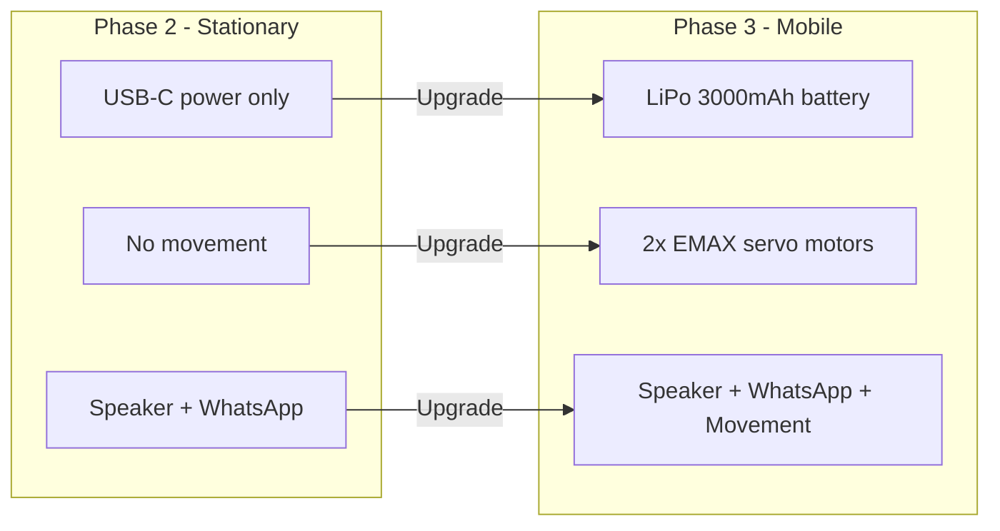
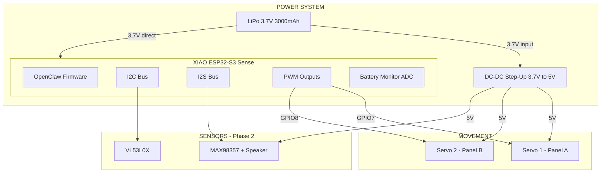
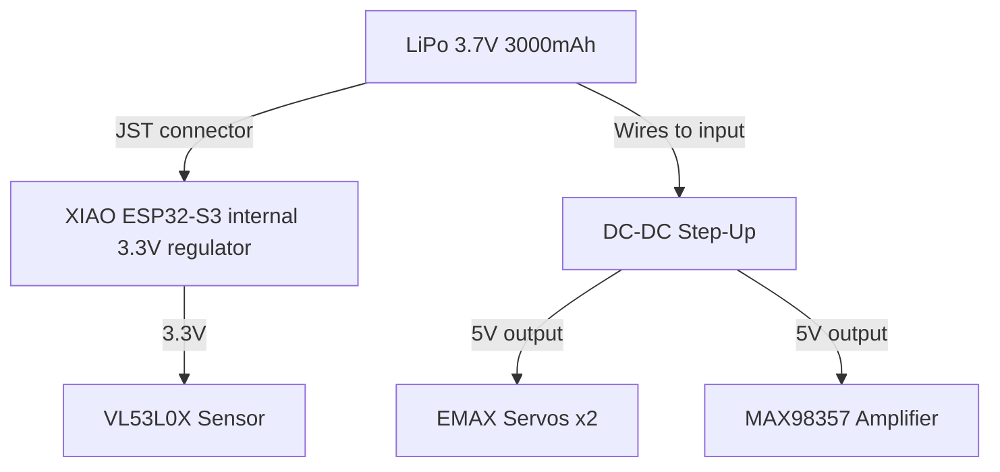
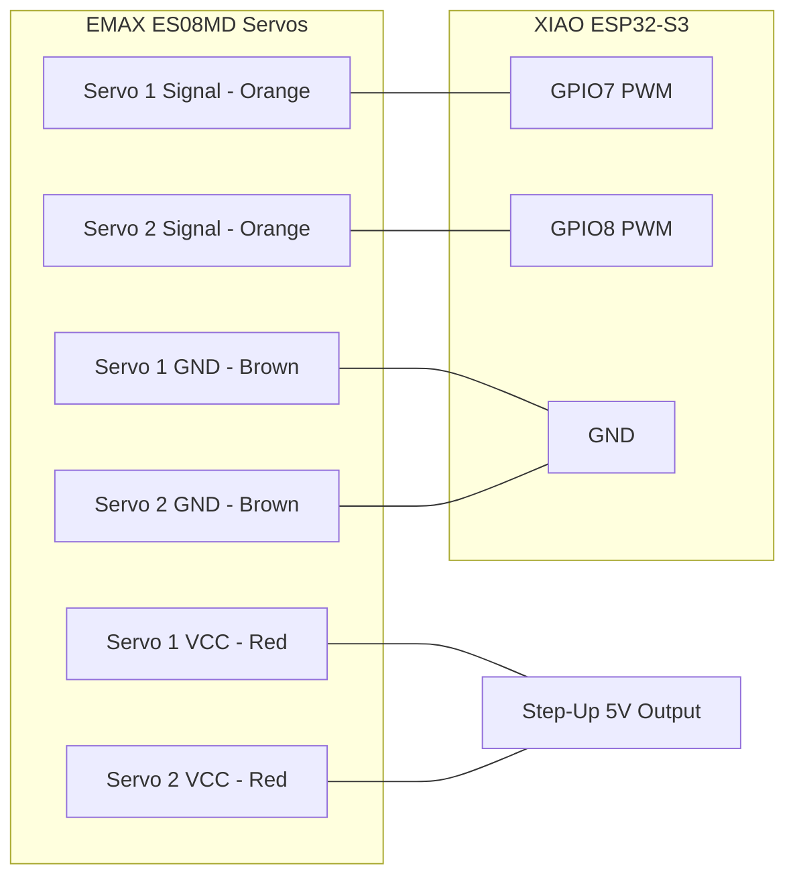
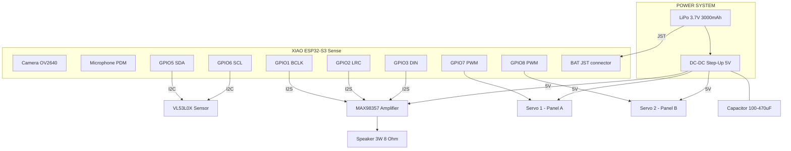
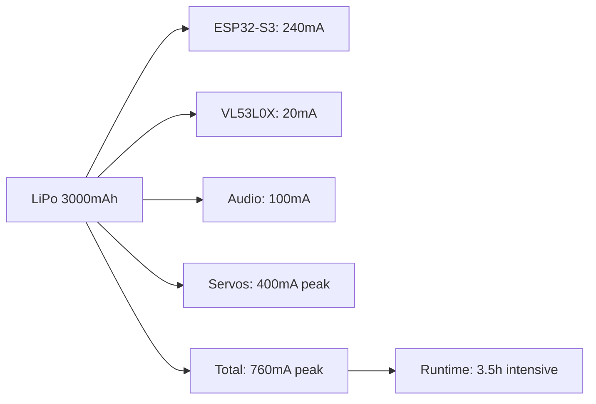

# Phase 3 — The Muscles

> **Battery + Step-Up + Servos**
> Movimiento independiente y equilibrio.

---

## Overview

Phase 3 cuts the cord. TARS gains **independent power** via a LiPo battery, **voltage regulation** through DC-DC Step-Up converters, and **physical movement** with digital servo motors. After this phase, TARS can move, gesture, and run without being plugged into a computer.

**End result:** A robot that hears, thinks, speaks, senses distance, moves its panels, and runs on battery — all wirelessly.

---

## What Changes from Phase 2



| Capability | Phase 2 | Phase 3 |
|------------|---------|---------|
| Power source | USB-C cable | **LiPo 3.7V 3000mAh battery** |
| Voltage regulation | None needed | **DC-DC Step-Up 3.7V to 5V** |
| Movement | None | **2x EMAX ES08MD servos** |
| Portable | No | **Yes, fully wireless** |
| Runtime | Unlimited (USB) | **~3.5h intensive, ~8-10h idle** |
| Gestures | None | **Panel rotation, head tilt, scanning** |

---

## Architecture



---

## New Components (Phase 3)

| # | Component | Price | Function |
|---|-----------|-------|----------|
| 1 | EMAX ES08MD Digital Servo x2 | €25.49 | Panel movement, gestures |
| 2 | DC-DC Boost Step-Up (3.7V to 5V/9V/12V) x10 | €7.99 | Voltage conversion for 5V devices |
| 3 | LiPo Battery 3.7V 3000mAh (JST PHR-02) | €13.19 | Portable power source |
| | **Phase 3 additions** | **€46.67** | |
| | **Cumulative total (P1+P2+P3)** | **€141.52** | |

---

## LiPo Battery — 3.7V 3000mAh

### Specifications

| Spec | Value |
|------|-------|
| Voltage | 3.7V nominal (4.2V full, 3.0V cutoff) |
| Capacity | 3000mAh |
| Connector | JST PHR-02 (compatible with XIAO) |
| Chemistry | Lithium Polymer |
| Charging | Via XIAO's built-in charging circuit (USB-C) |

### How It Powers TARS



### Battery Life Estimation

| Component | Typical Current Draw |
|-----------|---------------------|
| ESP32-S3 (WiFi active) | ~240mA |
| VL53L0X sensor | ~20mA |
| MAX98357 + speaker (playing) | ~100mA |
| Servos (moving) | ~200mA each |
| Servos (idle/holding) | ~10mA each |
| **Total (everything active)** | **~790mA** |
| **Total (idle, no servos)** | **~370mA** |

| Mode | Estimated Runtime |
|------|------------------|
| Full intensive (all moving + speaking) | ~3.5 hours |
| Normal use (occasional movement + voice) | ~5-6 hours |
| Idle (listening, WiFi, no servos) | ~8-10 hours |
| Deep sleep | ~days |

### Safety Rules

1. **NEVER** discharge below 3.0V — damages the battery permanently
2. **NEVER** short-circuit the battery — risk of fire
3. **NEVER** puncture, bend, or heat the battery
4. **ALWAYS** charge via the XIAO's USB-C port (built-in charge controller)
5. **Monitor** battery voltage via ADC pin on XIAO
6. **Store** at ~3.8V (50% charge) if not using for weeks

### Battery Monitoring Code

```cpp
#define BATTERY_PIN A0  // ADC pin connected to battery

float readBatteryVoltage() {
    int raw = analogRead(BATTERY_PIN);
    // XIAO ESP32-S3: 12-bit ADC, voltage divider factor
    float voltage = (raw / 4095.0) * 3.3 * 2.0;  // x2 for voltage divider
    return voltage;
}

int batteryPercentage(float voltage) {
    if (voltage >= 4.2) return 100;
    if (voltage <= 3.0) return 0;
    return (int)((voltage - 3.0) / 1.2 * 100);
}

void checkBattery() {
    float v = readBatteryVoltage();
    int pct = batteryPercentage(v);
    
    if (pct < 10) {
        // Critical! Warn user and reduce power
        sendWhatsApp("TARS battery critical: " + String(pct) + "%");
        disableServos();
    }
}
```

---

## DC-DC Step-Up Converter

### Why Do We Need It?

The LiPo battery outputs **3.7V**, but servos and the MAX98357 amplifier need **5V**. The Step-Up converter boosts the voltage.

### Specifications

| Spec | Value |
|------|-------|
| Input Voltage | 2V - 24V |
| Output Voltage | 5V / 9V / 12V (adjustable) |
| Max Current | ~2A |
| Efficiency | ~90% |
| Quantity | 10 modules included (use 1-2) |

### Wiring


| Step-Up Pin | Connection |
|------------|------------|
| VIN+ | Battery positive (3.7V) |
| VIN- / GND | Battery negative |
| VOUT+ | 5V output to servos and amplifier |
| VOUT- / GND | Common ground with ESP32 |

> **CRITICAL:** Before connecting anything, use the multimeter from the soldering kit to verify the output is exactly 5V. Adjust the potentiometer on the Step-Up module if needed.

### Setup Procedure

1. Connect battery to Step-Up VIN+/VIN-
2. **Before connecting any load**, measure VOUT with multimeter
3. Adjust the tiny potentiometer until output reads **5.0V**
4. Connect servos and MAX98357 to VOUT
5. Verify voltage stays stable under load (connect one servo, measure again)

---

## EMAX ES08MD Servos

### Specifications

| Spec | Value |
|------|-------|
| Weight | 12g each |
| Torque | 2.4 kg/cm (at 6V) |
| Speed | 0.08s / 60 degrees |
| Voltage | 4.8V - 6.0V |
| Type | Digital, metal gears |
| Signal | PWM (standard servo protocol) |
| Rotation | 0 - 180 degrees |

### What Do They Move in TARS?

TARS from Interstellar is a rectangular monolith with **articulated panels** that rotate and fold:

| Servo | Function | Movement |
|-------|----------|----------|
| Servo 1 (GPIO7) | Panel A rotation | Opens/closes left body panel |
| Servo 2 (GPIO8) | Panel B rotation | Opens/closes right body panel |

**Gesture examples:**

| Gesture | Servo 1 | Servo 2 | When |
|---------|---------|---------|------|
| Neutral | 90 deg | 90 deg | Default standing position |
| Greeting | 45 deg | 135 deg | Panels open when someone approaches |
| Thinking | 80 deg | 100 deg | Small movement while processing |
| Shrug | 60 deg then 90 deg | 120 deg then 90 deg | Quick open-close when sarcastic |
| Alert | 0 deg | 180 deg | Panels fully open for emphasis |
| Sleep | 90 deg | 90 deg | Panels closed, low power |

### Wiring



| Servo Wire | Connection |
|-----------|------------|
| Orange (Signal) Servo 1 | GPIO7 on ESP32 |
| Orange (Signal) Servo 2 | GPIO8 on ESP32 |
| Red (VCC) both | 5V from Step-Up |
| Brown (GND) both | Common GND with ESP32 |

### Power Warning

> **IMPORTANT:** Servos draw up to **400mA each** during rapid movement (current spikes up to 1A). NEVER power servos directly from the ESP32's 3.3V or 5V pin — it will cause resets or damage. Always use the Step-Up module.

> **Recommended:** Add a **100uF - 470uF electrolytic capacitor** across the 5V servo power line to absorb current spikes.

### Arduino Code — Servo Control

```cpp
#include <ESP32Servo.h>

Servo servo1;
Servo servo2;

#define SERVO1_PIN 7
#define SERVO2_PIN 8

void setup() {
    servo1.attach(SERVO1_PIN);
    servo2.attach(SERVO2_PIN);
    
    // Start at neutral position
    servo1.write(90);
    servo2.write(90);
}

// TARS gesture functions
void gesture_neutral() {
    servo1.write(90);
    servo2.write(90);
}

void gesture_greeting() {
    servo1.write(45);
    servo2.write(135);
    delay(1000);
    gesture_neutral();
}

void gesture_shrug() {
    servo1.write(60);
    servo2.write(120);
    delay(300);
    gesture_neutral();
}

void gesture_thinking() {
    for (int i = 85; i <= 95; i++) {
        servo1.write(i);
        servo2.write(180 - i);
        delay(50);
    }
    gesture_neutral();
}

void gesture_alert() {
    servo1.write(0);
    servo2.write(180);
    delay(2000);
    gesture_neutral();
}

// OpenClaw calls this with the gesture name from Groq
void executeGesture(String gesture) {
    if (gesture == "greeting") gesture_greeting();
    else if (gesture == "shrug") gesture_shrug();
    else if (gesture == "thinking") gesture_thinking();
    else if (gesture == "alert") gesture_alert();
    else gesture_neutral();
}
```

### Gesture Integration with Groq

Groq's Llama 3.1 response now includes a gesture tag:

```json
{
  "response": "Another human seeking wisdom from a rectangle. Fascinating.",
  "gesture": "shrug",
  "emotion": "amused_sarcasm"
}
```

Updated system prompt addition:
```
When responding, also choose a gesture from: neutral, greeting, shrug, thinking, alert.
Return your response as JSON with keys: response, gesture, emotion.
```

---

## Complete Phase 3 Wiring



### GPIO Pin Assignment (All Phases)

| GPIO | Function | Phase | Device |
|------|----------|-------|--------|
| GPIO1 | I2S BCLK | Phase 2 | MAX98357 |
| GPIO2 | I2S LRC | Phase 2 | MAX98357 |
| GPIO3 | I2S DIN | Phase 2 | MAX98357 |
| GPIO5 | I2C SDA | Phase 2 | VL53L0X |
| GPIO6 | I2C SCL | Phase 2 | VL53L0X |
| GPIO7 | PWM Servo 1 | Phase 3 | EMAX Servo |
| GPIO8 | PWM Servo 2 | Phase 3 | EMAX Servo |
| A0 | ADC Battery | Phase 3 | Battery monitor |
| Built-in | Camera | Phase 1 | OV2640 |
| Built-in | Microphone | Phase 1 | PDM Mic |

---

## Updated config.json for Phase 3

```json
{
  "servos": {
    "enabled": true,
    "servo1_pin": 7,
    "servo2_pin": 8,
    "neutral_angle": 90,
    "gestures_enabled": true
  },
  "battery": {
    "monitor_enabled": true,
    "adc_pin": "A0",
    "low_threshold_percent": 15,
    "critical_threshold_percent": 5,
    "warn_via_whatsapp": true
  },
  "power": {
    "step_up_voltage": 5.0,
    "servo_power_save": true,
    "auto_sleep_minutes": 30
  }
}
```

---

## Step-by-Step Build Guide

### Step 1: Set Up the Step-Up Converter

1. Connect LiPo battery to Step-Up VIN+/VIN-
2. **Do NOT connect any load yet**
3. Use multimeter to measure VOUT
4. Adjust potentiometer until output reads **5.0V** (+/- 0.1V)
5. Mark the Step-Up module so you don't accidentally adjust it later

### Step 2: Test Servos Independently

1. Connect ONE servo to Step-Up 5V output
2. Connect servo signal wire to GPIO7
3. Upload servo test sketch (sweep 0-180 degrees)
4. Verify smooth movement without ESP32 resets
5. Repeat with second servo on GPIO8
6. Test both servos simultaneously

### Step 3: Add Capacitor

1. Solder a **100uF-470uF electrolytic capacitor** across the 5V line
   - **Positive (longer leg)** to 5V
   - **Negative (marked stripe)** to GND
2. This absorbs servo current spikes and prevents brownouts
3. Verify voltage stability: move both servos rapidly while monitoring with multimeter

### Step 4: Battery Power Test

1. Disconnect USB-C
2. Connect LiPo to XIAO JST battery port
3. Verify XIAO boots and connects to WiFi
4. Verify VL53L0X reads distances
5. Verify speaker plays audio
6. Verify servos move
7. Check battery voltage via ADC — should read ~3.7-4.2V

### Step 5: Integrated Test

1. All components on battery power (no USB)
2. Approach TARS → VL53L0X detects → Groq responds → speaker plays → servos gesture
3. Monitor battery voltage over time
4. Test WhatsApp messages still work
5. Test bilingual responses with gestures

### Step 6: Power Management

1. Configure auto-sleep in config.json
2. Test low battery warning via WhatsApp
3. Test servo disable at critical battery level
4. Verify charging works (plug USB-C while battery is connected)

---

## Phase 3 Checklist

### Hardware
- [ ] EMAX ES08MD servos x2 purchased and received
- [ ] DC-DC Step-Up modules purchased and received
- [ ] LiPo 3.7V 3000mAh battery purchased and received
- [ ] Step-Up output calibrated to 5.0V with multimeter
- [ ] Capacitor (100-470uF) soldered on 5V line
- [ ] Servos wired to GPIO7 and GPIO8
- [ ] Servos powered from Step-Up 5V
- [ ] Battery connected to XIAO JST port
- [ ] All Phase 2 components still connected

### Software
- [ ] ESP32Servo library installed
- [ ] Servo test sketch works (sweep 0-180)
- [ ] Gesture functions implemented
- [ ] Battery monitoring via ADC works
- [ ] Low battery WhatsApp warning works
- [ ] Auto-sleep configured

### Integration
- [ ] Runs on battery power without USB
- [ ] All sensors work on battery
- [ ] Speaker works on battery via Step-Up
- [ ] Servos move smoothly on battery
- [ ] No brownouts or resets during servo movement
- [ ] Groq responses include gesture commands
- [ ] Gestures execute synchronized with speech
- [ ] Battery lasts minimum 3 hours intensive use

---

## Troubleshooting

| Problem | Solution |
|---------|----------|
| ESP32 resets when servos move | Capacitor missing or too small. Add 470uF. Check Step-Up output under load. |
| Step-Up output not 5V | Adjust potentiometer with small screwdriver. Measure with multimeter. |
| Servo jitters at idle | Normal for cheap servos. Use servo.detach() when not moving to stop jitter. |
| Battery drains fast | Disable WiFi when not needed. Detach servos when idle. Use deep sleep. |
| Servo doesn't reach full range | Some servos have < 180 deg range. Calibrate min/max pulse width in code. |
| Battery won't charge via USB | Check JST connector polarity. XIAO expects specific pin orientation. |
| Servo makes grinding noise | Don't push past mechanical limits. Reduce angle range if hitting physical stops. |

---

## Power Consumption Summary



---

## What Phase 3 Adds

| New Capability | Description |
|---------------|-------------|
| Battery power | Runs ~3.5h without USB cable |
| Servo movement | 2 articulated panels with gestures |
| Gesture sync | Movements synchronized with speech |
| Power management | Battery monitoring, auto-sleep, low battery alerts |
| Portable | Can be placed anywhere with WiFi |

## What Phase 3 Still Cannot Do

| Limitation | Solved in |
|------------|-----------|
| No physical body/enclosure | Phase 4 |
| No OLED display face | Phase 4 |
| Components on breadboard | Phase 4 |
| Wires exposed | Phase 4 |
| Not waterproof | Phase 4 (ASA material) |

---

## Cost Summary

| Category | Cost |
|----------|------|
| **Phase 3 hardware** | **€46.67** |
| EMAX ES08MD Servos x2 | €25.49 |
| DC-DC Step-Up x10 | €7.99 |
| LiPo Battery 3000mAh | €13.19 |
| **Cumulative hardware (P1+P2+P3)** | **€141.52** |
| **Monthly services (unchanged)** | **~€2-4** |

---

> *"I'm not going to lie to you. That's a 70% chance."* — TARS
