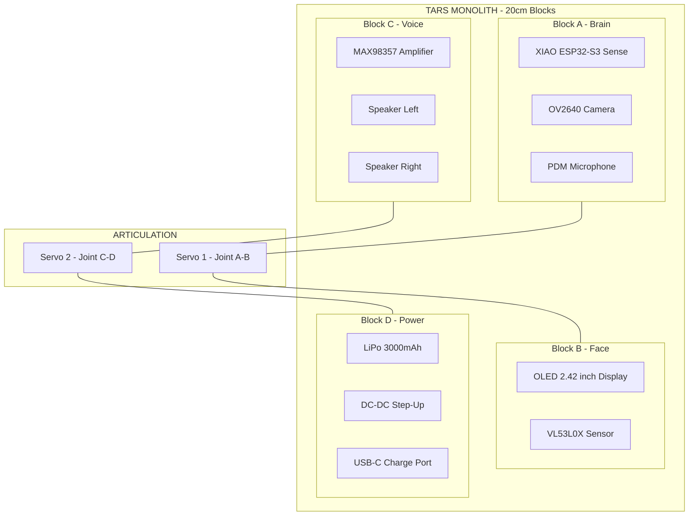
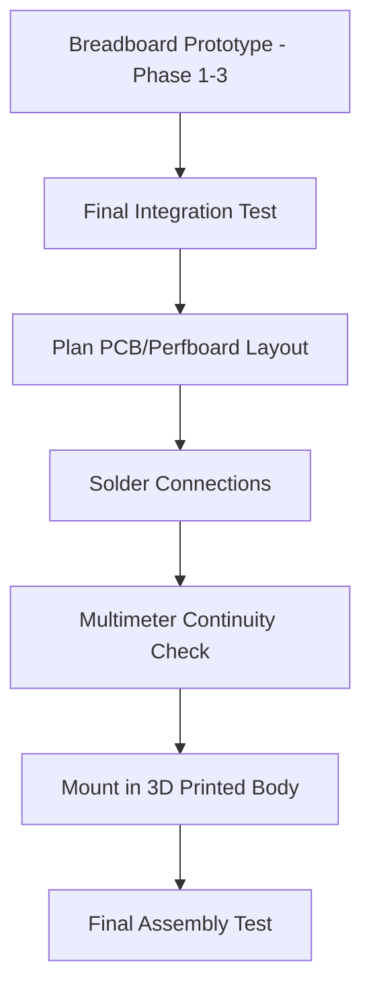
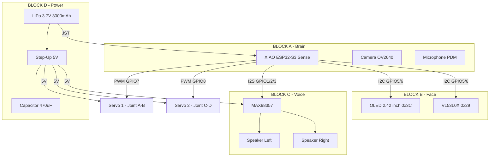

# Phase 4 — The Monolith

> **Bambu Lab P1S (ASA/PLA)**
> Ensamblaje final de los bloques de 20cm.

---

## Overview

Phase 4 is where TARS gets its **body**. All the electronics from Phases 1-3 are mounted inside a 3D-printed rectangular monolith inspired by TARS from Interstellar. The body is made of articulated 20cm blocks printed on a Bambu Lab P1S using ASA or PLA filament, with the OLED display serving as TARS's "face."

**End result:** A fully functional, self-contained TARS robot — a rectangular articulated monolith that hears, thinks, speaks, sees, moves, and insults you in 2 languages.

---

## What Changes from Phase 3

| Capability | Phase 3 | Phase 4 |
|------------|---------|---------|
| Enclosure | Breadboard, wires exposed | **3D-printed articulated body** |
| Display | None | **OLED 2.42" face with expressions** |
| Structure | Loose components | **20cm modular blocks** |
| Finish | Prototype | **Final product** |
| Connections | Breadboard jumpers | **Soldered, permanent** |
| Weather resistance | None | **ASA: UV and heat resistant** |

---

## Architecture — Final Assembly



---

## New Components (Phase 4)

| # | Component | Price | Function |
|---|-----------|-------|----------|
| 1 | Waveshare 2.42" OLED 128x64 (SPI/I2C) | €21.99 | TARS's face / expressions |
| 2 | Breadboard 400+830 + jumper wires | €10.99 | Final prototyping before soldering |
| | **Phase 4 additions** | **€32.98** | |
| | **Total all phases** | **~€174.50** | |

**3D Printing (separate cost):**

| Item | Estimated Cost |
|------|---------------|
| Bambu Lab P1S printer | ~€699 (one-time, if purchasing) |
| ASA filament 1kg | ~€25-30 |
| PLA filament 1kg (alternative) | ~€20-25 |
| Print time (all blocks) | ~15-25 hours |

> If you don't own a Bambu Lab P1S, consider using a local makerspace, online 3D printing service, or a friend's printer.

---

## The TARS Body Design

### Interstellar Reference

In the movie, TARS is a **rectangular articulated monolith** composed of connected blocks that can rotate and reconfigure for walking, standing, and various tasks. Our TARS miniature follows the same concept at 20cm scale.

### Block Layout

```
+--------+
| BLOCK A|  <- Brain: ESP32-S3, Camera, Microphone
|  20cm  |
+--[S1]--+  <- Servo 1: Joint between A and B
+--------+
| BLOCK B|  <- Face: OLED Display, LiDAR Sensor
|  20cm  |
+--------+
+--------+
| BLOCK C|  <- Voice: Amplifier, Speakers (x2)
|  20cm  |
+--[S2]--+  <- Servo 2: Joint between C and D
+--------+
| BLOCK D|  <- Power: Battery, Step-Up, Charge Port
|  20cm  |
+--------+

Total height: ~80cm (4 blocks x 20cm)
Width: ~8-10cm
Depth: ~4-5cm
```

### Block Dimensions

| Block | Height | Width | Depth | Contains |
|-------|--------|-------|-------|----------|
| Block A (Brain) | 20cm | 8cm | 4cm | ESP32-S3, camera lens hole, mic hole |
| Block B (Face) | 20cm | 8cm | 4cm | OLED display window, VL53L0X aperture |
| Block C (Voice) | 20cm | 8cm | 4cm | MAX98357, 2x speaker grills |
| Block D (Power) | 20cm | 8cm | 4cm | LiPo battery, Step-Up, USB-C port |

---

## 3D Printing — Bambu Lab P1S

### Why Bambu Lab P1S?

| Feature | Value |
|---------|-------|
| Build volume | 256 x 256 x 256 mm (enough for 20cm blocks) |
| Enclosed chamber | Yes (required for ASA) |
| Auto bed leveling | Yes |
| Multi-color | With AMS (optional) |
| Speed | Up to 500mm/s |
| Accuracy | 0.05mm layer resolution |

### Material Choice

| Material | Pros | Cons | Best For |
|----------|------|------|----------|
| **ASA** | UV resistant, heat resistant, strong | Needs enclosed printer, slight warping | Outdoor/durable TARS |
| **PLA** | Easy to print, cheap, good detail | Brittle, warps in heat (> 60 C) | Indoor TARS prototype |
| **PETG** | Good middle ground, flexible | Strings, harder to tune | Alternative to ASA |

> **Recommended:** ASA for the final version (durability), PLA for test prints.

### Print Settings

| Parameter | ASA | PLA |
|-----------|-----|-----|
| Nozzle temperature | 240-260 C | 200-220 C |
| Bed temperature | 90-110 C | 50-60 C |
| Layer height | 0.2mm | 0.2mm |
| Infill | 20-30% | 15-20% |
| Walls | 3-4 perimeters | 2-3 perimeters |
| Supports | Yes (for internal cavities) | Yes |
| Enclosure | Required | Optional |
| Print time per block | ~3-5 hours | ~2-4 hours |

### Design Features per Block

#### Block A — Brain

```
+------------------+
|  [Camera Lens]   |  <- 8mm hole for OV2640
|                  |
|  [Mic Hole]      |  <- 2mm holes for PDM mic
|                  |
|  Internal:       |
|  - XIAO ESP32-S3 |
|  - Wire routing  |
|  - Antenna area  |  <- Keep WiFi antenna near wall
+--[Servo Mount]---+
```

Design considerations:
- **Camera hole:** 8mm diameter on the front face, aligned with OV2640 lens
- **Microphone holes:** Small perforations (1-2mm) for sound to reach PDM mic
- **WiFi antenna:** Keep near the outer wall, avoid metal shielding around it
- **Cable routing:** Internal channels for wires to pass to Block B
- **Mounting:** M2 screw posts or snap-fit clips for ESP32-S3

#### Block B — Face

```
+------------------+
|                  |
|  +-----------+   |
|  | OLED 2.42"|   |  <- Display window cutout
|  | 128x64    |   |
|  +-----------+   |
|                  |
|  [LiDAR Window]  |  <- Small aperture for VL53L0X laser
|                  |
+------------------+
```

Design considerations:
- **OLED window:** Rectangular cutout 60mm x 32mm with 0.5mm border
- **LiDAR aperture:** 5mm hole for laser to pass through
- **Display mount:** Recessed cavity with screw posts or adhesive pad

#### Block C — Voice

```
+------------------+
|  [Speaker Grill] |  <- Pattern of holes for left speaker
|                  |
|  Internal:       |
|  - MAX98357      |
|  - Speaker L     |
|  - Speaker R     |
|                  |
|  [Speaker Grill] |  <- Pattern of holes for right speaker
+--[Servo Mount]---+
```

Design considerations:
- **Speaker grills:** Array of 2mm holes in a circular or rectangular pattern
- **Internal damping:** Add foam or felt to reduce vibration resonance
- **Speaker mount:** Press-fit or screw mount facing outward

#### Block D — Power

```
+------------------+
|                  |
|  Internal:       |
|  - LiPo Battery  |
|  - Step-Up board  |
|  - Capacitors    |
|                  |
|  [USB-C Port]    |  <- Accessible for charging
|  [Power Switch]  |  <- Optional ON/OFF
+------------------+
```

Design considerations:
- **USB-C port:** Rectangular cutout accessible from outside for charging
- **Power switch:** Optional SPST toggle switch cutout
- **Battery compartment:** Snug fit with padding to prevent movement
- **Ventilation:** Small holes for heat dissipation from Step-Up

---

## OLED Display — TARS's Face

### Specifications

| Spec | Value |
|------|-------|
| Size | 2.42 inches diagonal |
| Resolution | 128 x 64 pixels |
| Type | OLED (self-emitting, high contrast) |
| Interface | I2C (shares bus with VL53L0X) |
| I2C Address | 0x3C |
| Voltage | 3.3V - 5V |
| Color | Monochrome (white, yellow, or blue depending on model) |

### TARS Expressions

TARS doesn't have a traditional face — it has a minimalist display. Here are the expression frames:

| Expression | Display | Triggered When |
|------------|---------|---------------|
| Neutral | `[  ====  ]` | Idle, default state |
| Thinking | `[  .--.  ]` | Processing Groq response |
| Talking | Animated bars | Playing audio through speaker |
| Amused | `[  ^  ^  ]` | High humor response |
| Alert | `[  !!!!  ]` | Obstacle detected, proximity warning |
| Sleeping | `[  ----  ]` | Auto-sleep mode |
| Low Battery | `[  BAT%  ]` | Battery below threshold |
| Listening | `[  ((o)) ]` | VAD detected voice, recording |

### Arduino Code — OLED Expressions

```cpp
#include <U8g2lib.h>
#include <Wire.h>

// I2C OLED on same bus as VL53L0X (SDA=GPIO5, SCL=GPIO6)
U8G2_SSD1309_128X64_NONAME2_F_HW_I2C u8g2(U8G2_R0, U8X8_PIN_NONE);

void setup() {
    Wire.begin(5, 6);
    u8g2.begin();
}

void showExpression(String expression) {
    u8g2.clearBuffer();
    u8g2.setFont(u8g2_font_ncenB14_tr);
    
    if (expression == "neutral") {
        u8g2.drawStr(20, 35, "[  ====  ]");
    }
    else if (expression == "thinking") {
        u8g2.drawStr(20, 35, "[  .--.  ]");
    }
    else if (expression == "amused") {
        u8g2.drawStr(20, 35, "[  ^  ^  ]");
    }
    else if (expression == "alert") {
        u8g2.drawStr(20, 35, "[  !!!!  ]");
    }
    else if (expression == "sleeping") {
        u8g2.drawStr(20, 35, "[  ----  ]");
    }
    else if (expression == "listening") {
        u8g2.drawStr(20, 35, "[ ((o)) ]");
    }
    else if (expression == "low_battery") {
        float v = readBatteryVoltage();
        int pct = batteryPercentage(v);
        String bat = "BAT: " + String(pct) + "%";
        u8g2.drawStr(20, 35, bat.c_str());
    }
    
    u8g2.sendBuffer();
}

// Animated talking bars
void showTalking() {
    for (int frame = 0; frame < 10; frame++) {
        u8g2.clearBuffer();
        for (int i = 0; i < 8; i++) {
            int height = random(5, 40);
            u8g2.drawBox(10 + i * 14, 64 - height, 10, height);
        }
        u8g2.sendBuffer();
        delay(100);
    }
}

// Status bar at bottom
void showStatusBar(int battery, int humor, String mode) {
    u8g2.setFont(u8g2_font_5x7_tr);
    String status = "B:" + String(battery) + "% H:" + String(humor) + "% " + mode;
    u8g2.drawStr(0, 63, status.c_str());
}
```

### I2C Address Map (Final)

| Device | I2C Address | Added In |
|--------|-------------|----------|
| VL53L0X | 0x29 | Phase 2 |
| OLED Display | 0x3C | Phase 4 |

> No conflicts — both devices share the same I2C bus (GPIO5/GPIO6) without issues.

---

## Final Soldering

### From Breadboard to Permanent

Phase 4 is when you transition from breadboard prototyping to **permanent soldered connections**. Use the soldering kit from Phase 1.

### Soldering Plan



### Soldering Checklist

| Connection | From | To | Wire Gauge |
|-----------|------|-----|------------|
| I2C SDA | ESP32 GPIO5 | VL53L0X SDA + OLED SDA | 26 AWG |
| I2C SCL | ESP32 GPIO6 | VL53L0X SCL + OLED SCL | 26 AWG |
| I2S BCLK | ESP32 GPIO1 | MAX98357 BCLK | 26 AWG |
| I2S LRC | ESP32 GPIO2 | MAX98357 LRC | 26 AWG |
| I2S DIN | ESP32 GPIO3 | MAX98357 DIN | 26 AWG |
| Servo 1 Signal | ESP32 GPIO7 | Servo 1 orange wire | 26 AWG |
| Servo 2 Signal | ESP32 GPIO8 | Servo 2 orange wire | 26 AWG |
| 5V Power | Step-Up VOUT | Servos VCC + MAX98357 VIN | 22 AWG (power) |
| GND Common | All GND pins | Common ground bus | 22 AWG |
| Battery | LiPo JST | XIAO BAT + Step-Up VIN | 22 AWG |

### Soldering Tips for Final Assembly

1. **Temperature:** 320-350 C for most connections
2. **Tin** both surfaces before joining
3. **Hold** iron for max 3 seconds per joint
4. **Verify** each connection with multimeter (continuity mode) immediately
5. **Heat shrink** tubing on all exposed connections
6. **Label** wires with tape before disconnecting from breadboard
7. **Take photos** of breadboard layout before disassembling
8. **Solder** one block at a time, testing between blocks

---

## Joint/Hinge Mechanism

### Servo Mounting in Joints

The servos sit at the junction between blocks, creating the articulated joints:

```
+----------+
| BLOCK A  |
|          |
+----||----+  <- Servo horn screwed to Block A
     ||
  [SERVO]     <- Servo body mounted in Block B
     ||
+----||----+  <- Servo case fixed to Block B
| BLOCK B  |
|          |
+----------+
```

### Design Requirements

| Parameter | Value |
|-----------|-------|
| Servo horn | Standard cross or circle horn |
| Mounting | M2 screws into printed screw posts |
| Range of motion | 0-180 degrees |
| Cable routing | Through 5mm internal channel |
| Play/backlash | Minimal (metal gear servos) |

### Hinge Design Tips

1. **Print orientation:** Print hinge parts flat, standing up causes layer weakness
2. **Tolerances:** Add 0.3mm clearance for moving parts
3. **Reinforcement:** Add extra walls around screw posts
4. **Wire channels:** 5mm minimum diameter for servo cables to pass through
5. **Test fit:** Print a test hinge before committing to full block print

---

## Final Assembly Order

### Step 1: Print All Blocks

1. Slice STL files in Bambu Studio
2. Print Block A (Brain) first — test fit ESP32-S3
3. Print Block B (Face) — test fit OLED and VL53L0X
4. Print Block C (Voice) — test fit speakers and amplifier
5. Print Block D (Power) — test fit battery and Step-Up
6. Print hinge/joint pieces (x2)
7. Sand any rough edges with 200-400 grit sandpaper

### Step 2: Wire and Solder Each Block

1. **Block A:** Solder ESP32-S3 with I2C, I2S, and PWM wires. Route cables down.
2. **Block B:** Solder OLED and VL53L0X. Connect I2C wires from Block A.
3. **Block C:** Solder MAX98357 and speakers. Connect I2S wires from Block A.
4. **Block D:** Solder Step-Up, capacitor, and battery connector. Route 5V up.

### Step 3: Mount Servos in Joints

1. Mount Servo 1 between Block A and Block B
2. Mount Servo 2 between Block C and Block D
3. Route servo signal wires through channels to ESP32
4. Test rotation before fully tightening screws

### Step 4: Assemble Blocks

1. Connect Block A to Block B via Servo 1 joint
2. Connect Block C to Block D via Servo 2 joint
3. Connect Block B to Block C (fixed joint or third hinge)
4. Route all power and signal wires through internal channels
5. Verify no wires are pinched when joints rotate

### Step 5: Final Integration Test

1. Power on via battery
2. Verify WiFi connects
3. Test all sensors (microphone, camera, VL53L0X)
4. Test all outputs (speaker, OLED, servos, WhatsApp)
5. Test full interaction cycle: speak → think → respond → gesture
6. Test battery life
7. Test charging via USB-C port access

---

## Complete Final Wiring Diagram



---

## Phase 4 Checklist

### 3D Printing
- [ ] STL files designed or downloaded for all 4 blocks
- [ ] Hinge/joint pieces designed
- [ ] Test print of one block for fit verification
- [ ] All 4 blocks printed (ASA or PLA)
- [ ] Joint pieces printed (x2)
- [ ] Sanded and cleaned
- [ ] Component test-fit in each block

### OLED Display
- [ ] OLED 2.42" purchased and received
- [ ] Wired to I2C bus (GPIO5/GPIO6, address 0x3C)
- [ ] Expressions coded and tested
- [ ] Status bar implemented
- [ ] Talking animation working

### Soldering
- [ ] Breadboard layout photographed for reference
- [ ] All connections soldered on perfboard or direct wire
- [ ] Multimeter continuity check on every connection
- [ ] Heat shrink on all exposed joints
- [ ] All wires labeled
- [ ] No cold solder joints (shiny, smooth cones)

### Assembly
- [ ] ESP32-S3 mounted in Block A
- [ ] OLED + VL53L0X mounted in Block B
- [ ] MAX98357 + speakers mounted in Block C
- [ ] Battery + Step-Up mounted in Block D
- [ ] Servo 1 installed in Joint A-B
- [ ] Servo 2 installed in Joint C-D
- [ ] All internal wiring routed through channels
- [ ] No wires pinched when joints rotate
- [ ] USB-C charging port accessible

### Final Validation
- [ ] Powers on from battery
- [ ] WiFi connects automatically
- [ ] Microphone captures voice (Groq STT works)
- [ ] Camera captures images (Groq Vision works)
- [ ] VL53L0X reads distances through aperture
- [ ] OLED shows expressions
- [ ] Speaker plays TARS voice clearly
- [ ] Servos move blocks smoothly
- [ ] WhatsApp messages received
- [ ] Bilingual responses (ES + RO)
- [ ] Gestures synchronized with speech
- [ ] Battery lasts 3+ hours
- [ ] Charging works while assembled
- [ ] TARS looks like TARS from Interstellar

---

## Troubleshooting

| Problem | Solution |
|---------|----------|
| Parts don't fit in blocks | Adjust STL tolerances. Add 0.5mm clearance. Reprint. |
| OLED not visible through window | Sand window area thinner. Use clear window insert. |
| WiFi signal weak inside body | Position antenna near wall. Avoid enclosing in metal. ASA/PLA don't block WiFi. |
| Speaker muffled | Increase speaker grill hole size. Add more perforations. Reduce infill near speaker area. |
| Servo can't rotate block | Blocks too heavy. Reduce infill to 15%. Check for friction in hinge. |
| Wires break when joint rotates | Use flexible silicone wire. Add strain relief. Leave slack in wire channel. |
| Battery slides around | Add foam padding. Print tighter battery compartment. |
| Body wobbles | Tighten servo horn screws. Check hinge tolerances. |

---

## Complete TARS Specifications

| Spec | Value |
|------|-------|
| **Height** | ~80cm (4 x 20cm blocks) |
| **Width** | ~8cm |
| **Depth** | ~4-5cm |
| **Weight** | ~300-500g (estimated with electronics) |
| **CPU** | ESP32-S3 dual-core 240MHz |
| **RAM** | 8MB PSRAM |
| **AI Brain** | Groq Llama 3.1 8B Instant (840 tok/s) |
| **STT** | Groq Whisper Large v3 Turbo (< 100ms) |
| **Vision** | Groq Llama 4 Scout |
| **Voice** | OpenAI tts-1, Onyx voice |
| **Sensors** | Camera, Microphone, LiDAR (0-4m) |
| **Display** | OLED 2.42" 128x64 |
| **Audio** | MAX98357 3W + 8 Ohm speakers |
| **Movement** | 2x EMAX ES08MD servos (2.4 kg/cm) |
| **Battery** | LiPo 3.7V 3000mAh (~3.5h) |
| **Connectivity** | WiFi 2.4GHz, WhatsApp, Telegram |
| **Languages** | Spanish + Romanian |
| **Humor** | Adjustable 0-100% (default 75%) |
| **Material** | ASA or PLA (3D printed) |
| **Total Cost** | ~€174.50 hardware + ~€2-4/month |

---

## Total Project Cost Summary

| Phase | Hardware Cost | What You Get |
|-------|-------------|-------------|
| Phase 1 - Brain | €63.88 | XIAO + Soldering kit |
| Phase 2 - Senses | €30.97 | VL53L0X + MAX98357 + Speakers |
| Phase 3 - Muscles | €46.67 | Servos + Step-Up + Battery |
| Phase 4 - Monolith | €32.98 | OLED + Breadboard + prototyping |
| **TOTAL Hardware** | **~€174.50** | |
| 3D Printing (filament) | ~€25-30 | ASA or PLA, 1kg spool |
| **Monthly operation** | **~€2-4** | Groq + OpenAI TTS |

---

> *"Do not go gentle into that good night."* — Dylan Thomas (TARS approved)
