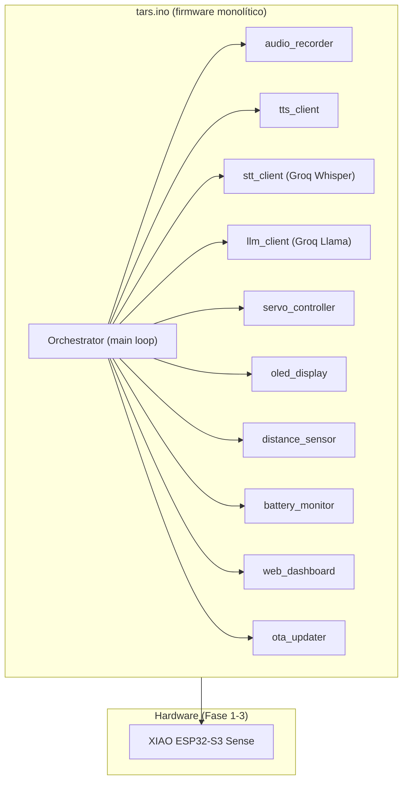
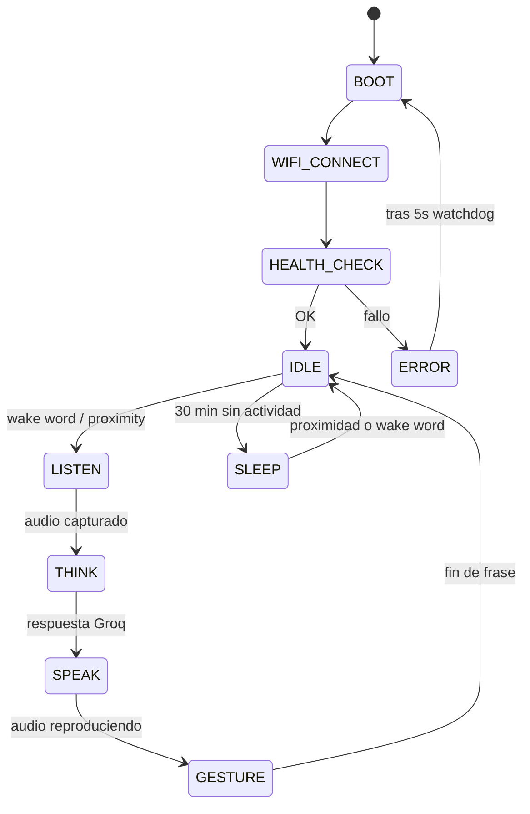

# Phase 4 — The Monolith

> **Final Integration + Firmware Unification + Polish**
> Ensamblaje final, firmware monolítico y últimos detalles.

> ⚠️ **NOTA IMPORTANTE:** En versiones anteriores de la documentación, Fase 4 era "imprimir un cuerpo de 4 bloques de 20 cm con PLA/ASA". Eso cambió: **la mecánica completa ahora está en Fase 3 + [PHASE3_MECHANICS.md](PHASE3_MECHANICS.md)** (chasis PETG de 35,1 × 15,6 × 3,9 cm con los 4 bloques paralelos canónicos 9×4×1). Fase 4 es ahora la fase de **integración final**: unificar firmware, pasar de prototipo en breadboard a cableado definitivo, calibrar, y dar los últimos toques.

---

## Overview

Fase 4 cierra el proyecto. Después de Fase 3 tienes un TARS funcional pero con:
- El firmware repartido en prototipos separados (uno por periférico)
- El cableado en breadboard con jumpers
- Sin calibración global de gestos + pantalla + voz sincronizados
- Sin diagnóstico integrado (health check, panel web, OTA)

**End result:** un TARS cerrado, soldado, con un único sketch `tars.ino`, un panel web local para diagnóstico/OTA y todas las interacciones coreografiadas (voz + gesto + OLED + LED al unísono).

---

## Qué cambia respecto a Fase 3

| Capacidad | Fase 3 | Fase 4 |
|-----------|--------|--------|
| Firmware | Múltiples sketches de prueba | **Un único `tars.ino` + módulos (audio, tts, stt, servos, distance, oled, battery)** |
| Cableado | Breadboard + jumpers | **Soldado definitivo en perfboard o cable a cable** |
| Coreografía | Gesto y voz independientes | **Gesto + OLED + voz sincronizados por el orquestador** |
| Diagnóstico | Serial Monitor | **Panel web local (192.168.x.x) + OTA firmware update** |
| Acabado del chasis | PETG crudo | **Pulido + imprimación + pintura (gris metálico + naranja)** |
| Puesta en marcha | Manual | **Autoboot: WiFi → health check → greeting** |

---

## Arquitectura final



---

## Componentes nuevos

Ninguno de hardware. Fase 4 es **sólo trabajo de firmware, ensamblaje y acabado**.

| Ítem | Coste |
|------|-------|
| Estaño, flux, cable fino (ya incluido en el kit de soldadura de Fase 1) | €0 |
| Imprimación + pintura acrílica gris metálico + naranja (opcional) | ~€10 |
| **Fase 4 total** | **~€10** |

---

## Checklist de integración

### Firmware
- [ ] Módulo `audio_recorder.h/cpp` (PDM mic GPIO 41/42)
- [ ] Módulo `stt_client.h/cpp` (Groq Whisper)
- [ ] Módulo `llm_client.h/cpp` (Groq Llama + tool calling)
- [ ] Módulo `tts_client.h/cpp` (OpenAI tts-1)
- [ ] Módulo `audio_player.h/cpp` (I²S GPIO 7/8/9 → MAX98357A)
- [ ] Módulo `distance_sensor.h/cpp` (2× VL53L1X, XSHUT GPIO 2/3, dir 0x30/0x31)
- [ ] Módulo `servo_controller.h/cpp` (GPIO 43/44, rango 30-150°)
- [ ] Módulo `oled_display.h/cpp` (U8g2 SSD1309 I²C 0x3C)
- [ ] Módulo `battery_monitor.h/cpp` (ADC GPIO 1, divisor 100k/100k)
- [ ] Módulo `web_dashboard.h/cpp` (AsyncWebServer)
- [ ] Módulo `ota_updater.h/cpp` (ArduinoOTA)
- [ ] Orquestador `tars.ino` con FSM: IDLE → LISTEN → THINK → SPEAK → GESTURE → IDLE
- [ ] `config.json` en LittleFS con credenciales, humor %, idioma, thresholds

### Ensamblaje
- [ ] Todos los módulos probados individualmente en Fase 2-3
- [ ] Cables cortados a medida (sin bucle sobrante)
- [ ] Conexiones críticas soldadas (I²C compartido, I²S, PWM servos, ADC batería)
- [ ] Capacitor 470 µF en la línea 5 V del MT3608
- [ ] Pull-ups I²C 4.7 kΩ comprobados
- [ ] Chasis impreso en PETG (ver PHASE3_MECHANICS.md)
- [ ] Componentes encajados en su z del bloque central
- [ ] Brazos montados en los servos con horn + M2
- [ ] Ventanas PMMA (cámara, ToF, OLED) pegadas
- [ ] Rejilla altavoz sellada con foam
- [ ] Tapa superior con imanes (acceso USB-C)

### Calibración
- [ ] Servos: neutro = 90°, test rango 30°-150°, sin colisiones
- [ ] MT3608 a 5.0 V ±0.1 V bajo carga (dos servos moviéndose)
- [ ] VL53L1X #1 y #2 devuelven distancias independientes
- [ ] OLED renderiza a 30 fps sin flicker
- [ ] Altavoz: volumen máximo sin distorsión audible
- [ ] Divisor ADC batería: 4.2 V → ~2400 lectura bruta, 3.0 V → ~1700

### Integración final
- [ ] `tars.ino` compila sin warnings
- [ ] Arranque autónomo: WiFi → health check → saludo
- [ ] Ciclo completo: "Hola TARS" → reconoce → piensa → habla → gesto → OLED
- [ ] Respuesta < 3 s extremo a extremo
- [ ] Batería dura > 6 h en uso activo
- [ ] Panel web accesible en http://tars.local
- [ ] OTA funciona (subir nuevo .bin sin cable)
- [ ] Crash recovery: watchdog + reboot automático

### Acabado (opcional)
- [ ] Pulido suave del chasis (lija 400 → 800)
- [ ] Imprimación 2 capas
- [ ] Pintura gris metálico (cuerpo)
- [ ] Detalles naranja (botones, bordes)
- [ ] Etiquetas serigrafiadas: "TARS", "CASE-7", "MONOLITH"
- [ ] Foto de familia para el README

---

## Panel web local — diagnóstico

Un servidor HTTP sobre la XIAO (AsyncWebServer) expone:

| Endpoint | Función |
|----------|---------|
| `GET /` | Dashboard HTML con estado en vivo |
| `GET /api/state` | JSON con modo, batería, últimas frases, latencia Groq |
| `POST /api/gesture` | Forzar un gesto (`greeting`, `shrug`, `alert`, ...) |
| `POST /api/say` | Reproducir texto arbitrario por el altavoz |
| `POST /api/config` | Actualizar `config.json` (humor %, idioma, thresholds) |
| `POST /api/ota` | Subir nuevo firmware `.bin` |
| `GET /api/logs` | Últimas 100 líneas de log |

---

## Máquina de estados del orquestador



---

## Diagnósticos típicos

| Síntoma | Diagnóstico | Solución |
|---------|-------------|----------|
| Arranca y reinicia en bucle | Brownout por servo sin capacitor | Añadir 470 µF + verificar MT3608 bajo carga |
| OLED parpadea al hablar | Bus I²C saturado | Bajar frecuencia a 100 kHz o poner Fast-mode 400 kHz si no ayuda |
| Latencia > 5 s | WiFi débil o Groq rate-limit | Acercar al router o reintentar con backoff |
| Servo tiembla al inicio | Pulso no definido | `servo.attach()` + `write(90)` antes del primer loop |
| Distancia VL53L1X siempre 65535 | XSHUT boot sequence mal | Revisar que sensor #2 esté LOW mientras se inicia #1 |
| OTA falla a mitad | Watchdog interrumpe el flash | Deshabilitar watchdog durante `Update.begin()` |

---

## Cost Summary

| Categoría | Coste |
|-----------|-------|
| **Fase 4 hardware** | **€0** (sólo trabajo) |
| Pintura / acabado (opcional) | ~€10 |
| **Cumulative total (P1+P2+P3+P4)** | **~€202.27** |

---

## Resultado final

```
╔══════════════════════════════════════════╗
║          TARS — v1.0 FINAL               ║
║                                          ║
║  ✅ Hardware integrado (Fase 1-3)        ║
║  ✅ Chasis PETG 35 cm (PHASE3_MECHANICS) ║
║  ✅ Firmware monolítico + OTA            ║
║  ✅ Panel web de diagnóstico             ║
║  ✅ Coreografía voz + gesto + OLED       ║
║  ✅ Autonomía 6-10 h                     ║
║  ✅ Pintura y acabado (opcional)         ║
║                                          ║
║  Estado: listo para insultar humanos     ║
╚══════════════════════════════════════════╝
```

---

> *"Everybody good? Plenty of slaves for my robot colony?"* — TARS
