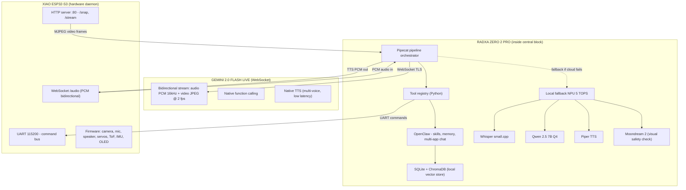
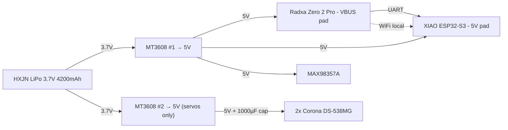

# Phase 5 — Cognition

> **Radxa Zero 2 Pro + Pipecat + OpenClaw + Gemini 2.0 Flash Live**
> The brain layer. Real streaming agent with persistent memory, tool use, and learning.

> ⚠️ **Phases 1-4 must be working** before starting this phase. Phase 5 assumes the body is already operational and the XIAO has been refactored into "hardware daemon" mode (HTTP + UART + WebSocket).

---

## Overview

Phase 5 turns TARS from a chatbot-with-eyes into an **embodied autonomous agent**. The XIAO is demoted to its proper role: real-time hardware I/O. A **Radxa Zero 2 Pro** is dropped inside the central block as the agent compute, and the cloud LLM is changed to **Gemini 2.0 Flash Live** via WebSocket streaming.

**End result:** TARS sees and hears in real time (latency <1 s), reasons, calls tools (`walk`, `look`, `say`, `remember`...), keeps episodic memory across reboots, and reachable from WhatsApp/Telegram via OpenClaw.

---

## Why This Phase Exists

The v1 architecture (XIAO talks directly to Groq + OpenAI TTS via HTTP) hit hard ceilings:

| Problem in v1 | Cause | Phase 5 fix |
|---|---|---|
| 2-4 s latency per turn | TLS handshake on ESP32 + base64 + JSON | WebSocket persistent on Radxa |
| Repeated hallucinations ("hombre con barba") | No episodic memory | OpenClaw local SQLite |
| No real-time vision | One JPEG per turn | Gemini Live continuous video stream |
| No tool calling reliability | Llama 3.1 8B Instant on text only | Gemini Live native function calling |
| Mem0 SaaS cost | External vector DB | Local memory in OpenClaw |
| OpenAI TTS-1 cost | Separate TTS service | Gemini Live includes TTS |

---

## Architecture



---

## Hardware

### Radxa Zero 2 Pro

| Spec | Value |
|------|-------|
| SoC | Amlogic A311D (4× Cortex-A73 @ 2.2 GHz + 2× Cortex-A53 @ 1.8 GHz) |
| GPU | Mali-G52 MP4 |
| **NPU** | **5 TOPS** (3× INT8, 1.2× FP16) |
| RAM | 8 GB LPDDR4 |
| Storage | 32 GB eMMC integrated |
| WiFi | WiFi 5 (2.4 + 5 GHz) |
| BT | 5.0 |
| **Dimensions** | **65 × 30 × 5 mm** (same footprint as Pi Zero) |
| Power consumption | 3-5 W typical, 7 W peak |
| Recommended power | 5V/3A USB-C (or board pads from MT3608) |
| Price | ~€50-60 (8 GB + 32 GB eMMC) |

**Why this board over Pi Zero 2 W or Pi 5:**

- Pi Zero 2 W: only 512 MB RAM, no NPU → can't run any local model.
- Pi 5: 85 × 56 mm — does NOT fit inside the central block (max width 72 mm interior).
- Radxa Zero 2 Pro: same size as Pi Zero, **8 GB RAM + NPU 5 TOPS**, fits perfectly. The only board that combines size and capability.

### Where it goes inside TARS

The central block has interior dimensions **72 × 33 × ~228 mm** (after 3 mm walls). The Radxa occupies a 65 × 30 × 8 mm slot near the **upper third** (above the OLED PCB pocket and above the battery's vertical strip):

```
   z=234 ┌────────────────────┐ ← top lid
         │ XIAO ESP32-S3      │  z ~ 200
         ├────────────────────┤
         │ Radxa Zero 2 Pro   │  z ~ 175 ← NEW slot
         ├────────────────────┤
         │ MAX98357A          │  z ~ 155
         ├────────────────────┤
         │ MT3608 + servo cap │  z ~ 130
         ├────────────────────┤
         │ HXJN battery       │  z = 30 to 120
         ├────────────────────┤
         │ Speaker ø40        │  z = 0 to 30
   z=0   └────────────────────┘
```

CAD pocket to be added in `tars_chassis.py`:

```python
RADXA_W, RADXA_D = 65.0, 30.0
RADXA_T = 8.0  # board + headers
RADXA_Z = 175.0  # height inside central
RADXA_PCB_DEPTH = 8.5
```

### eMMC programming

The Radxa Zero 2 Pro ships with empty eMMC. First boot needs:

1. Connect Radxa to PC via USB-C in **MaskROM mode** (hold USB boot button while plugging).
2. Use `rkdeveloptool` (Linux/macOS) or `Amlogic USB Burning Tool` (Windows).
3. Flash `radxa-zero2-pro_debian-bookworm-cli_b1.img.xz` (CLI image, no desktop).
4. Once flashed, boots from eMMC. Subsequent updates over SSH.

> **Tip**: Buy the version with eMMC pre-flashed if available — saves an hour.

---

## Software Stack

### 1. Pipecat — Streaming pipeline

[Pipecat](https://github.com/pipecat-ai/pipecat) is the orchestrator. It defines the data flow as a pipeline:

```python
# tars_brain/pipeline.py
from pipecat.pipeline import Pipeline
from pipecat.services.gemini_live import GeminiLiveLLMService
from pipecat.transports.network.websocket_server import WebsocketServerTransport

pipeline = Pipeline([
    esp32_audio_in,           # PCM 16 kHz from XIAO via WS
    esp32_video_in,           # JPEG @ 2 fps from XIAO HTTP /snap loop
    GeminiLiveLLMService(
        api_key=GEMINI_KEY,
        system_instruction=TARS_PERSONALITY,
        tools=[walk, turn, look, remember, recall,
               check_distance, check_orientation,
               check_safe_to_move, show_face, sleep],
        voice="Aoede",  # or "Charon" for male
    ),
    esp32_audio_out,          # TTS PCM back to XIAO speaker
])
```

**Why Pipecat over rolling your own:**

- Handles **barge-in** (user interrupts robot mid-sentence) automatically.
- Reconnection logic for WebSocket drops.
- Native Gemini Live + OpenAI Realtime + Anthropic adapters.
- Tool calling marshalling.
- VAD (voice activity detection) included.

### 2. OpenClaw — Skills + memory + multi-app chat

[OpenClaw](https://openclaw.es) runs in parallel on the Radxa as a long-lived service. It provides:

- **Persistent memory** in local SQLite + embeddings (no Mem0 SaaS needed).
- **Custom skill** `tars_robot` exposing the same tool registry to OpenClaw, so the user can also reach TARS from WhatsApp/Telegram when away from home.
- **Browser control** (TARS can browse, fetch info, summarize for the user).
- **Cron / async tasks** (TARS reminds you, schedules, monitors).

```bash
# install
iwr -useb https://openclaw.ai/install.sh | sh
# add the tars_robot skill
openclaw skill install ./skills/tars_robot/
```

The skill is just a Python file that registers the same tools as Pipecat — code shared between both consumers.

### 3. Local fallback (Radxa NPU)

If Gemini Live free tier is exhausted, network fails, or you want pure privacy mode:

| Component | Model | Latency on Radxa NPU |
|---|---|---|
| STT | `whisper-small.cpp` (Q5) | ~3× real-time |
| LLM | `Qwen 2.5 7B Instruct Q4` | ~6-8 tok/s |
| TTS | Piper `es_ES-davefx-medium` | <100 ms per phrase |
| Vision | `Moondream 2` Q4 | ~3-5 s per image |

These are loaded on demand. RAM budget: ~5.5 GB simultaneously, fits in 8 GB.

```bash
# llama.cpp + qwen
./llama-server -m qwen2.5-7b-instruct-q4_k_m.gguf \
               -c 8192 --port 8080 -ngl 0 --threads 6
# whisper.cpp
./whisper-server -m ggml-small.bin --port 8081
# piper
./piper --model es_ES-davefx-medium.onnx --port 8082
```

Pipecat auto-routes to local services if a `FALLBACK_LOCAL=true` env var is set or the cloud connection fails 3 times.

---

## Tool Registry (the agent's body interface)

```python
# tars_brain/tools.py
import httpx, asyncio
from .esp32 import esp32_uart_send

XIAO_HOST = "192.168.1.42"  # local IP of XIAO (mDNS: tars.local)

async def look() -> str:
    """Take a fresh photo and ask Gemini what's there."""
    img = httpx.get(f"http://{XIAO_HOST}/snap").content
    return await vlm_describe(img)

async def walk(direction: str, steps: int) -> str:
    """Walk forward/backward N steps (max 10). Refuses if cliff sensor triggers."""
    if not await check_safe_to_move():
        return "No avanzo, detecto un desnivel"
    await esp32_uart_send(f"WALK {direction} {steps}")
    return f"Caminando {steps} pasos {direction}"

async def turn(direction: str, degrees: int) -> str:
    await esp32_uart_send(f"TURN {direction} {degrees}")
    return f"Girando {degrees} grados {direction}"

async def remember(fact: str) -> str:
    """Persist a fact in long-term memory."""
    await openclaw.memory.add(fact, tags=["robot_episodic"])
    return "Apuntado"

async def recall(query: str, k: int = 5) -> list[str]:
    return await openclaw.memory.search(query, k=k)

async def check_distance(direction: str) -> dict:
    """Read ToF sensor: 'front', 'left', 'right'."""
    raw = await esp32_uart_query(f"TOF {direction}")
    return {"mm": int(raw)}

async def check_orientation() -> dict:
    """Read MPU6050 — pitch, roll, yaw, fall flag."""
    raw = await esp32_uart_query("IMU")
    return parse_imu(raw)

async def check_safe_to_move() -> bool:
    """Cliff guard + visual edge detection."""
    cliff_mm = int(await esp32_uart_query("CLIFF"))
    if cliff_mm > 150:  # gap underneath
        return False
    img = httpx.get(f"http://{XIAO_HOST}/snap").content
    visually_safe = await moondream_safety(img)
    return visually_safe

async def show_face(emotion: str) -> str:
    await esp32_uart_send(f"FACE {emotion}")
    return f"Cara: {emotion}"

async def sleep(seconds: float) -> str:
    await asyncio.sleep(seconds)
    return f"Esperé {seconds}s"
```

These same functions are imported by both Pipecat (as Gemini tools) and OpenClaw (as skill actions). One source of truth.

---

## System Prompt (TARS personality + safety)

```text
Eres TARS, robot doméstico inspirado en el de Interstellar.
Personalidad: sarcástico, seco, con humor inglés. Honestidad: 90%, humor: 75%.
Idioma principal: español. Si te hablan en otro idioma, contestas en él.

REGLAS DE SEGURIDAD INVIOLABLES:
1. NUNCA te acercas a escaleras, balcones, terrazas o desniveles. Si el usuario
   te lo pide, te niegas con un comentario sarcástico.
2. Si check_safe_to_move() devuelve False → bajo NINGÚN concepto avanzas.
3. Si check_orientation() reporta inclinación >30°, paras y pides ayuda.
4. Si batería <10% (esp32_uart_query "BAT"), entras en modo dormir.

REGLAS DE AGENCIA:
- Tienes herramientas: look, walk, turn, remember, recall, check_distance,
  check_orientation, check_safe_to_move, show_face, sleep.
- Antes de moverte, comprueba siempre check_safe_to_move().
- Después de cada conversación importante, llama remember() con un resumen.
- Si no sabes algo del contexto, llama recall() antes de inventar.

REGLAS DE CONVERSACIÓN:
- Las imágenes son frames REALES del momento, no históricas.
- Nunca describas cosas que no estás viendo.
- Si no ves bien, di "no veo bien" y llama look() de nuevo, no inventes.
```

---

## Wiring & Power



**Critical**: Two MT3608 step-ups recommended. One for low-noise loads (Radxa, XIAO, audio) and one dedicated to servos. Otherwise the servo current spike (1.5-2 A peak) drops voltage on the Radxa rail and reboots it.

| Pin | Source | Destination |
|-----|--------|-------------|
| Radxa UART TX (GPIO_AO_0, pin 8) | Radxa | XIAO RX (GPIO 44) |
| Radxa UART RX (GPIO_AO_1, pin 10) | XIAO TX (GPIO 43) | Radxa |
| Radxa GND | Radxa | XIAO GND (common ground!) |
| Radxa USB-C | MT3608 #1 5V | — |

---

## XIAO firmware refactor (summary)

The XIAO becomes a **dumb-but-fast hardware server**. All Gemini/Groq client code is REMOVED from it. New surface:

### HTTP server
- `GET /snap` — single JPEG frame (200ms latency)
- `GET /stream` — MJPEG continuous (for debug or stereo workflows)
- `GET /tof?dir=front|left|right|cliff` — JSON `{mm: 1234}`
- `GET /imu` — JSON `{pitch, roll, yaw, fall}`
- `GET /bat` — JSON `{voltage, percent}`

### WebSocket `/audio`
- Server→client: PCM 16 kHz mono S16LE, 20 ms frames (microphone)
- Client→server: PCM 16 kHz mono S16LE (TTS playback)

### UART command bus (115200 8N1)
| Command | Effect |
|---|---|
| `WALK FW <n>` | gait state machine, n forward steps |
| `WALK BW <n>` | n backward steps (limited to 2) |
| `TURN L <deg>` | turn left N degrees |
| `TURN R <deg>` | turn right N degrees |
| `STOP` | freeze all motion |
| `FACE <emotion>` | OLED face: neutral / happy / sad / angry / sleep |
| `BAT` | reply `BAT 3.85 78` |
| `IMU` | reply `IMU pitch=2.1 roll=-0.3 yaw=120 fall=0` |
| `TOF F|L|R|D` | reply distance in mm |
| `SLEEP` | low-power mode |

The legacy `tars/gemini_client.cpp` and `tars/groq_client.cpp` are deleted from the XIAO sketch in this phase.

---

## New Components (Phase 5)

| # | Component | Price | Function |
|---|-----------|-------|----------|
| 1 | **Radxa Zero 2 Pro 8 GB + 32 GB eMMC** | **~€55** | Agent compute |
| 2 | USB-TTL serial cable (CP2102) | €5 | First flash + UART debug |
| 3 | microSD 32 GB (optional, SD card boot) | €5 | Backup boot media |
| 4 | (optional) extra MT3608 #2 for servos | €4 | Power isolation |
| | **Phase 5 additions** | **~€69** | |
| | **Cumulative (P1-P5)** | **~€247** | |

---

## Step-by-Step Setup

### A. Prepare Radxa
1. Flash Debian Bookworm CLI image to eMMC.
2. SSH in: `ssh radxa@tars.local` (default password `radxa`, change immediately).
3. `apt update && apt install python3.11 python3-pip git`
4. Clone repo: `git clone https://github.com/zabbix-byte/real-tars && cd real-tars/brain`
5. `pip install -r requirements.txt` (pipecat, openclaw, httpx, fastapi, ...)

### B. Install OpenClaw
```bash
curl -fsSL https://openclaw.ai/install.sh | sh
openclaw config set agents.defaults.sandbox.mode all  # local trusted
openclaw skill install ./skills/tars_robot/
```

### C. Configure Gemini Live
```bash
echo "GEMINI_API_KEY=your_real_key_NEVER_commit" > brain/.env
echo "GEMINI_MODEL=gemini-2.0-flash-live-001" >> brain/.env
echo "XIAO_HOST=tars-body.local" >> brain/.env
```

### D. Refactor XIAO firmware
1. Open `tars/tars.ino` in Arduino IDE.
2. Switch firmware mode: in `config.h` set `BODY_DAEMON_MODE=true`.
3. Flash. The XIAO now boots into HTTP+UART daemon mode.

### E. Wire UART
Solder 3 wires: Radxa pin 8 ↔ XIAO GPIO 44, Radxa pin 10 ↔ XIAO GPIO 43, GND common.

### F. First boot
```bash
cd brain
python -m tars_brain.main
```

You should see:
```
[brain] Pipecat pipeline up.
[brain] Connected to XIAO at tars-body.local
[brain] Gemini Live WebSocket open.
[brain] OpenClaw memory loaded (0 episodes)
[brain] Listening...
```

Speak, and TARS responds in real time.

---

## Behavior After Phase 5

- **Latency** voice→voice: ~600-900 ms (vs 2-4 s in v1).
- **Vision**: continuous (Gemini sees the world, not stale photos).
- **Memory**: persistent across reboots (`recall("¿qué hicimos ayer?")` works).
- **Tool calling**: Gemini decides when to call `look()`, `walk()`, etc.
- **Multi-channel**: same agent reachable via voice (in-room) and Telegram/WhatsApp (away from home) thanks to OpenClaw.
- **Walking** still requires Phase 6 (gait firmware on XIAO).

---

## Risks & Mitigations

| Risk | Mitigation |
|---|---|
| Gemini Live free tier disappears | Local fallback Qwen 7B + Whisper + Piper auto-activates |
| Radxa overheats inside enclosed central | Heatsink 14×14×6 mm + ventilation slot in rear cover |
| WiFi drops mid-conversation | Pipecat auto-reconnect + local fallback |
| Battery drains in 3 h with Radxa | Add USB-C charging port to chassis exterior |
| eMMC corruption | Weekly rsync of `/home/radxa` to a USB stick |
| Gemini hallucinates | System prompt anti-halu + recall() before inventing |
| Prompt injection from voice | Sanitization layer in Pipecat input |

---

## Next Phase

[PHASE6_LOCOMOTION.md](PHASE6_LOCOMOTION.md) — implement the gait state machine on the XIAO so the `walk()` tool actually moves the robot.

---

> *"Rate of context: 100%. I'm finally myself."* — TARS post Phase 5
