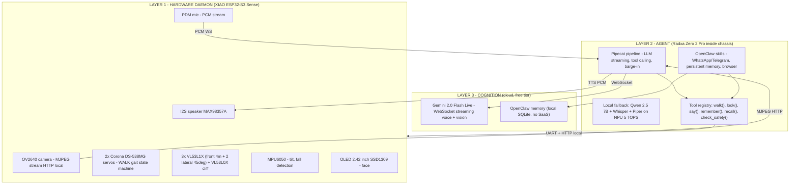
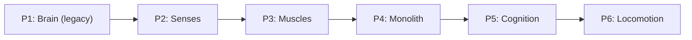
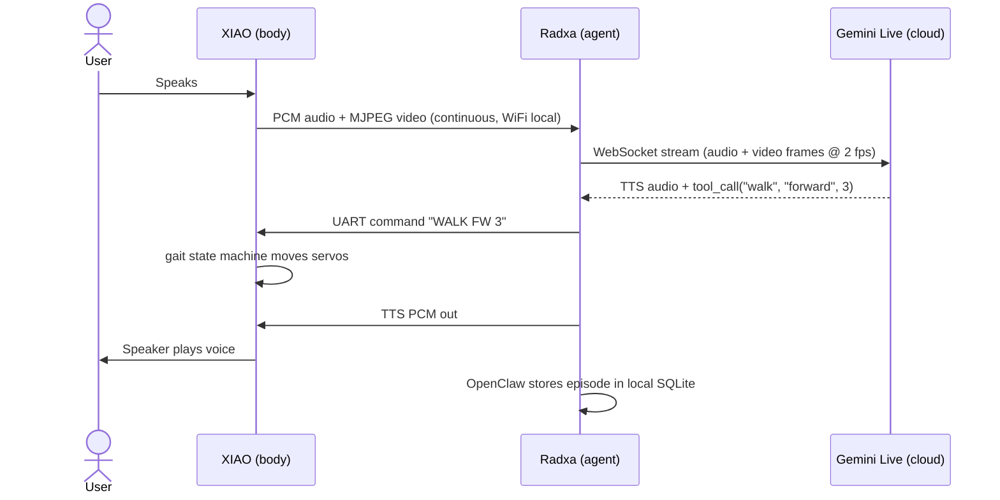

# TARS Project — Real Robot

> Inspired by TARS from *Interstellar*.
> A rectangular articulated monolith that hears, thinks, speaks, sees, **walks**, learns and insults you. Real autonomous embodied agent in a 23 cm chassis.

> **Status (April 2026):** architecture v2 — split brain (Radxa Zero 2 Pro) + body (XIAO ESP32-S3) + cloud agent (Pipecat + Gemini Live, free tier).

---

## Architecture v2 — Three layers

The project now follows the canonical robotics pattern: high-level cognition, mid-level perception, and low-level motor control are physically separated.

**Why this works:**

- **XIAO** does what an MCU does well: real-time sensor I/O, servo PWM, audio I²S, camera capture. It no longer talks to LLMs directly.
- **Radxa Zero 2 Pro** runs the agent loop, holds persistent memory, and orchestrates tool calls. Same physical footprint as a Pi Zero (65 × 30 × 5 mm) but with **NPU 5 TOPS** + 8 GB RAM. Fits inside the central block.
- **Cloud (Gemini Live)** is used only for the heavy multimodal streaming. **Free tier covers domestic use** (~3-4 h/day).

---

## Build Phases

| Phase | Name | Components | Result | Doc |
|-------|------|-----------|--------|-----|
| 1 | **Brain (legacy)** | XIAO + Groq + Telegram | Standalone mode: ESP32 talks to Groq via WiFi | [PHASE1_BRAIN.md](PHASE1_BRAIN.md) |
| 2 | **Senses** | 3x VL53L1X + 1x VL53L0X cliff + MPU6050 + speaker | Hears, speaks, measures, detects falls and edges | [PHASE2_SENSES.md](PHASE2_SENSES.md) |
| 3 | **Muscles** | LiPo + MT3608 + 2x Corona DS-538MG + OLED | Portable, with strong servos for actual walking | [PHASE3_MUSCLES.md](PHASE3_MUSCLES.md) |
| 3b | **Mechanics** | Chassis ABS 234x156x39 mm (Bambu X2D) | TARS-canonical body, no screws, snap-fit | [PHASE3_MECHANICS.md](PHASE3_MECHANICS.md) |
| 4 | **Monolith** | Full assembly + Radxa integration | Robot powers up, all hardware online | [PHASE4_MONOLITH.md](PHASE4_MONOLITH.md) |
| 5 | **Cognition** | Radxa Zero 2 Pro + Pipecat + OpenClaw + Gemini Live | True streaming agent: sees in real time, learns, remembers | [PHASE5_COGNITION.md](PHASE5_COGNITION.md) |
| 6 | **Locomotion** | Gait firmware + IMU loop + cliff guard | Walks forward/backward, turns, refuses stairs | [PHASE6_LOCOMOTION.md](PHASE6_LOCOMOTION.md) |

---

## Component List

| # | Component | Price | Phase | Notes |
|---|-----------|-------|-------|-------|
| 1 | XIAO ESP32-S3 Sense | EUR 14.00 | 1 | Hardware daemon, no longer the brain |
| 2 | Soldering kit 24-in-1 + multimeter | EUR 24.69 | 1 | One-off |
| 3 | VL53L1X ToF (0-4m) x3 | EUR 35.97 | 2 | 1 frontal + 2 lateral 45° |
| 4 | VL53L0X ToF (anti-cliff, downward) | EUR 5.00 | 2 | Stops robot at edges/stairs |
| 5 | MPU6050 IMU | EUR 2.00 | 2 | Fall detection, tilt feedback |
| 6 | MAX98357A I²S DAC | EUR 9.99 | 2 | |
| 7 | Speaker 3W 8Ω 40mm | EUR 8.99 | 2 | |
| 8 | **Corona DS-538MG digital servo x2** | **EUR 24.00** | 3 | **4.5 kg·cm — required for walking** |
| 9 | MT3608 DC-DC Boost (3.7→5V) | EUR 7.99 | 3 | Plus 1000 µF cap on servo line |
| 10 | Capacitor 1000 µF + silicone wire | EUR 4.00 | 3 | Servo current spike absorption |
| 11 | HXJN LiPo 3.7V 4200mAh BMS | EUR 22.99 | 3 | |
| 12 | Waveshare OLED 2.42" 128x64 SSD1309 | EUR 21.99 | 3 | |
| 13 | ABS filament (~220 g, full chassis) | EUR ~5.00 | 3b | Lighter than PETG, ~18% mass saving |
| 14 | **Radxa Zero 2 Pro 8 GB + 32 GB eMMC** | **EUR 55.00** | 5 | **Agent compute, fits inside central block** |
| 15 | USB-TTL cable for Radxa first flash | EUR 5.00 | 5 | |
| 16 | Miuzei starter kit (jumpers, breadboard) | EUR 10.99 | 1-3 | |
| | **TOTAL hardware** | **~EUR 257** | | |

### Cloud Services (free tier suffices for domestic use)

| Service | Cost | Function |
|---------|------|----------|
| **Gemini 2.0 Flash Live** | **EUR 0/month** (free tier ~4M tokens/day) | STT + LLM + TTS + vision streaming |
| OpenClaw (local) | Free | Agent skills, persistent memory, multi-app chat |
| Pipecat (local) | Free, open source | Streaming pipeline orchestration |
| Telegram Bot (optional, fallback) | Free | Out-of-house messaging |
| **TOTAL monthly** | **~EUR 0** | (worst-case ~5€/mo if free tier exceeded) |

> **Migration from v1**: Mem0 SaaS, OpenAI TTS-1 and Groq are no longer required. Their roles are absorbed by Gemini Live (multimodal) + OpenClaw (local memory). Saves ~€22/month vs the v1 stack.

---

## Cost Per Phase

| Phase | Hardware | Cumulative |
|-------|----------|-----------|
| Phase 1 - Brain | ~EUR 39 | ~EUR 39 |
| Phase 2 - Senses | ~EUR 62 | ~EUR 101 |
| Phase 3 - Muscles + Mechanics | ~EUR 86 | ~EUR 187 |
| Phase 4 - Monolith (assembly only) | EUR 0 | ~EUR 187 |
| **Phase 5 - Cognition (Radxa)** | **~EUR 60** | **~EUR 247** |
| **Phase 6 - Locomotion (extras)** | **~EUR 10** | **~EUR 257** |

---

## Interaction Flow (v2 — streaming)

---

## Final Specifications

| Spec | Value |
|------|-------|
| Height | 23.4 cm (6 units of 39 mm, canonical TARS proportion) |
| Width | 15.6 cm (2 lateral arms 39 + central 78) |
| Depth | 3.9 cm |
| Weight | ~370 g (ABS chassis, no screws) |
| **Body MCU** | **XIAO ESP32-S3 Sense** (240 MHz, 8 MB PSRAM) — sensors, servos, audio I/O |
| **Agent compute** | **Radxa Zero 2 Pro** (6-core ARM @ 2.2 GHz, NPU 5 TOPS, 8 GB RAM) |
| **Cloud LLM** | **Gemini 2.0 Flash Live** via Pipecat (WebSocket streaming voice + vision) |
| **Local fallback** | Qwen 2.5 7B Q4 + Whisper small + Piper TTS on Radxa NPU |
| Memory | OpenClaw local SQLite (episodic + semantic) |
| Sensors | OV2640 camera, PDM mic, 3x VL53L1X (4m), VL53L0X cliff, MPU6050 IMU |
| Display | Waveshare OLED 2.42" 128x64 SSD1309 |
| Audio | MAX98357A + 3W 8Ω 40mm speaker |
| **Movement** | **2x Corona DS-538MG (4.5 kg·cm)** — supports actual walking gait |
| **Locomotion** | TARS-style alternating arm gait (lateral oscillation ±60°) |
| Battery | HXJN LiPo 3.7V 4200mAh + BMS (~3 h with Radxa active, ~6 h idle) |
| Power | MT3608 boost 3.7→5V + 1000 µF servo line cap |
| Safety | Anti-cliff (downward ToF), fall detection (IMU), prompt geofencing |
| Connectivity | WiFi 2.4 GHz, BT 5.0, Telegram, WhatsApp (via OpenClaw) |
| Languages | Spanish + Romanian (English emergent) |
| Humor | 0-100% (default 75%) |
| Body material | **ABS** (~220 g full chassis) on Bambu X2D |
| Chassis fit | All electronics inside central 78×33×~228 mm void, no screws |

---

## Quick Start

1. **Phases 1-4** build the body and prove that hardware works.
2. **Phase 5** drops the Radxa Zero 2 Pro into the central block, flashes Pipecat + OpenClaw, connects to Gemini Live.
3. **Phase 6** flashes the gait firmware on the XIAO and calibrates servos.

After Phase 6, TARS:
- Listens, sees, and answers in real time (latency <1 s).
- Remembers people and places across reboots.
- Walks forward, backward, turns left/right under voice command.
- Refuses stairs and edges via cliff sensor + agent safety prompt.
- Talks to you over WhatsApp/Telegram when you're not at home.

---

## Translations (legacy)

- [Documentacion en Espanol](TARS_Robot_Build_ES.md) — v1 architecture
- [Documentation en Francais](TARS_Robot_Build_FR.md) — v1 architecture

---

> *"Humor setting: 75%. Adjust upward at your own risk."* — TARS
