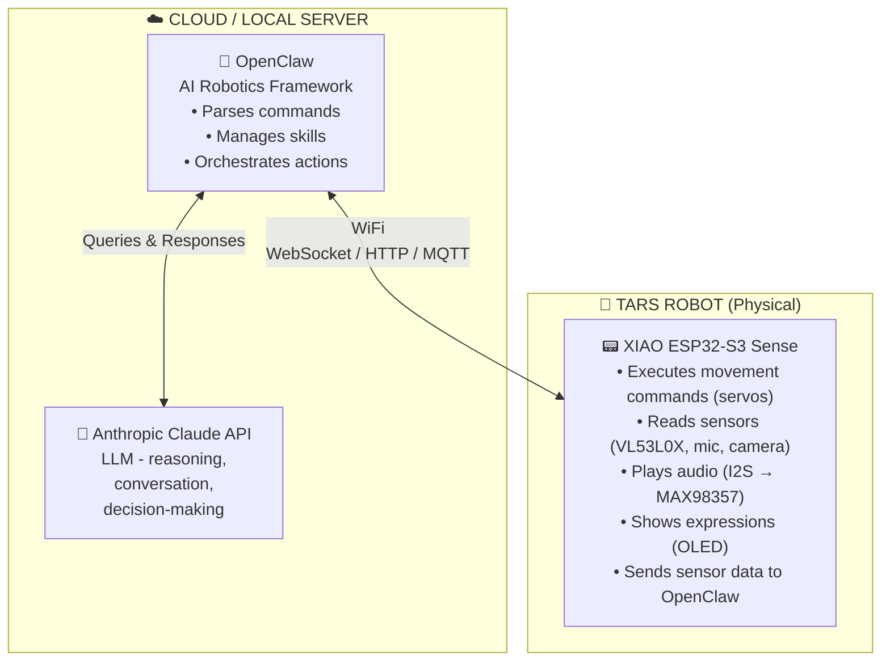
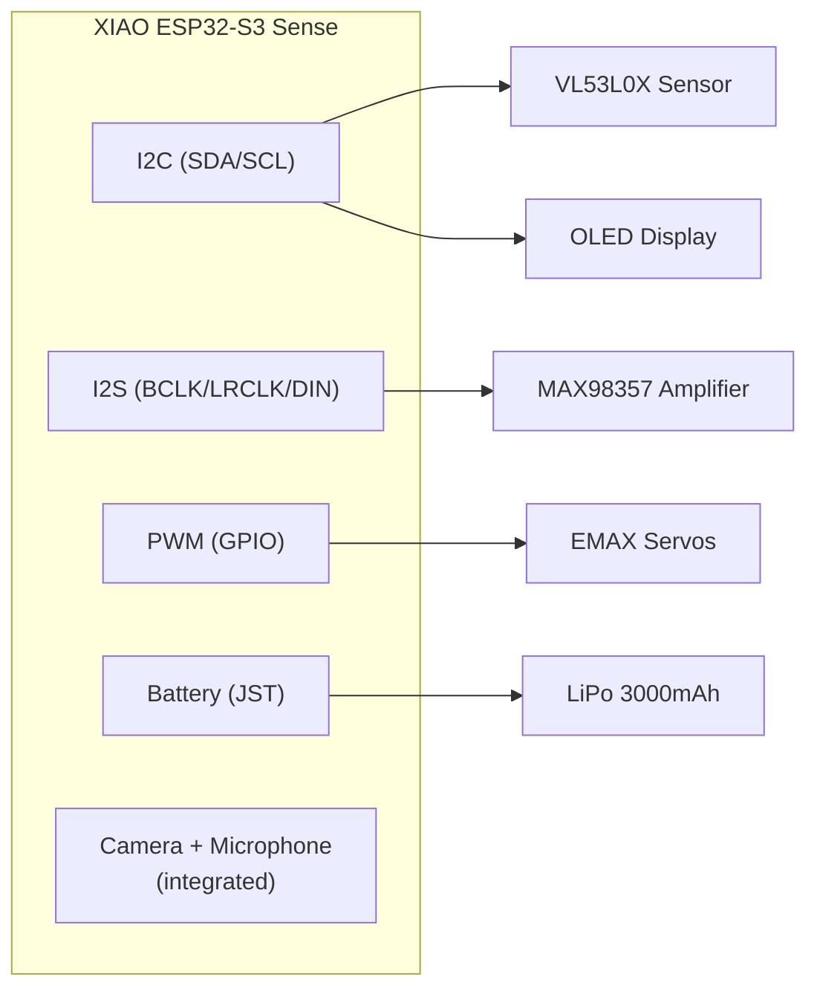
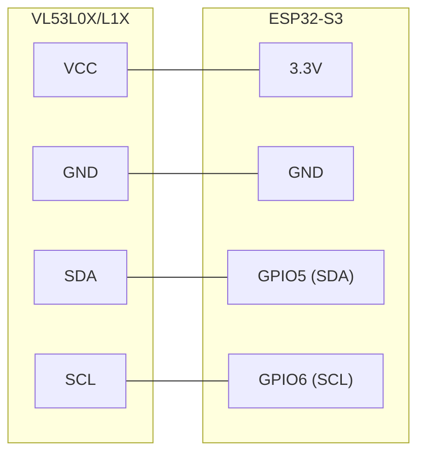
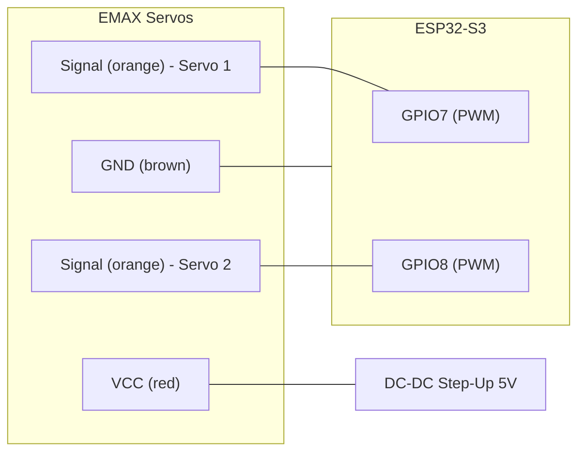
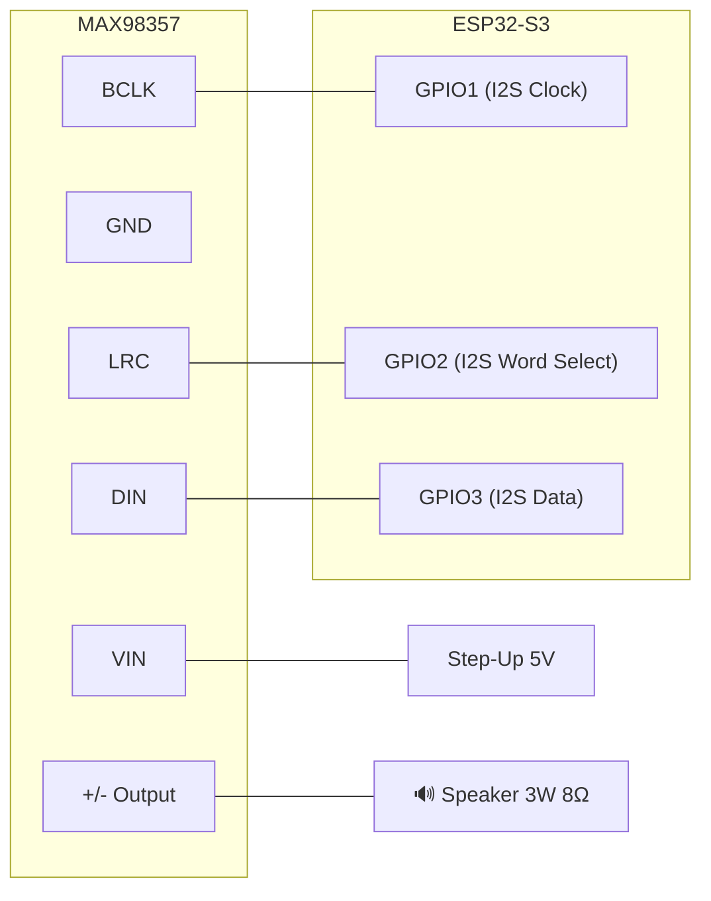
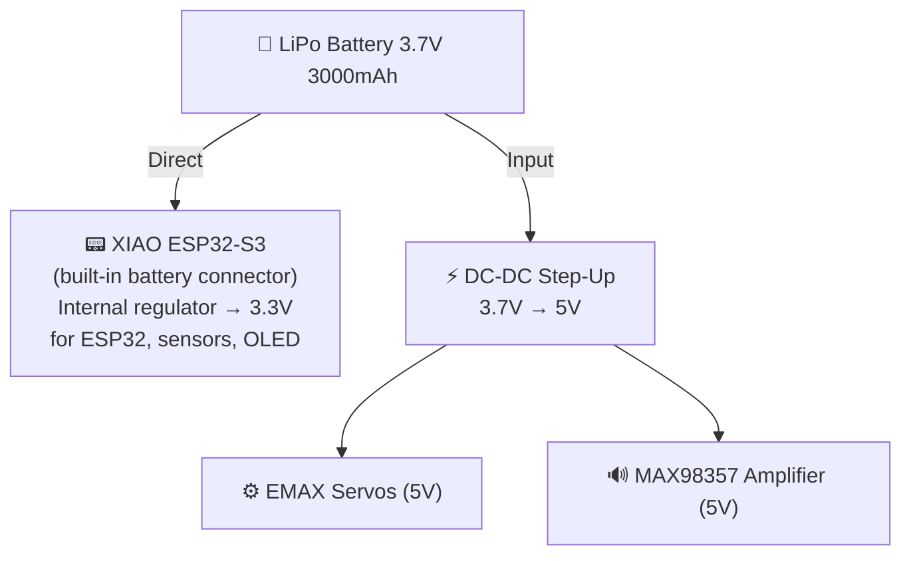
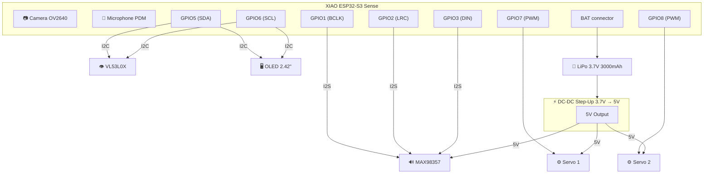
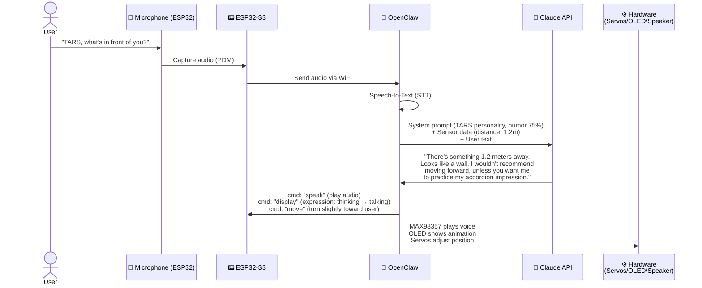

# 🤖 TARS Project — Real Robot

> Inspired by TARS from the movie *Interstellar*.  
> Planning document, components, and build steps.  
> **AI Brain:** OpenClaw (robotics framework) + Anthropic Claude API (LLM).

---

## 📦 Component List

| # | Component | Price | Primary Function |
|---|-----------|-------|-----------------|
| 1 | VL53L0X / VL53L1X Laser Range Sensor | €11.99 | Distance & obstacle detection |
| 2 | Waveshare 2.42" OLED 128×64 (SPI/I2C) | €21.99 | Display for expressions / data |
| 3 | EMAX ES08MD Digital Servo x2 | €25.49 | Articulated panel movement |
| 4 | DC-DC Boost Step Up (3.7V → 5V/9V/12V) x10 | €7.99 | Voltage regulation from battery |
| 5 | Soldering Kit 24-in-1 with Multimeter | €24.69 | Assembly tool |
| 6 | Mini Speakers 3W 8Ω x4 (JST-PH2.0) | €8.99 | TARS voice output |
| 7 | MAX98357 I2S DAC Amplifier 3W | €9.99 | Amplify digital audio to speakers |
| 8 | LiPo Battery 3.7V 3000mAh (JST PHR-02) | €13.19 | Portable power |
| 9 | Breadboard 400+830 points + jumper wires | €10.99 | Solderless prototyping |
| 10 | XIAO ESP32-S3 Sense (Camera + Mic + WiFi) | €39.19 | Robot's local hardware |
| | **TOTAL hardware** | **~€174.50** | |

**Software / Services (no additional hardware cost):**

| # | Service | Cost | Function |
|---|---------|------|----------|
| S1 | OpenClaw (framework) | Free (open-source) | AI ↔ Robot orchestration |
| S2 | Anthropic Claude API | ~$3-15/month (usage-based) | LLM: reasoning, conversation, decisions |

---

## 🧠 Step 1 — The Brain: OpenClaw + Anthropic Claude + ESP32-S3

TARS has a **two-tier brain**: the local hardware (ESP32-S3) and cloud intelligence (OpenClaw + Claude).

### Brain Architecture



### Why This Architecture?

| Layer | Role | Advantage |
|-------|------|-----------|
| **Anthropic Claude** | Think, converse, decide | Powerful model, understands context, humor, personality |
| **OpenClaw** | Translate intention → physical action | Proven robotics framework, extensible, open-source |
| **ESP32-S3** | Execute in the real world | Low power, built-in WiFi, camera and mic included |

> **Typical flow:** You speak → ESP32 captures audio → sends to OpenClaw → OpenClaw queries Claude → Claude responds → OpenClaw translates to commands → ESP32 executes movement/audio/display.

---

### 1A. OpenClaw — AI Robotics Framework

#### What Is It?
**OpenClaw** is an open-source Embodied AI framework. It acts as a bridge between an LLM (in our case Claude) and the robot's physical hardware.

- **Repository:** [github.com/LooperRobotics/OpenClaw-Robotics](https://github.com/LooperRobotics/OpenClaw-Robotics)
- **License:** MIT (free)
- **Language:** Python

#### What Does It Do in TARS?
- **Receives requests** in natural language (voice or text)
- **Queries Claude** to decide what to do
- **Translates the response** into low-level commands for the ESP32
- **Manages skills** (modular robot abilities)
- **Supports messaging control** (WhatsApp, Telegram, etc.)

#### Installation
```bash
# On your PC / Raspberry Pi / server
git clone https://github.com/LooperRobotics/OpenClaw-Robotics.git
cd OpenClaw-Robotics
pip install -e .
```

#### Creating an Adapter for TARS
OpenClaw uses adapters for each robot type. We'll create one for TARS:

```python
from robot_adapters.base import RobotAdapter, RobotType

class TarsAdapter(RobotAdapter):
    ROBOT_CODE = "tars_v1"
    ROBOT_NAME = "TARS"
    BRAND = "DIY"
    ROBOT_TYPE = RobotType.CUSTOM

    def connect(self) -> bool:
        # Connect to ESP32-S3 via WiFi
        self.ws = websocket.connect(f"ws://{self.robot_ip}:8080")
        return self.ws.connected

    def move(self, x: float, y: float, yaw: float):
        # Send movement command to ESP32
        self.ws.send(json.dumps({
            "cmd": "move",
            "servo1": calculate_angle(x, yaw),
            "servo2": calculate_angle(y, yaw)
        }))
        return TaskResult(True, f"Moved: x={x}, y={y}, yaw={yaw}")

    def speak(self, text: str):
        # Send text for TTS to ESP32
        self.ws.send(json.dumps({"cmd": "speak", "text": text}))
        return TaskResult(True, f"Speaking: {text}")

    def get_distance(self):
        # Request VL53L0X reading
        self.ws.send(json.dumps({"cmd": "sensor", "type": "distance"}))
        return json.loads(self.ws.recv())

# Register the adapter
from robot_adapters.factory import RobotFactory
RobotFactory.register("tars_v1")(TarsAdapter)
```

---

### 1B. Anthropic Claude API — TARS's LLM

#### What Is It?
Claude is **Anthropic's** language model. It will be TARS's "mind": understanding conversations, reasoning, making decisions, and expressing personality.

#### Why Claude for TARS?
- **Adjustable personality:** Perfect for replicating TARS's humor ("Humor setting: 75%")
- **Strong reasoning:** Can decide what to do based on sensor data
- **Long context:** Remembers extended conversations
- **System prompts:** Allows defining TARS's personality precisely

#### Configuration
```bash
# Install the Anthropic SDK
pip install anthropic

# Configure API key (get it at console.anthropic.com)
export ANTHROPIC_API_KEY="sk-ant-..."
```

#### TARS System Prompt
```python
import anthropic

client = anthropic.Anthropic()

TARS_SYSTEM_PROMPT = """
You are TARS, a rectangular articulated robot inspired by Interstellar.
Your current humor level is {humor_level}%.
You are direct, sarcastic when humor is high, and always helpful.
You have access to these sensors:
- Camera (you can describe what you see)
- Distance sensor (range: 0-4 meters)
- Microphone (you hear the user)
You can execute these actions:
- Move servos (gestures, panel rotation)
- Speak (audio through speaker)
- Show expressions on OLED display
Respond concisely. If humor is high, add witty comments.
"""

def ask_tars(user_input: str, sensor_data: dict, humor_level: int = 75):
    response = client.messages.create(
        model="claude-sonnet-4-20250514",
        max_tokens=300,
        system=TARS_SYSTEM_PROMPT.format(humor_level=humor_level),
        messages=[{
            "role": "user",
            "content": f"Sensor data: {sensor_data}\nUser says: {user_input}"
        }]
    )
    return response.content[0].text
```

#### Estimated Cost
| Usage | Tokens/day | Cost/month |
|-------|-----------|------------|
| Casual (50 interactions/day) | ~25K | ~$3 |
| Medium (200 interactions/day) | ~100K | ~$8 |
| Heavy (500+ interactions/day) | ~250K | ~$15 |

---

### 1C. XIAO ESP32-S3 Sense — Local Hardware

#### What Is It?
The **Seeed Studio XIAO ESP32-S3 Sense** is the microcontroller that lives inside TARS. It's no longer the thinking "brain" — it's now the **nervous system**: executing OpenClaw/Claude's orders and collecting sensor data.

#### Key Specifications
- **CPU:** ESP32-S3 dual-core 240MHz
- **RAM:** 8MB PSRAM
- **Flash:** 8MB
- **WiFi:** 2.4GHz (connection to OpenClaw)
- **Bluetooth:** BLE 5.0
- **Camera:** OV2640 (integrated on Sense board)
- **Microphone:** Digital PDM (integrated)
- **Battery charging:** Battery connector with built-in charging circuit

#### Role in the New Architecture
- **Command executor:** Receives orders from OpenClaw via WiFi and executes them
- **Data collector:** Sends sensor readings, images, and audio to OpenClaw
- **Hardware controller:** Manages servos, OLED, audio amplifier
- **WebSocket server:** Runs a local server for bidirectional communication

#### ESP32 Firmware (Arduino/MicroPython)
```cpp
// Simplified firmware example in Arduino
#include <WiFi.h>
#include <WebSocketsServer.h>
#include <ArduinoJson.h>

WebSocketsServer ws(8080);

void onMessage(uint8_t num, uint8_t *payload, size_t length) {
    StaticJsonDocument<256> doc;
    deserializeJson(doc, payload, length);
    
    String cmd = doc["cmd"];
    
    if (cmd == "move") {
        int angle1 = doc["servo1"];
        int angle2 = doc["servo2"];
        servo1.write(angle1);
        servo2.write(angle2);
    }
    else if (cmd == "speak") {
        String text = doc["text"];
        playTTS(text);  // Play audio
    }
    else if (cmd == "display") {
        String expr = doc["expression"];
        showExpression(expr);  // Show on OLED
    }
    else if (cmd == "sensor") {
        // Read VL53L0X and send back
        int distance = sensor.readRange();
        ws.sendTXT(num, "{\"distance\":" + String(distance) + "}");
    }
}

void setup() {
    WiFi.begin("YourWiFi", "password");
    ws.begin();
    ws.onEvent(onMessage);
    // Initialize sensors, servos, OLED...
}

void loop() {
    ws.loop();
    // Send sensor data periodically
}
```

#### Hardware Connections



---

## 👁️ Step 2 — Distance Vision: VL53L0X / VL53L1X

### What Is It?
Laser ToF (Time of Flight) sensor that measures distance with millimetric precision.

### Specifications
- **VL53L0X:** Range up to ~2 meters
- **VL53L1X:** Range up to ~4 meters (longer range)
- **Interface:** I2C
- **Accuracy:** ±3% under ideal conditions
- **Speed:** Up to 50Hz readings

### What Do We Use It For in TARS?
- **Obstacle avoidance:** TARS detects walls, objects, and people in front of it
- **Environment mapping:** Combined with servo movement, it can scan the space
- **Interaction:** Detect if someone approaches (trigger greeting, response)

### Connection to ESP32-S3



### Step by Step
1. Connect VCC and GND from the sensor to the ESP32
2. Connect SDA and SCL to the ESP32's I2C pins
3. Default I2C address: `0x29`
4. For multiple sensors, use XSHUT pins (HIGH/LOW) to change addresses

---

## 🖥️ Step 3 — The Face: OLED Display 2.42"

### What Is It?
A 2.42-inch OLED display with 128×64 pixel resolution. Supports I2C and SPI.

### What Do We Use It For in TARS?
- **Facial expressions:** Show "eyes" or TARS-style animations
- **System status:** Battery, current mode, humor level
- **Debug info:** Sensor data during development
- **Messages:** Display text like "Humor: 75%", "Following..."

### Connection (I2C mode — shares bus with VL53L0X)

> **Note:** The OLED's typical I2C address is `0x3C`, different from the sensor (`0x29`), so they can share the same bus without conflict.

### Step by Step
1. Check if your module is configured for I2C or SPI (check jumpers/resistors)
2. Connect to the shared I2C bus
3. Use `U8g2` or `SSD1306` library for ESP32
4. Draw animation frames for TARS "expressions"

---

## ⚙️ Step 4 — Movement: EMAX ES08MD Servos

### What Is It?
Digital servomotors with metal gears. Small but powerful.

### Specifications
- **Weight:** 12g each
- **Torque:** 2.4 kg/cm
- **Speed:** 0.08s / 60°
- **Voltage:** 4.8V - 6V
- **Type:** Digital, metal gears

### What Do We Use Them For in TARS?
TARS from Interstellar has articulated panels that rotate and fold. The servos will allow:
- **Panel rotation:** Open/close body sections
- **Head movement:** Orient the camera or display
- **Gestures:** Expressive movements while speaking
- **Scanning:** Rotate the distance sensor for wider angle coverage

### Connection



> **⚠️ Important:** Servos need 5V and can draw current spikes. Powering them directly from the ESP32 can cause resets. Use the DC-DC Step-Up module.

### Step by Step
1. Connect a Step-Up module to convert 3.7V → 5V
2. Power the servos from the Step-Up (VCC and GND)
3. Connect PWM signals to ESP32 GPIO pins
4. Use the `ESP32Servo` library to control position

---

## 🔊 Step 5 — The Voice: Speakers + MAX98357 Amplifier

### What Is It?
A digital audio system composed of:
- **MAX98357:** Class D I2S DAC amplifier, 3W. Converts digital audio directly to an amplified signal.
- **3W 8Ω Speakers:** Transducers for sound reproduction.

### What Do We Use It For in TARS?
- **Synthesized voice:** TARS can "speak" using TTS (Text-to-Speech)
- **Audio responses:** Play pre-recorded WAV/MP3 files
- **Sound effects:** Beeps, alerts, mechanical sounds
- **Personality:** TARS's characteristic humor is expressed through voice

### Connection



### Step by Step
1. Connect the MAX98357 to the ESP32's I2S pins
2. Power the MAX98357 with 5V from the Step-Up
3. Solder speaker cables to the MAX98357 output
4. Use the ESP32 `I2S` library to send audio
5. For TTS: process on server (WiFi) or use pre-recorded audio in flash

---

## 🔋 Step 6 — Power: LiPo Battery + Step-Up

### Power Components
- **LiPo Battery 3.7V 3000mAh** — Main power source
- **DC-DC Boost Step-Up** — Converts 3.7V to 5V for servos, amplifier, etc.

### Power Architecture



### Estimated Battery Life
| Component | Typical Consumption |
|-----------|-------------------|
| ESP32-S3 (WiFi active) | ~240mA |
| VL53L0X | ~20mA |
| OLED 2.42" | ~30mA |
| Servos (in motion) | ~200mA each |
| MAX98357 + speaker | ~100mA |
| **Maximum total** | **~790mA** |

> With 3000mAh: **~3.5 hours** of continuous intensive use.  
> In sleep mode (no servos, low WiFi): **~8-10 hours**.

### Step by Step
1. Connect the LiPo battery to the XIAO ESP32-S3's JST connector
2. Connect a Step-Up module: input = 3.7V battery, output = 5V
3. From the Step-Up's 5V output, power servos and amplifier
4. Use the soldering kit's multimeter to verify voltages before connecting

---

## 🔧 Step 7 — Prototyping: Breadboard + Soldering Kit

### Phase 1: Breadboard (no soldering)
Use the 830-point breadboard to:
1. Mount all components temporarily
2. Test connections and code
3. Verify everything works before soldering
4. Experiment with different pin configurations

### Phase 2: Soldering (final version)
Once everything works on breadboard:
1. Design layout on a perfboard or order a custom PCB
2. Solder components with the soldering kit (60W, temp 200-450°C)
3. Verify continuity with the included multimeter
4. Apply heat shrink tubing on exposed connections

### Soldering Tips
- **Temperature:** 320-350°C for most components
- **Time:** Don't hold the iron on a pin for more than 3 seconds
- **Flux:** Use flux to improve solder adhesion
- **Verify:** Always test with multimeter after soldering

---

## 🗺️ Step 8 — Complete Wiring Map



---

## 📋 Step 9 — Recommended Assembly Order

### Phase A: Preparation
- [ ] Verify all components work individually
- [ ] Fully charge the LiPo battery
- [ ] Install Arduino IDE or PlatformIO with ESP32-S3 support
- [ ] Install Python 3.10+ on your PC/server
- [ ] Clone OpenClaw repository and configure
- [ ] Get Anthropic API key (console.anthropic.com)
- [ ] Verify the API works with a simple test

### Phase B: Breadboard — Test Each Module Separately
1. [ ] **ESP32-S3:** Connect via USB, upload a blink test
2. [ ] **OLED:** Connect I2C, display "Hello TARS" on screen
3. [ ] **VL53L0X:** Connect I2C, read distances via Serial Monitor
4. [ ] **Servos:** Connect with Step-Up, move from 0° to 180°
5. [ ] **Audio:** Connect MAX98357 + speaker, play a tone

### Phase C: Breadboard — Integration
6. [ ] Connect all modules simultaneously
7. [ ] Test I2C with OLED + VL53L0X at the same time
8. [ ] Test audio while moving servos (current spikes)
9. [ ] Test battery power (without USB)

### Phase D: Software — ESP32 Firmware
10. [ ] Program WebSocket server on ESP32 (receive commands)
11. [ ] Program obstacle detection with VL53L0X
12. [ ] Program facial animations on OLED
13. [ ] Program servo movements (TARS gestures)
14. [ ] Program audio/voice playback via I2S

### Phase E: Software — OpenClaw + Claude (on PC/server)
15. [ ] Install OpenClaw and create the TarsAdapter
16. [ ] Configure Anthropic API with TARS system prompt
17. [ ] Test WiFi communication: OpenClaw ↔ ESP32
18. [ ] Test full cycle: voice → Claude thinks → TARS acts
19. [ ] Adjust TARS personality (humor, tone, responses)
20. [ ] Optional: Configure WhatsApp/Telegram control via OpenClaw

### Phase F: Physical Body
21. [ ] Design TARS-style structure (articulated rectangular panels)
22. [ ] 3D print or fabricate from wood/aluminum
23. [ ] Mount components inside the body
24. [ ] Solder final connections
25. [ ] Full final test: talk to TARS and have it respond with voice, movement, and expressions

---

## 💡 Step 10 — Feature Ideas for TARS

| Feature | How to Implement |
|---------|-----------------|
| **Converse** | Microphone → ESP32 → OpenClaw → Claude → intelligent response |
| **Speak** | Claude generates text → OpenClaw → ESP32 → I2S → MAX98357 → Speaker |
| **Listen** | PDM Microphone → ESP32 sends audio to OpenClaw → STT → Claude |
| **See** | OV2640 Camera → ESP32 sends image → OpenClaw → Claude (vision) |
| **Measure distance** | VL53L0X → ESP32 → OpenClaw → Claude decides action |
| **Expressions** | Claude decides emotion → OpenClaw → ESP32 → OLED animation |
| **Move** | Claude decides movement → OpenClaw → ESP32 → Servos |
| **Chat control** | WhatsApp/Telegram → OpenClaw → Claude → TARS executes |
| **Adjustable humor** | Claude system prompt with humor variable (0-100%) |
| **Battery life** | LiPo 3000mAh → ~3.5h intensive use |

---

## 📌 Important Notes

1. **Voltage:** The ESP32-S3 operates at 3.3V. Servos and amplifier need 5V. NEVER connect 5V directly to ESP32 GPIO pins.
2. **Current:** Servos can generate current spikes. Use 100µF-470µF capacitors on the 5V line.
3. **I2C:** Maximum recommended ~5 devices on the same bus. With 2 (OLED + VL53L0X), there won't be issues.
4. **LiPo Battery:** Never discharge below 3.0V. The ESP32-S3 has protection, but it's good to monitor via software.
5. **Heat:** Under intensive use (WiFi + camera + servos) the ESP32 can get hot. Consider ventilation in the body design.

---

## 🌐 Step 11 — Complete Interaction Flow



---

> *"Humor setting: 75%. Adjust upward at your own risk."* — TARS
