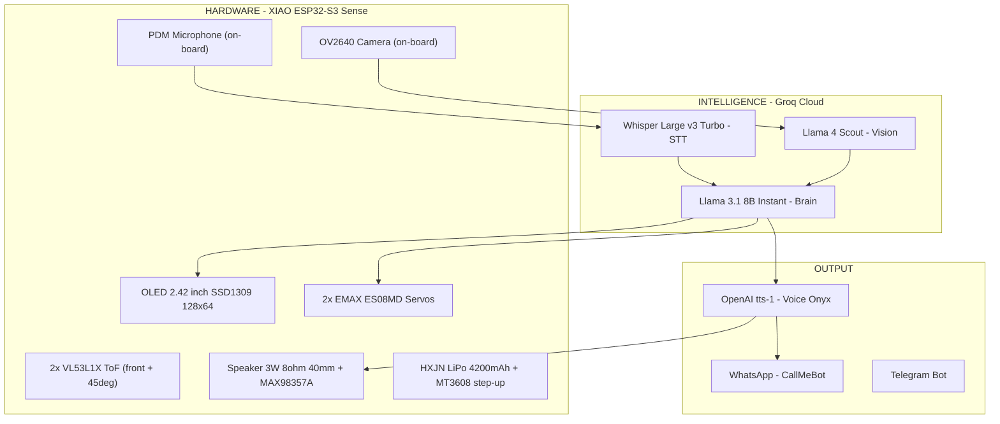
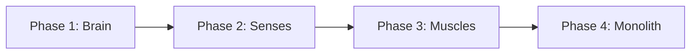
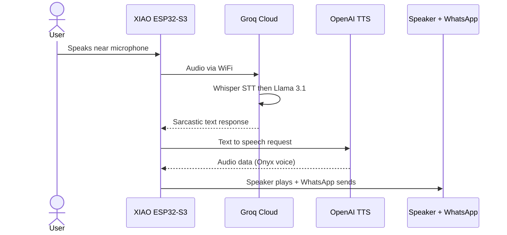

# TARS Project — Real Robot

> Inspired by TARS from *Interstellar*.
> A rectangular articulated monolith that hears, thinks, speaks, sees, moves, and insults you in 2 languages.

---

## Architecture

---

## Build Phases

The project is divided into 4 independent phases. Each phase builds on the previous one and has its own dedicated documentation:

| Phase | Name | Components | Result | Doc |
|-------|------|-----------|--------|-----|
| 1 | **Brain** | XIAO ESP32-S3 + Groq + Mobile | TARS te insulta por el movil en 2 idiomas | [PHASE1_BRAIN.md](PHASE1_BRAIN.md) |
| 2 | **Senses** | 2x VL53L1X + Speaker 40mm + MAX98357A | El robot te "oye", "habla" y mide distancias | [PHASE2_SENSES.md](PHASE2_SENSES.md) |
| 3 | **Muscles** | HXJN 4200mAh + MT3608 + 2x ES08MD + OLED | Portable, con brazos oscilantes y pantalla | [PHASE3_MUSCLES.md](PHASE3_MUSCLES.md) |
| 3b| **Mechanics** | Chasis PETG 351x156x39mm (Bambu X1/P1S) | Carcasa canonica 9x4x1 con todo integrado | [PHASE3_MECHANICS.md](PHASE3_MECHANICS.md) |
| 4 | **Monolith** | Ensamblaje final + firmware unificado | Robot TARS completo funcionando | [PHASE4_MONOLITH.md](PHASE4_MONOLITH.md) |

---

## Component List

| # | Component | Price | Phase |
|---|-----------|-------|-------|
| 1 | XIAO ESP32-S3 Sense (Camera + Mic + WiFi + 8MB PSRAM) | EUR 39.19 | 1 |
| 2 | Soldering Kit 24-in-1 with Multimeter | EUR 24.69 | 1 |
| 3 | VL53L1X ToF Range Sensor (0-4m) x2 | EUR 23.98 | 2 |
| 4 | MAX98357A I2S DAC Amplifier 3W | EUR 9.99 | 2 |
| 5 | Speaker 3W 8 Ohm 40mm diameter | EUR 8.99 | 2 |
| 6 | EMAX ES08MD Digital Servo x2 | EUR 25.49 | 3 |
| 7 | MT3608 DC-DC Boost Step-Up (3.7V to 5V) | EUR 7.99 | 3 |
| 8 | HXJN LiPo 4200mAh 606090 (bare wires, BMS) | EUR 22.99 | 3 |
| 9 | Waveshare 2.42 inch OLED 128x64 SSD1309 (I2C/SPI) | EUR 21.99 | 3 |
| 10 | Miuzei Starter Kit (breadboard + jumpers) | EUR 10.99 | 1-3 |
| 11 | PETG filament (264g for full chassis) | EUR ~6.00 | 3b |
| | **TOTAL hardware** | **~EUR 202.27** | |

### Cloud Services

| Service | Cost | Function |
|---------|------|----------|
| Groq API (Whisper + Llama) | ~EUR 0.05/month | STT + LLM reasoning |
| OpenAI TTS (tts-1, voice Onyx) | ~EUR 2-4/month | Voice generation (ES/RO) |
| OpenClaw (firmware) | Free | AI-Robot orchestration |
| CallMeBot WhatsApp | Free | Message delivery |
| **TOTAL monthly** | **~EUR 2-4** | |

---

## Cost Per Phase

| Phase | Hardware | Cumulative |
|-------|----------|-----------|
| Phase 1 - Brain | EUR 63.88 | EUR 63.88 |
| Phase 2 - Senses | EUR 42.96 | EUR 106.84 |
| Phase 3 - Muscles + Mechanics | EUR 95.44 | EUR 202.27 |
| Phase 4 - Monolith (assembly only) | EUR 0.00 | EUR 202.27 |

---

## Interaction Flow

---

## Final Specifications

| Spec | Value |
|------|-------|
| Height | 35.1 cm (9 units of 39mm, canonical 9x4x1 TARS) |
| Width | 15.6 cm (2 lateral arms + central double) |
| Depth | 3.9 cm |
| Weight | ~534 g (full assembly) |
| CPU | ESP32-S3 dual-core 240MHz, 8MB PSRAM |
| AI Brain | Groq Llama 3.1 8B Instant (840 tok/s) |
| STT | Groq Whisper Large v3 Turbo (< 100ms) |
| Vision | Groq Llama 4 Scout |
| Voice | OpenAI tts-1, Onyx |
| Sensors | Camera OV2640, Mic PDM, 2x VL53L1X ToF (0-4m) |
| Display | Waveshare 2.42" OLED 128x64 (SSD1309, I2C 0x3C) |
| Audio | MAX98357A + speaker 3W 8 Ohm 40mm (integrated acoustic box) |
| Movement | 2x EMAX ES08MD (2.4 kg/cm, +/-60 deg) |
| Battery | HXJN LiPo 3.7V 4200mAh with BMS (~10h active, ~33h idle) |
| Power | MT3608 step-up 3.7V->5V (eta ~90%) |
| Connectivity | WiFi 2.4GHz, WhatsApp, Telegram |
| Languages | Spanish + Romanian |
| Humor | 0-100% (default 75%) |
| Body | PETG, Bambu Lab X1 / P1S (~25h print, 264g filament) |

---

## Translations

- [Documentacion en Espanol](TARS_Robot_Build_ES.md)
- [Documentation en Francais](TARS_Robot_Build_FR.md)

---

> *"Humor setting: 75%. Adjust upward at your own risk."* — TARS
