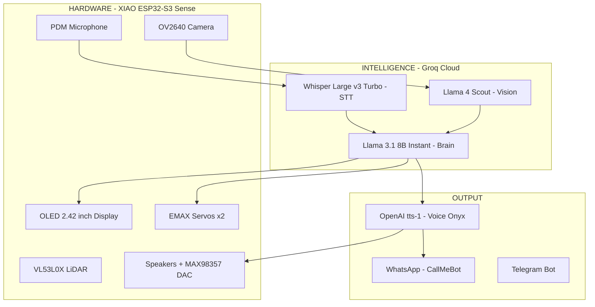
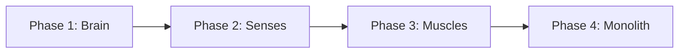
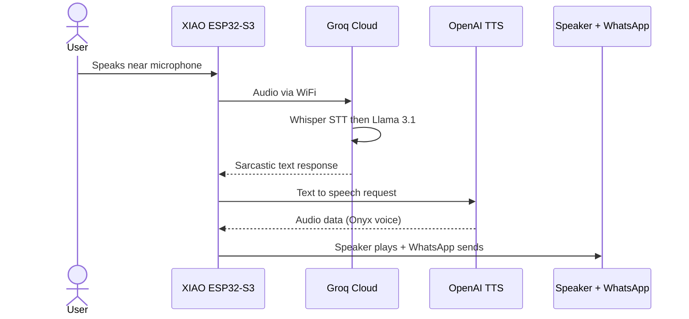

# TARS Project — Real Robot

> Inspired by TARS from *Interstellar*.
> A rectangular articulated monolith that hears, thinks, speaks, sees, moves, and insults you in 2 languages.

---

## Architecture

---

## Build Phases

The project is divided into 4 independent phases. Each phase builds on the previous one and has its own dedicated documentation:

| Phase | Name | Components | Result | Doc |
|-------|------|-----------|--------|-----|
| 1 | **Brain** | XIAO ESP32-S3 + Groq + Mobile | TARS te insulta por el movil en 2 idiomas | [PHASE1_BRAIN.md](PHASE1_BRAIN.md) |
| 2 | **Senses** | LiDAR + Speaker + DAC | El robot te "oye" y "habla" fisicamente | [PHASE2_SENSES.md](PHASE2_SENSES.md) |
| 3 | **Muscles** | Battery + Step-Up + Servos | Movimiento independiente y equilibrio | [PHASE3_MUSCLES.md](PHASE3_MUSCLES.md) |
| 4 | **Monolith** | Bambu Lab P1S (ASA/PLA) | Ensamblaje final de los bloques de 20cm | [PHASE4_MONOLITH.md](PHASE4_MONOLITH.md) |

---

## Component List

| # | Component | Price | Phase |
|---|-----------|-------|-------|
| 1 | XIAO ESP32-S3 Sense (Camera + Mic + WiFi) | EUR 39.19 | 1 |
| 2 | Soldering Kit 24-in-1 with Multimeter | EUR 24.69 | 1 |
| 3 | VL53L0X / VL53L1X Laser Range Sensor | EUR 11.99 | 2 |
| 4 | MAX98357 I2S DAC Amplifier 3W | EUR 9.99 | 2 |
| 5 | Mini Speakers 3W 8 Ohm x4 (JST-PH2.0) | EUR 8.99 | 2 |
| 6 | EMAX ES08MD Digital Servo x2 | EUR 25.49 | 3 |
| 7 | DC-DC Boost Step-Up (3.7V to 5V) x10 | EUR 7.99 | 3 |
| 8 | LiPo Battery 3.7V 3000mAh (JST PHR-02) | EUR 13.19 | 3 |
| 9 | Waveshare 2.42 inch OLED 128x64 (I2C) | EUR 21.99 | 4 |
| 10 | Breadboard 400+830 points + jumper wires | EUR 10.99 | 4 |
| | **TOTAL hardware** | **~EUR 174.50** | |

### Cloud Services

| Service | Cost | Function |
|---------|------|----------|
| Groq API (Whisper + Llama) | ~EUR 0.05/month | STT + LLM reasoning |
| OpenAI TTS (tts-1, voice Onyx) | ~EUR 2-4/month | Voice generation (ES/RO) |
| OpenClaw (firmware) | Free | AI-Robot orchestration |
| CallMeBot WhatsApp | Free | Message delivery |
| **TOTAL monthly** | **~EUR 2-4** | |

---

## Cost Per Phase

| Phase | Hardware | Cumulative |
|-------|----------|-----------|
| Phase 1 - Brain | EUR 63.88 | EUR 63.88 |
| Phase 2 - Senses | EUR 30.97 | EUR 94.85 |
| Phase 3 - Muscles | EUR 46.67 | EUR 141.52 |
| Phase 4 - Monolith | EUR 32.98 | EUR 174.50 |

---

## Interaction Flow

---

## Final Specifications

| Spec | Value |
|------|-------|
| Height | ~80cm (4 x 20cm blocks) |
| Weight | ~300-500g |
| CPU | ESP32-S3 dual-core 240MHz, 8MB PSRAM |
| AI Brain | Groq Llama 3.1 8B Instant (840 tok/s) |
| STT | Groq Whisper Large v3 Turbo (< 100ms) |
| Vision | Groq Llama 4 Scout |
| Voice | OpenAI tts-1, Onyx |
| Sensors | Camera, Microphone, LiDAR (0-4m) |
| Display | OLED 2.42 inch 128x64 |
| Audio | MAX98357 3W + 8 Ohm speakers |
| Movement | 2x EMAX ES08MD (2.4 kg/cm) |
| Battery | LiPo 3.7V 3000mAh (~3.5h) |
| Connectivity | WiFi 2.4GHz, WhatsApp, Telegram |
| Languages | Spanish + Romanian |
| Humor | 0-100% (default 75%) |
| Body | ASA or PLA, Bambu Lab P1S |

---

## Translations

- [Documentacion en Espanol](TARS_Robot_Build_ES.md)
- [Documentation en Francais](TARS_Robot_Build_FR.md)

---

> *"Humor setting: 75%. Adjust upward at your own risk."* — TARS
