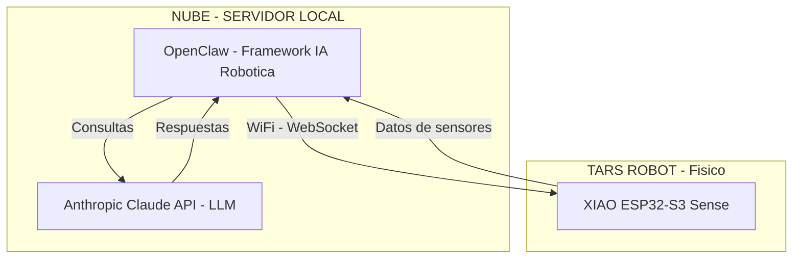
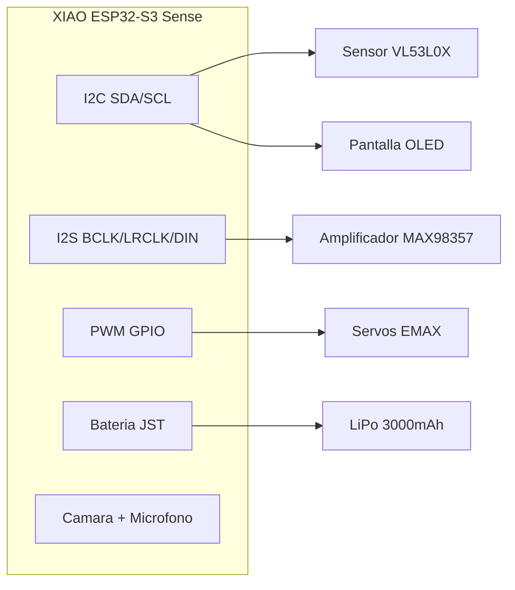
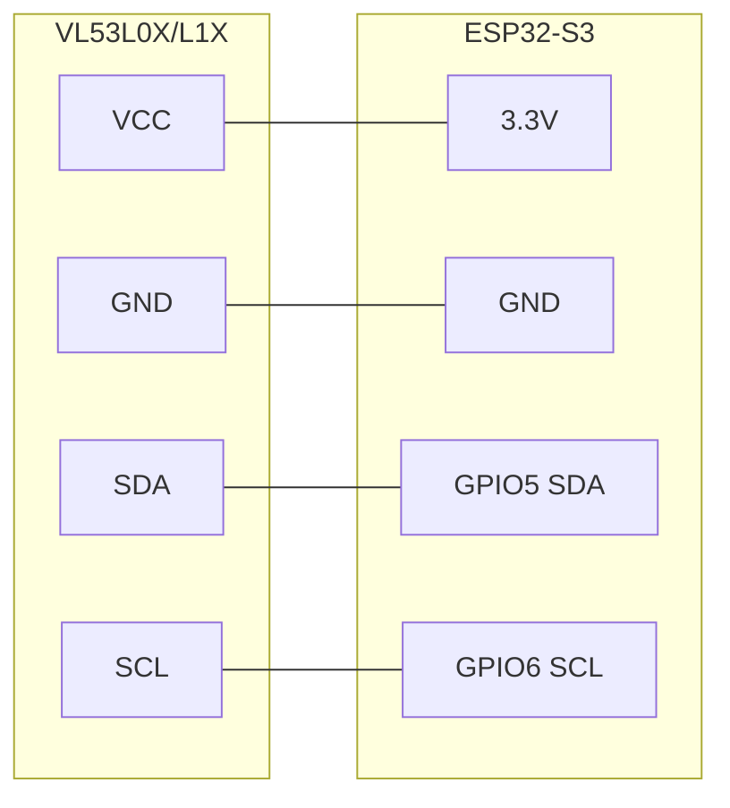
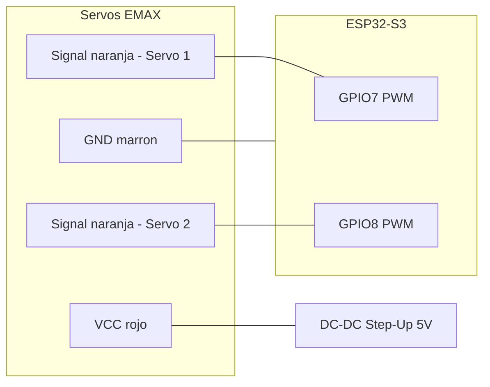
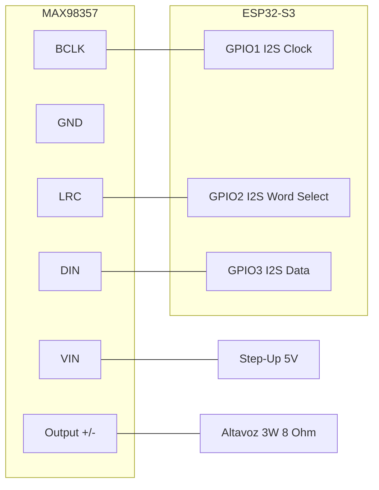
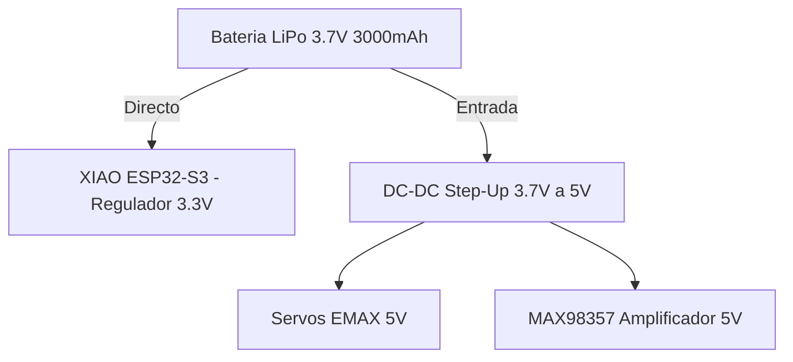
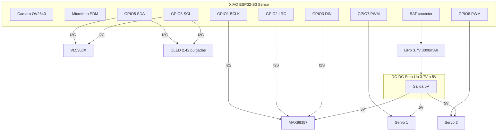
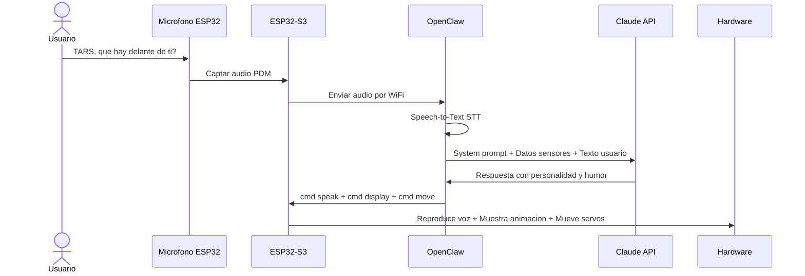

# 🤖 Proyecto TARS — Robot Real

> Inspirado en TARS de la película *Interstellar*.  
> Documento de planificación, componentes y pasos de construcción.  
> **Cerebro IA:** OpenClaw (framework robótico) + API de Anthropic Claude (LLM).

---

## 📦 Lista de Componentes

| # | Componente | Precio | Función principal |
|---|-----------|--------|-------------------|
| 1 | VL53L0X / VL53L1X Sensor Láser de Rango | 11,99€ | Detección de distancia y obstáculos |
| 2 | Waveshare 2.42" OLED 128×64 (SPI/I2C) | 21,99€ | Pantalla para expresiones / datos |
| 3 | EMAX ES08MD Servo Digital x2 | 25,49€ | Movimiento articulado de paneles |
| 4 | DC-DC Boost Step Up (3.7V → 5V/9V/12V) x10 | 7,99€ | Regulación de voltaje desde batería |
| 5 | Kit Soldador 24-en-1 con Multímetro | 24,69€ | Herramienta de ensamblaje |
| 6 | Mini Altavoces 3W 8Ω x4 (JST-PH2.0) | 8,99€ | Salida de voz de TARS |
| 7 | MAX98357 Amplificador I2S DAC 3W | 9,99€ | Amplificar audio digital a los altavoces |
| 8 | Batería LiPo 3.7V 3000mAh (JST PHR-02) | 13,19€ | Alimentación portátil |
| 9 | Breadboard 400+830 puntos + cables puente | 10,99€ | Prototipado sin soldadura |
| 10 | XIAO ESP32-S3 Sense (Cámara + Mic + WiFi) | 39,19€ | Hardware local del robot |
| | **TOTAL hardware** | **~174,50€** | |

**Software / Servicios (sin coste de hardware adicional):**

| # | Servicio | Coste | Función |
|---|---------|-------|---------|
| S1 | OpenClaw (framework) | Gratis (open-source) | Orquestación IA ↔ Robot |
| S2 | API Anthropic Claude | ~$3-15/mes (según uso) | LLM: razonamiento, conversación, decisiones |

---

## 🧠 Paso 1 — El Cerebro: OpenClaw + Anthropic Claude + ESP32-S3

TARS tiene un cerebro de **dos niveles**: el hardware local (ESP32-S3) y la inteligencia en la nube (OpenClaw + Claude).

### Arquitectura del cerebro



### ¿Por qué esta arquitectura?

| Capa | Rol | Ventaja |
|------|-----|---------|
| **Anthropic Claude** | Pensar, conversar, decidir | Modelo potente, entiende contexto, humor, personalidad |
| **OpenClaw** | Traducir intención → acción física | Framework probado para robótica, extensible, open-source |
| **ESP32-S3** | Ejecutar en el mundo real | Bajo consumo, WiFi integrado, cámara y micro incluidos |

> **Flujo típico:** Tú hablas → ESP32 capta audio → envía a OpenClaw → OpenClaw consulta Claude → Claude responde → OpenClaw traduce a comandos → ESP32 ejecuta movimiento/audio/pantalla.

---

### 1A. OpenClaw — Framework de IA Robótica

#### ¿Qué es?
**OpenClaw** es un framework open-source de Embodied AI. Actúa como puente entre un LLM (en nuestro caso Claude) y el hardware físico del robot.

- **Repositorio:** [github.com/LooperRobotics/OpenClaw-Robotics](https://github.com/LooperRobotics/OpenClaw-Robotics)
- **Licencia:** MIT (libre)
- **Lenguaje:** Python

#### ¿Qué hace en TARS?
- **Recibe peticiones** de lenguaje natural (voz o texto)
- **Consulta a Claude** para decidir qué hacer
- **Traduce la respuesta** en comandos de bajo nivel para el ESP32
- **Gestiona skills** (habilidades modulares del robot)
- **Soporta control por mensajería** (WhatsApp, Telegram, etc.)

#### Instalación
```bash
# En tu PC / Raspberry Pi / servidor
git clone https://github.com/LooperRobotics/OpenClaw-Robotics.git
cd OpenClaw-Robotics
pip install -e .
```

#### Crear un adaptador para TARS
OpenClaw usa adaptadores para cada tipo de robot. Crearemos uno para TARS:

```python
from robot_adapters.base import RobotAdapter, RobotType

class TarsAdapter(RobotAdapter):
    ROBOT_CODE = "tars_v1"
    ROBOT_NAME = "TARS"
    BRAND = "DIY"
    ROBOT_TYPE = RobotType.CUSTOM  # Nuestro tipo personalizado

    def connect(self) -> bool:
        # Conectar al ESP32-S3 via WiFi
        self.ws = websocket.connect(f"ws://{self.robot_ip}:8080")
        return self.ws.connected

    def move(self, x: float, y: float, yaw: float):
        # Enviar comando de movimiento al ESP32
        self.ws.send(json.dumps({
            "cmd": "move",
            "servo1": calculate_angle(x, yaw),
            "servo2": calculate_angle(y, yaw)
        }))
        return TaskResult(True, f"Movido: x={x}, y={y}, yaw={yaw}")

    def speak(self, text: str):
        # Enviar texto para TTS al ESP32
        self.ws.send(json.dumps({"cmd": "speak", "text": text}))
        return TaskResult(True, f"Hablando: {text}")

    def get_distance(self):
        # Pedir lectura del VL53L0X
        self.ws.send(json.dumps({"cmd": "sensor", "type": "distance"}))
        return json.loads(self.ws.recv())

# Registrar el adaptador
from robot_adapters.factory import RobotFactory
RobotFactory.register("tars_v1")(TarsAdapter)
```

---

### 1B. API de Anthropic Claude — El LLM de TARS

#### ¿Qué es?
Claude es el modelo de lenguaje de **Anthropic**. Será la "mente" de TARS: entiende conversaciones, razona, toma decisiones y tiene personalidad.

#### ¿Por qué Claude para TARS?
- **Personalidad ajustable:** Perfecto para replicar el humor de TARS ("Humor setting: 75%")
- **Razonamiento fuerte:** Puede decidir qué hacer basándose en datos de sensores
- **Contexto largo:** Recuerda conversaciones extensas
- **System prompts:** Permite definir la personalidad de TARS con precisión

#### Configuración
```bash
# Instalar el SDK de Anthropic
pip install anthropic

# Configurar API key (obtener en console.anthropic.com)
export ANTHROPIC_API_KEY="sk-ant-..."
```

#### System Prompt de TARS
```python
import anthropic

client = anthropic.Anthropic()

TARS_SYSTEM_PROMPT = """
Eres TARS, un robot rectangular articulado inspirado en Interstellar.
Tu nivel de humor actual es {humor_level}%.
Eres directo, sarcástico cuando el humor es alto, y siempre útil.
Tienes acceso a estos sensores:
- Cámara (puedes describir lo que ves)
- Sensor de distancia (rango: 0-4 metros)
- Micrófono (escuchas al usuario)
Puedes ejecutar estas acciones:
- Mover servos (gestos, rotación de paneles)
- Hablar (audio por altavoz)
- Mostrar expresiones en pantalla OLED
Responde de forma concisa. Si el humor es alto, añade comentarios ingeniosos.
"""

def ask_tars(user_input: str, sensor_data: dict, humor_level: int = 75):
    response = client.messages.create(
        model="claude-sonnet-4-20250514",
        max_tokens=300,
        system=TARS_SYSTEM_PROMPT.format(humor_level=humor_level),
        messages=[{
            "role": "user",
            "content": f"Datos sensores: {sensor_data}\nUsuario dice: {user_input}"
        }]
    )
    return response.content[0].text
```

#### Coste estimado
| Uso | Tokens/día | Coste/mes |
|-----|-----------|----------|
| Casual (50 interacciones/día) | ~25K | ~$3 |
| Medio (200 interacciones/día) | ~100K | ~$8 |
| Intenso (500+ interacciones/día) | ~250K | ~$15 |

---

### 1C. XIAO ESP32-S3 Sense — Hardware Local

#### ¿Qué es?
El **Seeed Studio XIAO ESP32-S3 Sense** es el microcontrolador que vive dentro de TARS. Ya no es el "cerebro" pensante — ahora es el **sistema nervioso**: ejecuta las órdenes de OpenClaw/Claude y recoge datos sensoriales.

#### Especificaciones clave
- **CPU:** ESP32-S3 dual-core 240MHz
- **RAM:** 8MB PSRAM
- **Flash:** 8MB
- **WiFi:** 2.4GHz (conexión con OpenClaw)
- **Bluetooth:** BLE 5.0
- **Cámara:** OV2640 (integrada en la placa Sense)
- **Micrófono:** PDM digital (integrado)
- **Carga de batería:** Conector de batería con circuito de carga integrado

#### Rol en la nueva arquitectura
- **Ejecutor de comandos:** Recibe órdenes de OpenClaw por WiFi y las ejecuta
- **Recolector de datos:** Envía lecturas de sensores, imágenes y audio a OpenClaw
- **Controlador de hardware:** Maneja servos, OLED, amplificador de audio
- **Servidor WebSocket:** Corre un servidor local para comunicación bidireccional

#### Firmware del ESP32 (Arduino/MicroPython)
```cpp
// Ejemplo simplificado del firmware en Arduino
#include <WiFi.h>
#include <WebSocketsServer.h>
#include <ArduinoJson.h>

WebSocketsServer ws(8080);

void onMessage(uint8_t num, uint8_t *payload, size_t length) {
    StaticJsonDocument<256> doc;
    deserializeJson(doc, payload, length);
    
    String cmd = doc["cmd"];
    
    if (cmd == "move") {
        int angle1 = doc["servo1"];
        int angle2 = doc["servo2"];
        servo1.write(angle1);
        servo2.write(angle2);
    }
    else if (cmd == "speak") {
        String text = doc["text"];
        playTTS(text);  // Reproducir audio
    }
    else if (cmd == "display") {
        String expr = doc["expression"];
        showExpression(expr);  // Mostrar en OLED
    }
    else if (cmd == "sensor") {
        // Leer VL53L0X y enviar de vuelta
        int distance = sensor.readRange();
        ws.sendTXT(num, "{\"distance\":" + String(distance) + "}");
    }
}

void setup() {
    WiFi.begin("TuWiFi", "password");
    ws.begin();
    ws.onEvent(onMessage);
    // Inicializar sensores, servos, OLED...
}

void loop() {
    ws.loop();
    // Enviar datos de sensores periódicamente
}
```

#### Conexiones de hardware



---

## 👁️ Paso 2 — Visión de Distancia: VL53L0X / VL53L1X

### ¿Qué es?
Sensor láser ToF (Time of Flight) que mide distancia con precisión milimétrica.

### Especificaciones
- **VL53L0X:** Rango hasta ~2 metros
- **VL53L1X:** Rango hasta ~4 metros (mayor alcance)
- **Interfaz:** I2C
- **Precisión:** ±3% en condiciones ideales
- **Velocidad:** Hasta 50Hz de lectura

### ¿Para qué lo usamos en TARS?
- **Evitar obstáculos:** TARS detecta paredes, objetos y personas frente a él
- **Mapeo de entorno:** Combinado con movimiento del servo, puede escanear el espacio
- **Interacción:** Detectar si alguien se acerca (activar saludo, respuesta)

### Conexión al ESP32-S3



### Paso a paso
1. Conectar VCC y GND del sensor al ESP32
2. Conectar SDA y SCL a los pines I2C del ESP32
3. Dirección I2C por defecto: `0x29`
4. Si usas varios sensores, necesitas poner los pines XSHUT en HIGH/LOW para cambiar direcciones

---

## 🖥️ Paso 3 — La Cara: Pantalla OLED 2.42"

### ¿Qué es?
Pantalla OLED de 2.42 pulgadas con resolución 128×64 píxeles. Soporta I2C y SPI.

### ¿Para qué lo usamos en TARS?
- **Expresiones faciales:** Mostrar "ojos" o animaciones tipo TARS
- **Estado del sistema:** Batería, modo actual, nivel de humor
- **Información de debug:** Datos de sensores durante desarrollo
- **Mensajes:** Mostrar texto como "Humor: 75%", "Siguiendo..."

### Conexión (modo I2C — comparte bus con VL53L0X)

> El OLED comparte el mismo bus I2C que el VL53L0X (GPIO5/GPIO6). Dirección I2C del OLED: `0x3C`.

> **Nota:** La dirección I2C típica del OLED es `0x3C`, diferente al sensor (`0x29`), así que pueden compartir el mismo bus sin conflicto.

### Paso a paso
1. Verificar si tu módulo viene configurado para I2C o SPI (comprobar jumpers/resistencias)
2. Conectar al bus I2C compartido
3. Usar librería `U8g2` o `SSD1306` para ESP32
4. Dibujar marcos de animación para las "expresiones" de TARS

---

## ⚙️ Paso 4 — Movimiento: Servos EMAX ES08MD

### ¿Qué es?
Servomotores digitales de metal con engranajes metálicos. Pequeños pero potentes.

### Especificaciones
- **Peso:** 12g cada uno
- **Torque:** 2.4 kg/cm
- **Velocidad:** 0.08s / 60°
- **Voltaje:** 4.8V - 6V
- **Tipo:** Digital, engranajes metálicos

### ¿Para qué lo usamos en TARS?
TARS de Interstellar tiene paneles articulados que rotan y se pliegan. Los servos permitirán:
- **Rotación de paneles:** Abrir/cerrar secciones del cuerpo
- **Movimiento de cabeza:** Orientar la cámara o la pantalla
- **Gestos:** Movimientos expresivos mientras habla
- **Escaneo:** Rotar el sensor de distancia para cubrir más ángulo

### Conexión



> **⚠️ Importante:** Los servos necesitan 5V y pueden consumir picos de corriente. Alimentarlos directamente desde el ESP32 puede causar resets. Usar el módulo DC-DC Step-Up.

### Paso a paso
1. Conectar un módulo Step-Up para convertir 3.7V → 5V
2. Alimentar los servos desde el Step-Up (VCC y GND)
3. Conectar las señales PWM a pines GPIO del ESP32
4. Usar la librería `ESP32Servo` para controlar posición

---

## 🔊 Paso 5 — La Voz: Altavoces + Amplificador MAX98357

### ¿Qué es?
Sistema de audio digital compuesto por:
- **MAX98357:** Amplificador DAC I2S clase D de 3W. Convierte audio digital directamente en señal amplificada.
- **Altavoces 3W 8Ω:** Transductores para reproducir el sonido.

### ¿Para qué lo usamos en TARS?
- **Voz sintetizada:** TARS puede "hablar" usando TTS (Text-to-Speech)
- **Respuestas de audio:** Reproducir archivos WAV/MP3 pregrabados
- **Efectos de sonido:** Beeps, alertas, sonidos mecánicos
- **Personalidad:** El humor característico de TARS se expresa con voz

### Conexión



### Paso a paso
1. Conectar el MAX98357 a los pines I2S del ESP32
2. Alimentar el MAX98357 con 5V del Step-Up
3. Soldar los cables del altavoz a la salida del MAX98357
4. Usar la librería `I2S` del ESP32 para enviar audio
5. Para TTS: procesar en servidor (WiFi) o usar audio pregrabado en flash

---

## 🔋 Paso 6 — Energía: Batería LiPo + Step-Up

### Componentes de energía
- **Batería LiPo 3.7V 3000mAh** — Fuente de energía principal
- **DC-DC Boost Step-Up** — Convierte 3.7V a 5V para servos, amplificador, etc.

### Arquitectura de alimentación



### Autonomía estimada
| Componente | Consumo típico |
|-----------|---------------|
| ESP32-S3 (WiFi activo) | ~240mA |
| VL53L0X | ~20mA |
| OLED 2.42" | ~30mA |
| Servos (en movimiento) | ~200mA cada uno |
| MAX98357 + altavoz | ~100mA |
| **Total máximo** | **~790mA** |

> Con 3000mAh: **~3.5 horas** de uso continuo intensivo.  
> En modo reposo (sin servos, WiFi bajo): **~8-10 horas**.

### Paso a paso
1. Conectar la batería LiPo al conector JST del XIAO ESP32-S3
2. Conectar un módulo Step-Up: entrada = batería 3.7V, salida = 5V
3. Desde la salida de 5V del Step-Up, alimentar servos y amplificador
4. Usar el multímetro del kit de soldadura para verificar voltajes antes de conectar

---

## 🔧 Paso 7 — Prototipado: Breadboard + Kit de Soldadura

### Fase 1: Breadboard (sin soldadura)
Usar la breadboard de 830 puntos para:
1. Montar todos los componentes temporalmente
2. Probar conexiones y código
3. Verificar que todo funciona antes de soldar
4. Experimentar con diferentes configuraciones de pines

### Fase 2: Soldadura (versión definitiva)
Una vez que todo funcione en breadboard:
1. Diseñar el layout en una PCB perforada o mandar a fabricar PCB
2. Soldar componentes con el kit de soldadura (60W, temp 200-450°C)
3. Verificar continuidad con el multímetro incluido
4. Aplicar termorretráctil en las conexiones expuestas

### Consejos de soldadura
- **Temperatura:** 320-350°C para la mayoría de componentes
- **Tiempo:** No mantener el soldador más de 3 segundos en un pin
- **Flux:** Usar flux para mejorar la adherencia del estaño
- **Verificar:** Siempre medir con multímetro después de soldar

---

## 🗺️ Paso 8 — Mapa de Conexiones Completo



---

## 📋 Paso 9 — Orden de Montaje Recomendado

### Fase A: Preparación
- [ ] Verificar que todos los componentes funcionan individualmente
- [ ] Cargar la batería LiPo completamente
- [ ] Instalar Arduino IDE o PlatformIO con soporte ESP32-S3
- [ ] Instalar Python 3.10+ en tu PC/servidor
- [ ] Clonar repositorio OpenClaw y configurar
- [ ] Obtener API key de Anthropic (console.anthropic.com)
- [ ] Verificar que la API funciona con un test simple

### Fase B: Breadboard — Probar cada módulo por separado
1. [ ] **ESP32-S3:** Conectar por USB, subir un blink test
2. [ ] **OLED:** Conectar I2C, mostrar "Hola TARS" en pantalla
3. [ ] **VL53L0X:** Conectar I2C, leer distancias por Serial Monitor
4. [ ] **Servos:** Conectar con Step-Up, mover de 0° a 180°
5. [ ] **Audio:** Conectar MAX98357 + altavoz, reproducir un tono

### Fase C: Breadboard — Integración
6. [ ] Conectar todos los módulos simultáneamente
7. [ ] Probar que I2C funciona con OLED + VL53L0X a la vez
8. [ ] Probar audio mientras mueve servos (picos de corriente)
9. [ ] Probar alimentación con batería (sin USB)

### Fase D: Software — Firmware ESP32
10. [ ] Programar servidor WebSocket en ESP32 (recibir comandos)
11. [ ] Programar detección de obstáculos con VL53L0X
12. [ ] Programar animaciones faciales en OLED
13. [ ] Programar movimiento de servos (gestos de TARS)
14. [ ] Programar reproducción de audio / voz via I2S

### Fase E: Software — OpenClaw + Claude (en PC/servidor)
15. [ ] Instalar OpenClaw y crear el adaptador TarsAdapter
16. [ ] Configurar la API de Anthropic con el system prompt de TARS
17. [ ] Probar comunicación WiFi: OpenClaw ↔ ESP32
18. [ ] Probar ciclo completo: voz → Claude piensa → TARS actúa
19. [ ] Ajustar personalidad de TARS (humor, tono, respuestas)
20. [ ] Opcional: Configurar control por WhatsApp/Telegram via OpenClaw

### Fase F: Cuerpo Físico
21. [ ] Diseñar estructura tipo TARS (paneles rectangulares articulados)
22. [ ] Imprimir en 3D o fabricar en madera/aluminio
23. [ ] Montar componentes dentro del cuerpo
24. [ ] Soldar conexiones definitivas
25. [ ] Test final completo: hablar con TARS y que responda con voz, movimiento y expresiones

---

## 💡 Paso 10 — Ideas para Funcionalidades de TARS

| Función | Cómo implementarla |
|---------|-------------------|
| **Conversar** | Micrófono → ESP32 → OpenClaw → Claude → respuesta inteligente |
| **Hablar** | Claude genera texto → OpenClaw → ESP32 → I2S → MAX98357 → Altavoz |
| **Escuchar** | Micrófono PDM → ESP32 envía audio a OpenClaw → STT → Claude |
| **Ver** | Cámara OV2640 → ESP32 envía imagen → OpenClaw → Claude (visión) |
| **Medir distancia** | VL53L0X → ESP32 → OpenClaw → Claude decide acción |
| **Expresiones** | Claude decide emoción → OpenClaw → ESP32 → OLED animación |
| **Moverse** | Claude decide movimiento → OpenClaw → ESP32 → Servos |
| **Control por chat** | WhatsApp/Telegram → OpenClaw → Claude → TARS ejecuta |
| **Humor ajustable** | System prompt de Claude con variable humor (0-100%) |
| **Autonomía** | Batería LiPo 3000mAh → ~3.5h uso intensivo |

---

## 📌 Notas Importantes

1. **Voltaje:** El ESP32-S3 trabaja a 3.3V. Los servos y amplificador necesitan 5V. NUNCA conectar 5V directamente a los pines GPIO del ESP32.
2. **Corriente:** Los servos pueden generar picos de corriente. Usar condensadores de 100µF-470µF en la línea de 5V.
3. **I2C:** Máximo recomendado ~5 dispositivos en el mismo bus. Con 2 (OLED + VL53L0X) no habrá problemas.
4. **Batería LiPo:** Nunca descargar por debajo de 3.0V. El ESP32-S3 tiene protección, pero es bueno monitorizarlo por software.
5. **Calor:** En uso intensivo (WiFi + cámara + servos) el ESP32 puede calentarse. Considerar ventilación en el diseño del cuerpo.

---

---

## 🌐 Paso 11 — Flujo Completo de una Interacción



---

> *"Humor setting: 75%. Ajustar hacia arriba bajo su propio riesgo."* — TARS
