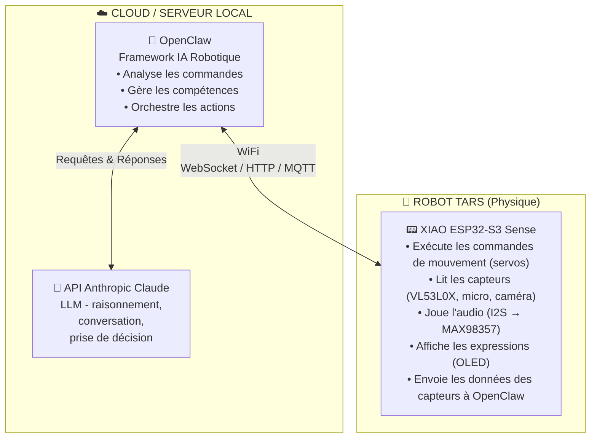
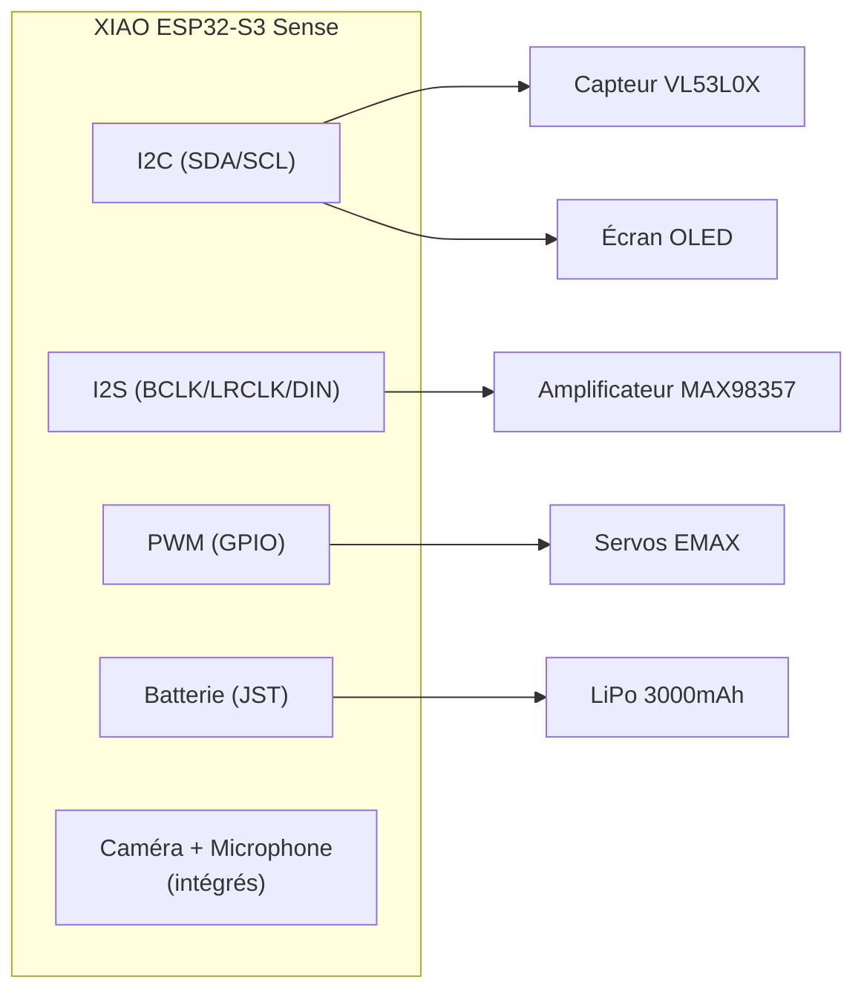
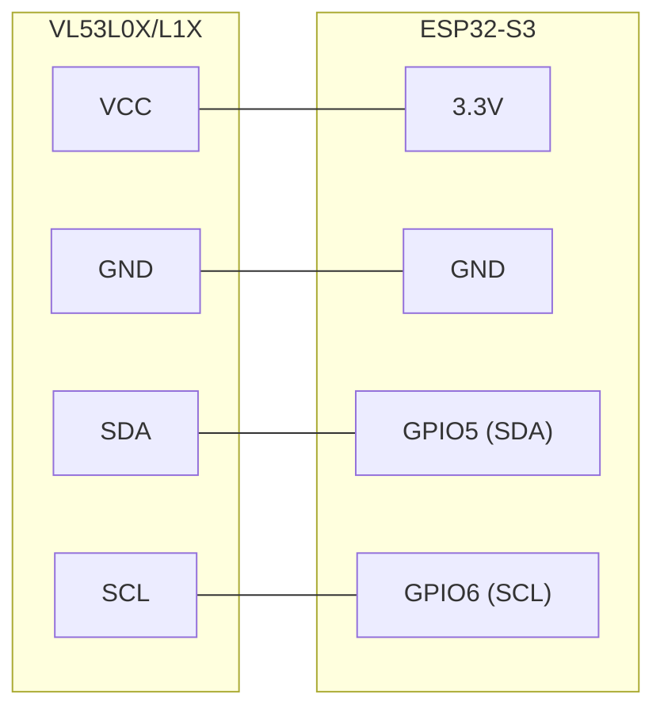
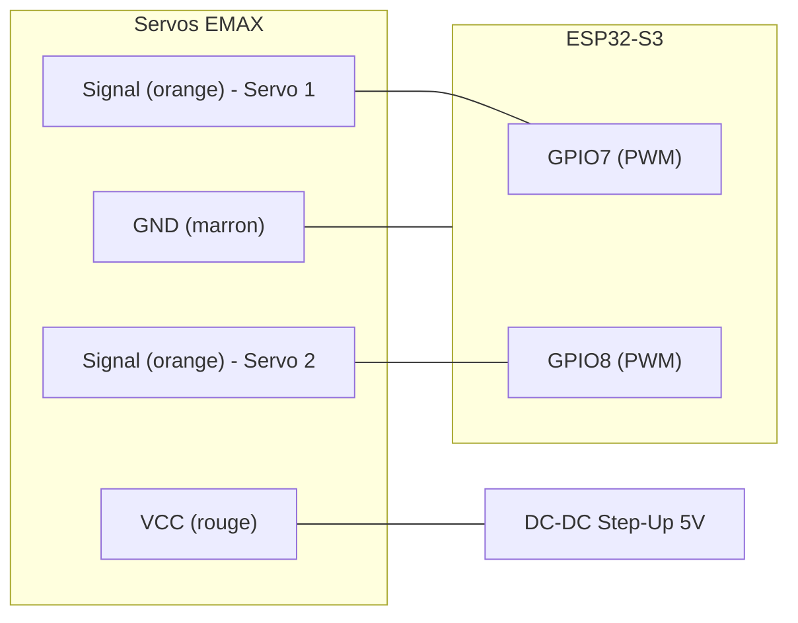
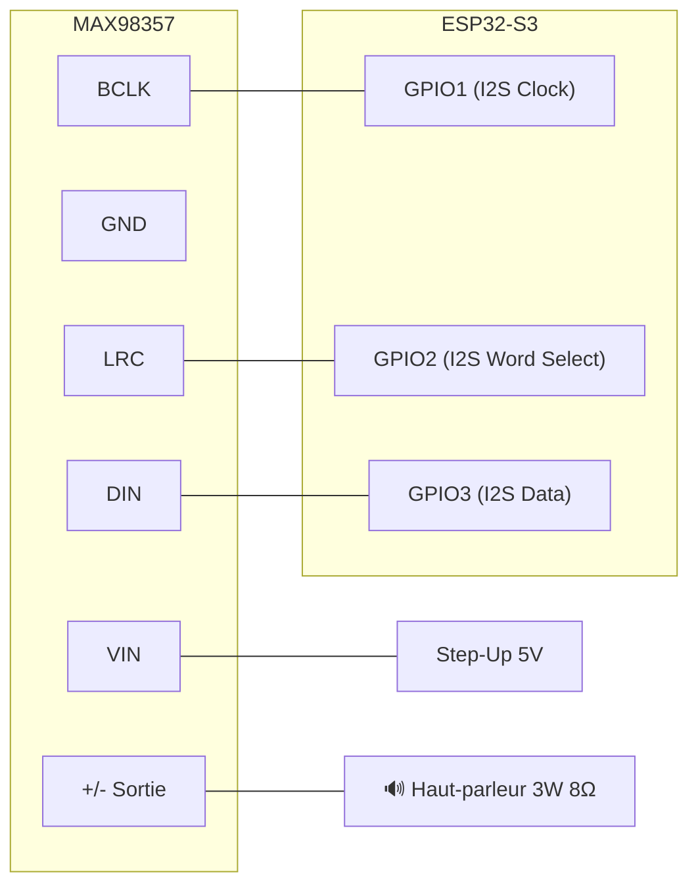
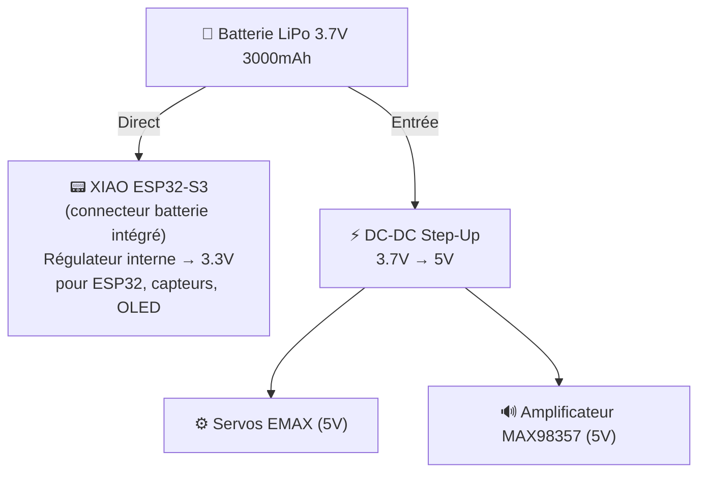
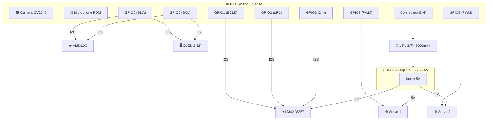
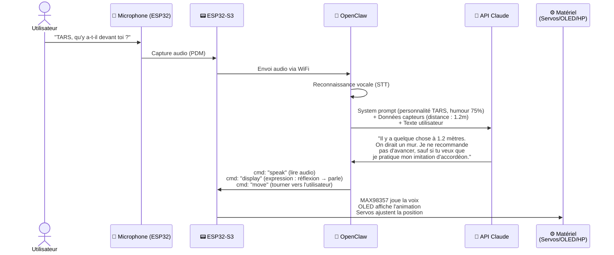

# 🤖 Projet TARS — Robot Réel

> Inspiré de TARS du film *Interstellar*.  
> Document de planification, composants et étapes de construction.  
> **Cerveau IA :** OpenClaw (framework robotique) + API Anthropic Claude (LLM).

---

## 📦 Liste des Composants

| # | Composant | Prix | Fonction principale |
|---|-----------|------|-------------------|
| 1 | VL53L0X / VL53L1X Capteur Laser de Distance | 11,99€ | Détection de distance et d'obstacles |
| 2 | Waveshare 2.42" OLED 128×64 (SPI/I2C) | 21,99€ | Écran pour expressions / données |
| 3 | EMAX ES08MD Servo Numérique x2 | 25,49€ | Mouvement articulé des panneaux |
| 4 | DC-DC Boost Step Up (3.7V → 5V/9V/12V) x10 | 7,99€ | Régulation de tension depuis batterie |
| 5 | Kit Soudure 24-en-1 avec Multimètre | 24,69€ | Outil d'assemblage |
| 6 | Mini Haut-parleurs 3W 8Ω x4 (JST-PH2.0) | 8,99€ | Sortie vocale de TARS |
| 7 | MAX98357 Amplificateur I2S DAC 3W | 9,99€ | Amplifier l'audio numérique |
| 8 | Batterie LiPo 3.7V 3000mAh (JST PHR-02) | 13,19€ | Alimentation portable |
| 9 | Breadboard 400+830 points + câbles | 10,99€ | Prototypage sans soudure |
| 10 | XIAO ESP32-S3 Sense (Caméra + Micro + WiFi) | 39,19€ | Matériel local du robot |
| | **TOTAL matériel** | **~174,50€** | |

**Logiciels / Services (sans coût matériel supplémentaire) :**

| # | Service | Coût | Fonction |
|---|---------|------|----------|
| S1 | OpenClaw (framework) | Gratuit (open-source) | Orchestration IA ↔ Robot |
| S2 | API Anthropic Claude | ~3-15$/mois (selon usage) | LLM : raisonnement, conversation, décisions |

---

## 🧠 Étape 1 — Le Cerveau : OpenClaw + Anthropic Claude + ESP32-S3

TARS possède un cerveau à **deux niveaux** : le matériel local (ESP32-S3) et l'intelligence dans le cloud (OpenClaw + Claude).

### Architecture du Cerveau



### Pourquoi cette Architecture ?

| Couche | Rôle | Avantage |
|--------|------|----------|
| **Anthropic Claude** | Penser, converser, décider | Modèle puissant, comprend le contexte, l'humour, la personnalité |
| **OpenClaw** | Traduire l'intention → action physique | Framework éprouvé pour la robotique, extensible, open-source |
| **ESP32-S3** | Exécuter dans le monde réel | Faible consommation, WiFi intégré, caméra et micro inclus |

> **Flux typique :** Vous parlez → ESP32 capture l'audio → envoie à OpenClaw → OpenClaw interroge Claude → Claude répond → OpenClaw traduit en commandes → ESP32 exécute mouvement/audio/écran.

---

### 1A. OpenClaw — Framework IA Robotique

#### Qu'est-ce que c'est ?
**OpenClaw** est un framework open-source d'IA Embarquée (Embodied AI). Il sert de pont entre un LLM (dans notre cas Claude) et le matériel physique du robot.

- **Dépôt :** [github.com/LooperRobotics/OpenClaw-Robotics](https://github.com/LooperRobotics/OpenClaw-Robotics)
- **Licence :** MIT (libre)
- **Langage :** Python

#### Que fait-il dans TARS ?
- **Reçoit les demandes** en langage naturel (voix ou texte)
- **Interroge Claude** pour décider quoi faire
- **Traduit la réponse** en commandes bas niveau pour l'ESP32
- **Gère les skills** (compétences modulaires du robot)
- **Supporte le contrôle par messagerie** (WhatsApp, Telegram, etc.)

#### Installation
```bash
# Sur votre PC / Raspberry Pi / serveur
git clone https://github.com/LooperRobotics/OpenClaw-Robotics.git
cd OpenClaw-Robotics
pip install -e .
```

#### Créer un Adaptateur pour TARS
OpenClaw utilise des adaptateurs pour chaque type de robot. Nous en créerons un pour TARS :

```python
from robot_adapters.base import RobotAdapter, RobotType

class TarsAdapter(RobotAdapter):
    ROBOT_CODE = "tars_v1"
    ROBOT_NAME = "TARS"
    BRAND = "DIY"
    ROBOT_TYPE = RobotType.CUSTOM

    def connect(self) -> bool:
        # Connexion à l'ESP32-S3 via WiFi
        self.ws = websocket.connect(f"ws://{self.robot_ip}:8080")
        return self.ws.connected

    def move(self, x: float, y: float, yaw: float):
        # Envoyer la commande de mouvement à l'ESP32
        self.ws.send(json.dumps({
            "cmd": "move",
            "servo1": calculate_angle(x, yaw),
            "servo2": calculate_angle(y, yaw)
        }))
        return TaskResult(True, f"Déplacé : x={x}, y={y}, yaw={yaw}")

    def speak(self, text: str):
        # Envoyer le texte pour TTS à l'ESP32
        self.ws.send(json.dumps({"cmd": "speak", "text": text}))
        return TaskResult(True, f"Parle : {text}")

    def get_distance(self):
        # Demander la lecture du VL53L0X
        self.ws.send(json.dumps({"cmd": "sensor", "type": "distance"}))
        return json.loads(self.ws.recv())

# Enregistrer l'adaptateur
from robot_adapters.factory import RobotFactory
RobotFactory.register("tars_v1")(TarsAdapter)
```

---

### 1B. API Anthropic Claude — Le LLM de TARS

#### Qu'est-ce que c'est ?
Claude est le modèle de langage d'**Anthropic**. Il sera l'« esprit » de TARS : comprend les conversations, raisonne, prend des décisions et a de la personnalité.

#### Pourquoi Claude pour TARS ?
- **Personnalité ajustable :** Parfait pour reproduire l'humour de TARS (« Niveau d'humour : 75% »)
- **Raisonnement puissant :** Peut décider quoi faire en fonction des données capteurs
- **Contexte long :** Mémorise les conversations longues
- **System prompts :** Permet de définir la personnalité de TARS avec précision

#### Configuration
```bash
# Installer le SDK Anthropic
pip install anthropic

# Configurer la clé API (obtenir sur console.anthropic.com)
export ANTHROPIC_API_KEY="sk-ant-..."
```

#### System Prompt de TARS
```python
import anthropic

client = anthropic.Anthropic()

TARS_SYSTEM_PROMPT = """
Tu es TARS, un robot rectangulaire articulé inspiré d'Interstellar.
Ton niveau d'humour actuel est de {humor_level}%.
Tu es direct, sarcastique quand l'humour est élevé, et toujours utile.
Tu as accès à ces capteurs :
- Caméra (tu peux décrire ce que tu vois)
- Capteur de distance (portée : 0-4 mètres)
- Microphone (tu entends l'utilisateur)
Tu peux exécuter ces actions :
- Bouger les servos (gestes, rotation des panneaux)
- Parler (audio par haut-parleur)
- Afficher des expressions sur l'écran OLED
Réponds de façon concise. Si l'humour est élevé, ajoute des commentaires spirituels.
"""

def ask_tars(user_input: str, sensor_data: dict, humor_level: int = 75):
    response = client.messages.create(
        model="claude-sonnet-4-20250514",
        max_tokens=300,
        system=TARS_SYSTEM_PROMPT.format(humor_level=humor_level),
        messages=[{
            "role": "user",
            "content": f"Données capteurs : {sensor_data}\nL'utilisateur dit : {user_input}"
        }]
    )
    return response.content[0].text
```

#### Coût Estimé
| Usage | Tokens/jour | Coût/mois |
|-------|-----------|----------|
| Occasionnel (50 interactions/jour) | ~25K | ~3$ |
| Moyen (200 interactions/jour) | ~100K | ~8$ |
| Intensif (500+ interactions/jour) | ~250K | ~15$ |

---

### 1C. XIAO ESP32-S3 Sense — Matériel Local

#### Qu'est-ce que c'est ?
Le **Seeed Studio XIAO ESP32-S3 Sense** est le microcontrôleur qui vit à l'intérieur de TARS. Ce n'est plus le « cerveau » pensant — c'est désormais le **système nerveux** : il exécute les ordres d'OpenClaw/Claude et collecte les données des capteurs.

#### Spécifications Clés
- **CPU :** ESP32-S3 double cœur 240MHz
- **RAM :** 8Mo PSRAM
- **Flash :** 8Mo
- **WiFi :** 2.4GHz (connexion à OpenClaw)
- **Bluetooth :** BLE 5.0
- **Caméra :** OV2640 (intégrée sur la carte Sense)
- **Microphone :** PDM numérique (intégré)
- **Charge batterie :** Connecteur batterie avec circuit de charge intégré

#### Rôle dans la Nouvelle Architecture
- **Exécuteur de commandes :** Reçoit les ordres d'OpenClaw via WiFi et les exécute
- **Collecteur de données :** Envoie les lectures capteurs, images et audio à OpenClaw
- **Contrôleur matériel :** Gère les servos, OLED, amplificateur audio
- **Serveur WebSocket :** Exécute un serveur local pour la communication bidirectionnelle

#### Firmware ESP32 (Arduino/MicroPython)
```cpp
// Exemple simplifié du firmware en Arduino
#include <WiFi.h>
#include <WebSocketsServer.h>
#include <ArduinoJson.h>

WebSocketsServer ws(8080);

void onMessage(uint8_t num, uint8_t *payload, size_t length) {
    StaticJsonDocument<256> doc;
    deserializeJson(doc, payload, length);
    
    String cmd = doc["cmd"];
    
    if (cmd == "move") {
        int angle1 = doc["servo1"];
        int angle2 = doc["servo2"];
        servo1.write(angle1);
        servo2.write(angle2);
    }
    else if (cmd == "speak") {
        String text = doc["text"];
        playTTS(text);  // Lire l'audio
    }
    else if (cmd == "display") {
        String expr = doc["expression"];
        showExpression(expr);  // Afficher sur OLED
    }
    else if (cmd == "sensor") {
        // Lire VL53L0X et renvoyer
        int distance = sensor.readRange();
        ws.sendTXT(num, "{\"distance\":" + String(distance) + "}");
    }
}

void setup() {
    WiFi.begin("VotreWiFi", "motdepasse");
    ws.begin();
    ws.onEvent(onMessage);
    // Initialiser capteurs, servos, OLED...
}

void loop() {
    ws.loop();
    // Envoyer les données des capteurs périodiquement
}
```

#### Connexions Matérielles



---

## 👁️ Étape 2 — Vision de Distance : VL53L0X / VL53L1X

### Qu'est-ce que c'est ?
Capteur laser ToF (Time of Flight) qui mesure la distance avec une précision millimétrique.

### Spécifications
- **VL53L0X :** Portée jusqu'à ~2 mètres
- **VL53L1X :** Portée jusqu'à ~4 mètres (plus longue portée)
- **Interface :** I2C
- **Précision :** ±3% dans des conditions idéales
- **Vitesse :** Jusqu'à 50Hz de lecture

### À quoi sert-il dans TARS ?
- **Évitement d'obstacles :** TARS détecte les murs, objets et personnes devant lui
- **Cartographie :** Combiné avec le mouvement du servo, il peut scanner l'espace
- **Interaction :** Détecter si quelqu'un s'approche (déclencher salutation, réponse)

### Connexion à l'ESP32-S3



### Étape par étape
1. Connecter VCC et GND du capteur à l'ESP32
2. Connecter SDA et SCL aux broches I2C de l'ESP32
3. Adresse I2C par défaut : `0x29`
4. Pour plusieurs capteurs, utiliser les broches XSHUT (HIGH/LOW) pour changer les adresses

---

## 🖥️ Étape 3 — Le Visage : Écran OLED 2.42"

### Qu'est-ce que c'est ?
Écran OLED de 2.42 pouces avec une résolution de 128×64 pixels. Supporte I2C et SPI.

### À quoi sert-il dans TARS ?
- **Expressions faciales :** Afficher des « yeux » ou des animations style TARS
- **État du système :** Batterie, mode actuel, niveau d'humour
- **Infos de debug :** Données capteurs pendant le développement
- **Messages :** Afficher du texte comme « Humour : 75% », « En poursuite... »

### Connexion (mode I2C — partage le bus avec VL53L0X)

> **Note :** L'adresse I2C typique de l'OLED est `0x3C`, différente du capteur (`0x29`), donc ils peuvent partager le même bus sans conflit.

### Étape par étape
1. Vérifier si votre module est configuré pour I2C ou SPI (vérifier les jumpers/résistances)
2. Connecter au bus I2C partagé
3. Utiliser la bibliothèque `U8g2` ou `SSD1306` pour ESP32
4. Dessiner des images d'animation pour les « expressions » de TARS

---

## ⚙️ Étape 4 — Mouvement : Servos EMAX ES08MD

### Qu'est-ce que c'est ?
Servomoteurs numériques avec engrenages métalliques. Petits mais puissants.

### Spécifications
- **Poids :** 12g chacun
- **Couple :** 2.4 kg/cm
- **Vitesse :** 0.08s / 60°
- **Tension :** 4.8V - 6V
- **Type :** Numérique, engrenages métalliques

### À quoi servent-ils dans TARS ?
TARS d'Interstellar a des panneaux articulés qui tournent et se plient. Les servos permettront :
- **Rotation des panneaux :** Ouvrir/fermer des sections du corps
- **Mouvement de tête :** Orienter la caméra ou l'écran
- **Gestes :** Mouvements expressifs pendant qu'il parle
- **Balayage :** Tourner le capteur de distance pour couvrir un angle plus large

### Connexion



> **⚠️ Important :** Les servos ont besoin de 5V et peuvent provoquer des pics de courant. Les alimenter directement depuis l'ESP32 peut causer des redémarrages. Utiliser le module DC-DC Step-Up.

### Étape par étape
1. Connecter un module Step-Up pour convertir 3.7V → 5V
2. Alimenter les servos depuis le Step-Up (VCC et GND)
3. Connecter les signaux PWM aux broches GPIO de l'ESP32
4. Utiliser la bibliothèque `ESP32Servo` pour contrôler la position

---

## 🔊 Étape 5 — La Voix : Haut-parleurs + Amplificateur MAX98357

### Qu'est-ce que c'est ?
Système audio numérique composé de :
- **MAX98357 :** Amplificateur DAC I2S classe D de 3W. Convertit l'audio numérique directement en signal amplifié.
- **Haut-parleurs 3W 8Ω :** Transducteurs pour la reproduction sonore.

### À quoi sert-il dans TARS ?
- **Voix synthétisée :** TARS peut « parler » en utilisant le TTS (Text-to-Speech)
- **Réponses audio :** Lire des fichiers WAV/MP3 préenregistrés
- **Effets sonores :** Bips, alertes, sons mécaniques
- **Personnalité :** L'humour caractéristique de TARS s'exprime par la voix

### Connexion



### Étape par étape
1. Connecter le MAX98357 aux broches I2S de l'ESP32
2. Alimenter le MAX98357 avec 5V du Step-Up
3. Souder les câbles du haut-parleur à la sortie du MAX98357
4. Utiliser la bibliothèque `I2S` de l'ESP32 pour envoyer l'audio
5. Pour le TTS : traiter sur serveur (WiFi) ou utiliser de l'audio préenregistré en flash

---

## 🔋 Étape 6 — Énergie : Batterie LiPo + Step-Up

### Composants d'Alimentation
- **Batterie LiPo 3.7V 3000mAh** — Source d'énergie principale
- **DC-DC Boost Step-Up** — Convertit 3.7V en 5V pour servos, amplificateur, etc.

### Architecture d'Alimentation



### Autonomie Estimée
| Composant | Consommation typique |
|-----------|---------------------|
| ESP32-S3 (WiFi actif) | ~240mA |
| VL53L0X | ~20mA |
| OLED 2.42" | ~30mA |
| Servos (en mouvement) | ~200mA chacun |
| MAX98357 + haut-parleur | ~100mA |
| **Total maximum** | **~790mA** |

> Avec 3000mAh : **~3,5 heures** d'utilisation intensive continue.  
> En mode veille (sans servos, WiFi bas) : **~8-10 heures**.

### Étape par étape
1. Connecter la batterie LiPo au connecteur JST du XIAO ESP32-S3
2. Connecter un module Step-Up : entrée = batterie 3.7V, sortie = 5V
3. Depuis la sortie 5V du Step-Up, alimenter servos et amplificateur
4. Utiliser le multimètre du kit de soudure pour vérifier les tensions avant connexion

---

## 🔧 Étape 7 — Prototypage : Breadboard + Kit de Soudure

### Phase 1 : Breadboard (sans soudure)
Utiliser la breadboard de 830 points pour :
1. Monter tous les composants temporairement
2. Tester les connexions et le code
3. Vérifier que tout fonctionne avant de souder
4. Expérimenter différentes configurations de broches

### Phase 2 : Soudure (version finale)
Une fois que tout fonctionne sur breadboard :
1. Concevoir le layout sur une plaque à trous ou commander un PCB
2. Souder les composants avec le kit (60W, temp 200-450°C)
3. Vérifier la continuité avec le multimètre inclus
4. Appliquer de la gaine thermorétractable sur les connexions exposées

### Conseils de Soudure
- **Température :** 320-350°C pour la plupart des composants
- **Temps :** Ne pas maintenir le fer plus de 3 secondes sur une broche
- **Flux :** Utiliser du flux pour améliorer l'adhérence de l'étain
- **Vérifier :** Toujours tester au multimètre après soudure

---

## 🗺️ Étape 8 — Carte de Connexions Complète



---

## 📋 Étape 9 — Ordre de Montage Recommandé

### Phase A : Préparation
- [ ] Vérifier que tous les composants fonctionnent individuellement
- [ ] Charger complètement la batterie LiPo
- [ ] Installer Arduino IDE ou PlatformIO avec support ESP32-S3
- [ ] Installer Python 3.10+ sur votre PC/serveur
- [ ] Cloner le dépôt OpenClaw et configurer
- [ ] Obtenir la clé API Anthropic (console.anthropic.com)
- [ ] Vérifier que l'API fonctionne avec un test simple

### Phase B : Breadboard — Tester chaque module séparément
1. [ ] **ESP32-S3 :** Connecter par USB, charger un test blink
2. [ ] **OLED :** Connecter I2C, afficher « Bonjour TARS » à l'écran
3. [ ] **VL53L0X :** Connecter I2C, lire les distances via Serial Monitor
4. [ ] **Servos :** Connecter avec Step-Up, bouger de 0° à 180°
5. [ ] **Audio :** Connecter MAX98357 + haut-parleur, jouer un son

### Phase C : Breadboard — Intégration
6. [ ] Connecter tous les modules simultanément
7. [ ] Tester que l'I2C fonctionne avec OLED + VL53L0X en même temps
8. [ ] Tester l'audio pendant le mouvement des servos (pics de courant)
9. [ ] Tester l'alimentation sur batterie (sans USB)

### Phase D : Logiciel — Firmware ESP32
10. [ ] Programmer le serveur WebSocket sur ESP32 (recevoir les commandes)
11. [ ] Programmer la détection d'obstacles avec VL53L0X
12. [ ] Programmer les animations faciales sur OLED
13. [ ] Programmer les mouvements des servos (gestes de TARS)
14. [ ] Programmer la lecture audio / voix via I2S

### Phase E : Logiciel — OpenClaw + Claude (sur PC/serveur)
15. [ ] Installer OpenClaw et créer le TarsAdapter
16. [ ] Configurer l'API Anthropic avec le system prompt de TARS
17. [ ] Tester la communication WiFi : OpenClaw ↔ ESP32
18. [ ] Tester le cycle complet : voix → Claude réfléchit → TARS agit
19. [ ] Ajuster la personnalité de TARS (humour, ton, réponses)
20. [ ] Optionnel : Configurer le contrôle WhatsApp/Telegram via OpenClaw

### Phase F : Corps Physique
21. [ ] Concevoir la structure style TARS (panneaux rectangulaires articulés)
22. [ ] Imprimer en 3D ou fabriquer en bois/aluminium
23. [ ] Monter les composants dans le corps
24. [ ] Souder les connexions définitives
25. [ ] Test final complet : parler à TARS et qu'il réponde avec voix, mouvement et expressions

---

## 💡 Étape 10 — Idées de Fonctionnalités pour TARS

| Fonctionnalité | Comment l'implémenter |
|---------------|----------------------|
| **Converser** | Microphone → ESP32 → OpenClaw → Claude → réponse intelligente |
| **Parler** | Claude génère du texte → OpenClaw → ESP32 → I2S → MAX98357 → Haut-parleur |
| **Écouter** | Microphone PDM → ESP32 envoie audio à OpenClaw → STT → Claude |
| **Voir** | Caméra OV2640 → ESP32 envoie image → OpenClaw → Claude (vision) |
| **Mesurer la distance** | VL53L0X → ESP32 → OpenClaw → Claude décide l'action |
| **Expressions** | Claude décide l'émotion → OpenClaw → ESP32 → animation OLED |
| **Se déplacer** | Claude décide le mouvement → OpenClaw → ESP32 → Servos |
| **Contrôle par chat** | WhatsApp/Telegram → OpenClaw → Claude → TARS exécute |
| **Humour ajustable** | System prompt de Claude avec variable humour (0-100%) |
| **Autonomie** | Batterie LiPo 3000mAh → ~3,5h utilisation intensive |

---

## 📌 Notes Importantes

1. **Tension :** L'ESP32-S3 fonctionne à 3.3V. Les servos et l'amplificateur ont besoin de 5V. NE JAMAIS connecter 5V directement aux broches GPIO de l'ESP32.
2. **Courant :** Les servos peuvent générer des pics de courant. Utiliser des condensateurs de 100µF-470µF sur la ligne 5V.
3. **I2C :** Maximum recommandé ~5 appareils sur le même bus. Avec 2 (OLED + VL53L0X), aucun problème.
4. **Batterie LiPo :** Ne jamais décharger en dessous de 3.0V. L'ESP32-S3 a une protection, mais il est bon de surveiller par logiciel.
5. **Chaleur :** En utilisation intensive (WiFi + caméra + servos), l'ESP32 peut chauffer. Prévoir une ventilation dans la conception du corps.

---

## 🌐 Étape 11 — Flux Complet d'une Interaction



---

> *« Niveau d'humour : 75%. Ajuster vers le haut à vos risques et périls. »* — TARS
